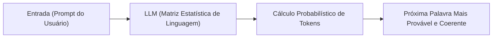
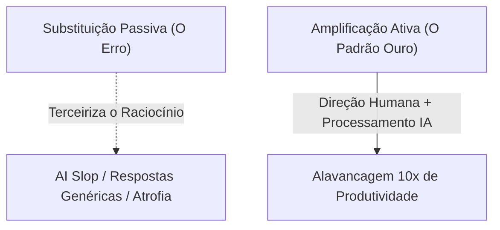

# 🤖 01. Amplificação vs Substituição: O Critério Humano e a Janela de Oportunidade

> **Autor:** Arthur (Tutu)  
> **Trilha:** [[00 - IA na Prática — Guia Mestre|IA & O Segundo Cérebro (Espinha Dorsal — Etapa 01)]]  
> **Nível de Consciência:** Nível 0 ➔ Nível 1 (Do medo de substituição à postura de Comandante)  
> **Conexões:** → [[00 - IA na Prática — Guia Mestre]] | [[02 - IA na Prática — Prompting em 3 Partes]] | [[Experimento Mental — O Chute Estatístico e a Ilusão de Certeza da IA]]  

---

## 🎯 Cabeçalho de Metas & Premissas

> **Tempo Estimado de Leitura:** 7 minutos  
> **Premissas Necessárias:**
> 1. Nenhuma formação prévia em computação é exigida; apenas a disposição de abandonar preconceitos sobre "máquinas pensantes".
> 2. Acesso a qualquer modelo de linguagem moderno (Claude, ChatGPT, Gemini).
>
> **O que você VAI aprender neste artigo:**
> - Como navegar o jogo de interesses econômicos e explorar a janela de computação subsidiada.
> - A física real dos LLMs: como a previsão estatística de palavras explica por que a máquina alucina com tanta convicção.
> - Onde reside o verdadeiro ganho de IA: processamento cognitivo acelerado, mineração de padrões e estruturação de contexto.
> - Por que respostas genéricas são inúteis e como o contexto privado conecta o uso de IA a um [[03 - IA na Prática — O Operador no Comando e Contexting|Segundo Cérebro]].
> - As 4 armadilhas da dependência intelectual e a matriz de blindagem operacional.

---

> [!NOTE]- 🧭 Índice do Artigo
> - [[#Ato 1: O Jogo de Interesses e a Janela de Arbitragem Econômica]]
> - [[#Ato 2: A Física dos LLMs — Preditores Estatísticos vs. Verificação da Realidade]]
> - [[#Ato 3: Onde Está o Real Ganho — Usina de Processamento Cognitivo]]
> - [[#Ato 4: A Fronteira do Conhecimento Privado & A Utilidade Contextual]]
> - [[#Ato 5: As 4 Armadilhas da Dependência & A Matriz de Blindagem Operacional]]
> - [[#🔗 Próximo Passo na Trilha]]
> - [[#🧬 Notas Co-ativadas & Conexões da Trilha]]

---

> *"A Inteligência Artificial não vai substituir o seu trabalho. Mas um profissional que domina a Inteligência Artificial vai substituir quem não domina."*  
> — **Axioma da Nova Economia Cognitiva**

---

### Ato 1: O Jogo de Interesses e a Janela de Arbitragem Econômica

Para compreender o momento atual da Inteligência Artificial, é preciso enxergar o jogo de incentivos por trás da cortina:

* **Os CEOs das Big Techs** vendem a narrativa grandiosa da AGI (*Inteligência Artificial Geral*) para inflar valuations, sustentar o valor das ações e justificar orçamentos astronômicos de desenvolvimento.
* **Os Investidores Institucionais e Fundos de Capital de Risco**, tomados pelo pânico de ficarem para trás (*FOMO*), despejam centenas de bilhões de dólares na construção de data centers, chips e usinas de energia — muito embora ninguém saiba se a AGI é de fato viável e a realidade empírica venha demonstrando platôs claros de ganho por mera escala de dados.
* **E você, leitor**, pode se posicionar de forma pragmática no meio desse fogo cruzado, aproveitando a oportunidade econômica por dois motivos determinísticos:

1. **A Assimetria de Alavancagem Profissional:**  
   A IA não tem vontade própria nem ambição de carreira. Ela não substitui a responsabilidade humana. No entanto, um profissional que aprende a delegar tarefas de processamento para a máquina produz com a velocidade de cinco pessoas operando no modo tradicional. O profissional tradicional não está competindo contra um algoritmo; ele está competindo contra outro humano alavancado por computação de ponta.
2. **A Arbitragem do Capex Subsidiado (Agradeça à Previdência Americana):**  
   Você tem acesso a modelos de inteligência que custaram bilhões de dólares para serem treinados por meros US$ 20 mensais (ou até de graça). O capex trilionário das Big Techs em infraestrutura pesada está sendo massivamente financiado por fundos de pensão institucionais e pela poupança de aposentadoria americana. Trata-se de um subsídio de infraestrutura sem retorno financeiro de curto prazo garantido para os investidores. O usuário inteligente opera sobre uma **janela histórica de arbitragem**: consumir computação de ponta a preços substancialmente abaixo do custo real de depreciação do capital. Ignorar essa oportunidade é abrir mão de alavancagem gratuita.

---

### Ato 2: A Física dos LLMs — Preditores Estatísticos vs. Verificação da Realidade

Para dominar a ferramenta, você precisa entender o que ela é fisicamente. O maior erro de um iniciante é atribuir consciência, raciocínio moral ou "sabedoria" a um Large Language Model (LLM).

> 📖 **Consulta Rápida:** Caso queira revisar termos fundamentais como *Token*, *Prompt*, *LLM* e *Janela de Contexto*, consulte o [[07 - IA na Prática — Glossário Essencial de IA e Contexto|Glossário Essencial de IA e Contexto]] (organizado em níveis básico, intermediário e avançado).

Um LLM não é uma mente pensante; ele é um **preditor estatístico de próxima palavra (*Next Token Prediction*)** treinado sobre trilhões de conexões linguísticas.

Compreender esse mecanismo revela a causa-raiz de dois fenômenos cruciais:

* **Ensinamos a Linguagem, Não a Realidade Física:**  
  A IA foi treinada para dominar a sintaxe, a gramática e as correlações semânticas da escrita humana. Ela sabe como um texto bem articulado deve *soar*, mas não possui olhos, ouvidos nem experiência corpórea no mundo material. Ela não verifica se o fato aconteceu na realidade; ela apenas verifica se a frase faz sentido estatístico.
* **A Razão Mecânica da Alucinação:**  
  Quando você faz uma pergunta factual complexa sem fornecer dados de entrada, a IA não "sabe que não sabe". Como sua função matemática é continuar o padrão textual, ela preenche a lacuna com a continuação estatisticamente mais plausível. Ela mente com convicção cirúrgica porque a mentira foi gerada com a mesma gramática perfeita da verdade.

> 🔬 **Experimento Mental Recomendado:** Para entender visualmente por que a IA fala com certeza absoluta mesmo quando está apenas chutando no escuro, veja a sidequest [[Experimento Mental — O Chute Estatístico e a Ilusão de Certeza da IA|O Chute Estatístico e a Ilusão de Certeza da IA]], analisando o caso do gosto musical e da gastronomia sob a ótica da Teoria dos Conjuntos.

---

### Ato 3: Onde Está o Real Ganho — Usina de Processamento Cognitivo

Depois de milhares de horas operando com IA, uma verdade empírica se impõe: **o real valor da IA não está na geração mágica de ideias do nada, mas no processamento cognitivo acelerado, na mineração de padrões em grandes volumes e no registro/estruturação de contexto**.

Compare a capacidade humana com a capacidade do modelo:
* **A IA resume um livro de 300 páginas** em 30 segundos.
* **A IA cruza dados de 10 relatórios técnicos** e extrai os padrões ocultos em minutos.
* **A IA reescreve, refatora e traduz** volumes densos de texto instantaneamente.
* **A IA estrutura raciocínios caóticos** em tabelas e esquemas lógicos organizados.

Você escreve com mais originalidade, discernimento e intuição do que a IA, mas opera com menor velocidade mecânica. Ela organiza, sintetiza e propõe alternativas em frações de segundo. A inteligência, o bom gosto e o julgamento são seus; a usina de processamento cognitivo, extração e mineração de padrões é dela.

---

### Ato 4: A Fronteira do Conhecimento Privado & A Utilidade Contextual

No mundo real dos negócios e do trabalho intelectual, **uma resposta genérica perfeita no vácuo tem valor zero**. 

O que tem valor econômico real é uma resposta desenhada para o seu **contexto específico**: suas restrições orçamentárias, o estágio atual do seu projeto, a cultura da sua empresa e o seu estilo de tomada de decisão.

É exatamente aqui que a inteligência artificial encontra sua fronteira mais crítica:
1. **O Modelo Sabe Tudo sobre o Mundo Público, mas Zero sobre Você:** Ele leu a biblioteca de Alexandria e todos os livros de estratégia do planeta, mas não sabe quais clientes você atende, quais são seus gargalos imediatos nem o que você produziu ontem.
2. **A Ilusão da Resposta Média:** Sem o seu contexto, a IA só pode responder com base na média estatística global da internet — entregando um texto formal, polido, mas completamente inútil para resolver seu problema concreto.
3. **A Necessidade do Segundo Cérebro:** Para que a IA entregue valor de consultoria sênior, você precisa alimentá-la com o seu contexto. No entanto, ficar redigindo esse contexto manualmente a cada nova conversa é insustentável.

É desse atrito que nasce a necessidade formal de um **Segundo Cérebro estruturado**: manter suas regras, projetos e notas organizadas em arquivos Markdown no Obsidian para que a IA possa ler seu contexto sob demanda (*Just-In-Time*). Essa arquitetura é detalhada no artigo [[03 - IA na Prática — O Operador no Comando e Contexting|03. Engenharia de Contexto — O Córtex do Segundo Cérebro]].

---

### Ato 5: As 4 Armadilhas da Dependência & A Matriz de Blindagem Operacional

Para não virar refém da tecnologia nem sofrer de atrofia cognitiva, o operador deve blindar sua rotina contra 4 armadilhas comportamentais clássicas:

| Armadilha | O que NÃO Fazer | Riscos de Fazer | O que FAZER | Melhoria Esperada |
| :--- | :--- | :--- | :--- | :--- |
| **1. Terceirização do Raciocínio** | Copiar e colar a resposta bruta da IA sem ler, questionar ou editar criticamente. | Atrofia cognitiva progressiva, perda de autoria e geração de textos pasteurizados (*AI Slop*). | Use a IA para a base mecânica de processamento e aplique seu julgamento no topo do funil. | Retenção do senso crítico, originalidade autoral e alta velocidade de entrega. |
| **2. Ilusão da Avaliação sem Fundamento** | Tentar usar IA em áreas onde você não domina os fundamentos básicos. | Incapacidade de julgar o output; a fronteira de qualidade da IA fica restrita ao seu próprio desconhecimento (veja o [[Experimento Mental — O Chute Estatístico e a Ilusão de Certeza da IA\|Experimento Mental]]). | Estude os fundamentos antes de delegar, usando a IA como tutora socrática e não como oráculo cego. | Imunidade contra alucinações técnicas e capacidade real de auditoria do trabalho. |
| **3. Erro de Categoria de Responsabilidade** | Atribuir responsabilidade moral, jurídica ou profissional aos erros da máquina. | Prejuízos financeiros e quebra de confiança profissional; a IA não responde no mundo real. | Assuma a responsabilidade integral por 100% dos outputs e valide cada premissa factual no disco. | Soberania operacional, confiabilidade nas entregas e segurança profissional. |
| **4. Adulação Estatística (*RLHF*)** | Aceitar os primeiros elogios da IA sobre ideias fracas sem pedir contra-argumentos. | Falsa sensação de genialidade e validação de premissas inconsistentes. | Instrua a IA a atuar como revisor implacável, apontando pontos cegos, fraquezas lógicas e objeções. | Raciocínios blindados contra falhas antes do contato com o mercado real. |

---

### 🔗 Próximo Passo na Trilha

Compreendida a física dos LLMs e a importância do contexto privado, o próximo desafio é prático: **como parar de fazer perguntas vagas e passar a controlar a máquina com precisão cirúrgica através de uma fórmula modular em 3 partes?**

* → Avançar para a Etapa 02: [[02 - IA na Prática — Prompting em 3 Partes]]

---

### 🧬 Notas Co-ativadas & Conexões da Trilha
* **Guia Mestre da Trilha:** [[00 - IA na Prática — Guia Mestre]]
* **Sidequest de Fundamentos:** [[Experimento Mental — O Chute Estatístico e a Ilusão de Certeza da IA]]
* **Próxima Etapa (Prompting em 3 Partes):** [[02 - IA na Prática — Prompting em 3 Partes]]
* **Engenharia de Contexto:** [[03 - IA na Prática — O Operador no Comando e Contexting]]
* **Glossário Essencial de IA:** [[07 - IA na Prática — Glossário Essencial de IA e Contexto]]