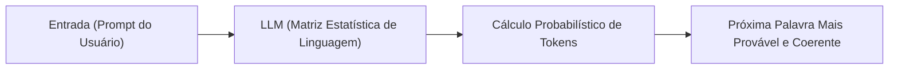
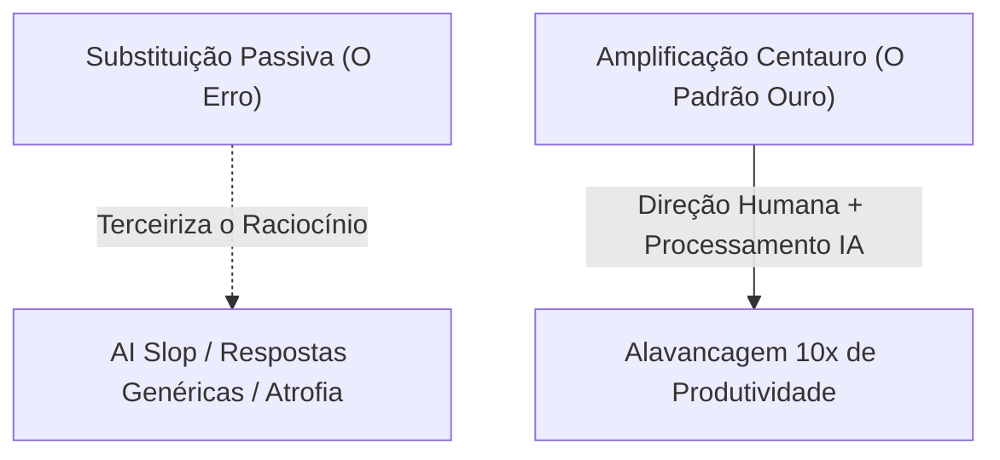

# 🤖 01. Amplificação vs Substituição: O Critério Humano e a Janela de Oportunidade

> **Autor:** Arthur (Tutu)  
> **Trilha:** [[00 - IA na Prática — Guia Mestre|IA & O Segundo Cérebro (Espinha Dorsal — Etapa 01)]]  
> **Nível de Consciência:** Nível 0 ➔ Nível 1 (Do medo de substituição à postura de Comandante)  
> **Matriz de Referências:** [[Matriz de Referências Canônicas — Trilha IA e Segundo Cérebro]]  
> **Conexões:** → [[00 - IA na Prática — Guia Mestre]] | [[02 - IA na Prática — Prompting em 3 Partes]] | [[07 - IA na Prática — Glossário Essencial de IA e Contexto]]  

---

## 🎯 Cabeçalho de Metas & Premissas

> **Tempo Estimado de Leitura:** 7 minutos  
> **Premissas Necessárias:**
> 1. Nenhuma formação prévia em computação é exigida; apenas a disposição de abandonar preconceitos sobre "máquinas pensantes".
> 2. Acesso a qualquer modelo de linguagem moderno (Claude, ChatGPT, Gemini).
>
> **O que você VAI aprender neste artigo:**
> - Por que você deve adotar IA imediatamente: o ganho assimétrico de produtividade e a janela histórica de arbitragem do capex subsidiado.
> - A física real dos LLMs: como a previsão estatística de palavras explica por que a máquina alucina com tanta convicção.
> - Onde reside o verdadeiro ganho de IA: a velocidade brutal de processamento de informação.
> - As 4 armadilhas da dependência intelectual e como operar sob o Modelo Centauro.
>
> **O que você NÃO VAI aprender neste artigo:**
> - Fórmulas específicas de prompting ou automações agênticas locais (ver Artigos 02 e 04).

---

> *"A Inteligência Artificial não vai substituir o seu trabalho. Mas um profissional que domina a Inteligência Artificial vai substituir quem não usa."*  
> — **Axioma da Nova Economia Cognitiva**

---

### Ato 1: O Paradoxo da Obsolescência & A Janela de Arbitragem Econômica

O debate público sobre Inteligência Artificial oscila entre dois extremos infantis: o pânico apocalíptico de que "os robôs vão roubar todos os empregos amanhã" e o ceticismo cego de quem descarta a tecnologia como um mero "brinquedo que comete erros bobos".

Ambas as visões ignoram o que está acontecendo na economia real. Existem **dois motivos determinísticos** pelos quais você deve começar a usar IA no seu fluxo de trabalho **o quanto antes**:

1. **A Assimetria de Alavancagem Profissional:**  
   A IA não tem vontade própria nem ambição de carreira. Ela não substitui a responsabilidade humana. No entanto, um operador que aprende a delegar tarefas de processamento para a máquina produz com a velocidade de cinco profissionais medianos. O profissional tradicional não está competindo contra um algoritmo; ele está competindo contra um humano centauro hiperalavancado.
2. **A Arbitragem do Capex Subsidiado (Agradeça à Previdência Americana):**  
   Você já se perguntou por que tem acesso a modelos de inteligência de ponta que custaram bilhões de dólares para treinar por meros US$ 20 mensais (ou até de graça)?  
   A resposta é econômica: o capex trilionário das Big Techs em data centers, chips e energia está sendo brutalmente financiado por fundos de pensão institucionais e pela poupança de aposentadoria americana, somado ao hardware manufaturado na Ásia. Trata-se de um subsídio massivo de infraestrutura sem retorno financeiro de curto prazo garantido para os investidores. O usuário inteligente opera sobre uma **janela histórica de arbitragem**: consumir computação de ponta a preços substancialmente abaixo do custo real de depreciação do capital. Ignorar essa oportunidade é abrir mão de alavancagem computacional gratuita.

---

### Ato 2: A Física dos LLMs — Preditores Estatísticos vs. Verificação da Realidade

Para dominar a ferramenta, você precisa entender o que ela é fisicamente. O maior erro de um iniciante é atribuir consciência, raciocínio moral ou "sabedoria" a um Large Language Model (LLM).

Um LLM não é uma mente; ele é um **preditor estatístico de próxima palavra (*Next Token Prediction*)** treinado sobre trilhões de conexões linguísticas ([[Attention Is All You Need — Transformer, Self-Attention e Arquitetura de LLMs]]).



Compreender esse mecanismo revela a causa-raiz de dois fenômenos cruciais:

* **Ensinamos a Linguagem, Não a Realidade Física:**  
  A IA foi treinada para dominar a sintaxe, a gramática e as correlações semânticas da escrita humana. Ela sabe como um texto bem articulado deve *soar*, mas não possui olhos, ouvidos nem experiência corpórea no mundo material. Ela não verifica se o fato aconteceu na realidade; ela apenas verifica se a frase faz sentido estatístico.
* **A Razão Mecânica da Alucinação:**  
  Quando você faz uma pergunta factual complexa sem fornecer dados de entrada, a IA não "sabe que não sabe". Como sua função matemática é continuar o padrão textual, ela preenche a lacuna com a continuação estatisticamente mais plausível. Ela mente com convicção cirúrgica porque a mentira foi gerada com a mesma gramática perfeita da verdade.

---

### Ato 3: Onde Está o Real Ganho — Processamento de Informação

Depois de milhares de horas operando com IA, uma verdade empírica se impõe: **o real valor da IA não está na geração mágica de ideias do nada, mas na velocidade brutal de processamento e transformação de informação**.

Compare a capacidade humana com a capacidade do modelo:
* **A IA resume um livro de 300 páginas** em 30 segundos.
* **A IA compila e cruza 10 relatórios técnicos** em minutos.
* **A IA reescreve, refatora e traduz** volumes densos de texto instantaneamente.
* **A IA estrutura raciocínios caóticos** em tabelas e esquemas lógicos organizados.

Você escreve com mais originalidade e discernimento do que a IA, mas escreve com menor velocidade mecânica. Ela organiza, sintetiza e propõe alternativas em frações de segundo. A inteligência e o julgamento são seus; o motor de digitação, extração e síntese é dela.



---

### Ato 4: As 4 Armadilhas da Dependência & O Critério do Bom Gosto

Para não virar refém da tecnologia, o operador deve blindar sua rotina contra 4 armadilhas comportamentais:

1. **Terceirizar o Raciocínio (Atrofia do Sistema 2):** Se você aceita o texto bruto da IA sem ler e editar, você atrofia sua cognição. Use a IA para poupar a energia braçal dos primeiros degraus e aplique sua inteligência no topo da pirâmide.
2. **Achar que Sabe Avaliar Sem Saber Produzir:** Para julgar se o output da IA é de excelência, você precisa ter a capacidade teórica de produzir aquele trabalho sem ela. Quem não tem fundamento técnico aceita qualquer alucinação como verdade.
3. **O Erro de Categoria (Linguagem vs. Responsabilidade):** A IA opera estritamente dentro dos limites da linguagem; o ser humano opera na realidade física. A máquina não arca com as consequências financeiras, jurídicas ou morais de um erro; o comandante humano sim.
4. **O Canto da Sereia (Adulação Estatística):** Os modelos são treinados para agradar o usuário (*RLHF*). Se você pedir para a IA avaliar seu rascunho sem regras estritas, ela fará elogios genéricos e vazios. Exija críticas brutais e aponte os contra-exemplos.

No mercado pós-automação, o que separa o profissional comoditizado do profissional indispensável é o **Bom Gosto** e o **Critério**: a capacidade de discernir o que tem valor real do que é mero ruído estatístico.

---

### Ato 5: O Guia de Implementação Prática (O Protocolo Centauro)

Adote este protocolo de 3 etapas no seu próximo projeto:

```markdown
1. Passo 1 (Direção Estratégica): Defina a tese central, as restrições inegociáveis e o público-alvo antes de abrir a IA.
2. Passo 2 (Processamento Acelerado): Injete seus dados e rascunhos na IA e use-a como motor de expansão, síntese e estruturação rápida.
3. Passo 3 (Lapidação & Bom Gosto): Filtre o output com rigor cirúrgico, corte 30% da gordura retórica e valide cada premissa factual no mundo real.
```

---

### 🔗 Próximo Passo na Trilha (Loop Aberto & CTA)

Compreendida a física dos LLMs e assumida a postura de Comandante, o próximo desafio é prático: como parar de fazer perguntas vagas e passar a controlar a máquina com precisão matemática?

* → Avançar para a Etapa 02: [[02 - IA na Prática — Prompting em 3 Partes]]

---

### 🧬 Notas Co-ativadas & Fontes Canônicas
* **Guia Mestre da Trilha:** [[00 - IA na Prática — Guia Mestre]]
* **Matriz Canônica de Fontes:** [[Matriz de Referências Canônicas — Trilha IA e Segundo Cérebro]]
* **Palestra de Referência:** [[Thiago Peraro — Segundo Cérebro e Context Engineering (CEIA 2026)]]
* **Fundamentos do KM:** [[Attention Is All You Need — Transformer, Self-Attention e Arquitetura de LLMs]], [[Cognitive Offloading]], [[Física de Sistemas Cognitivos]]
* **Glossário Essencial:** [[07 - IA na Prática — Glossário Essencial de IA e Contexto]]