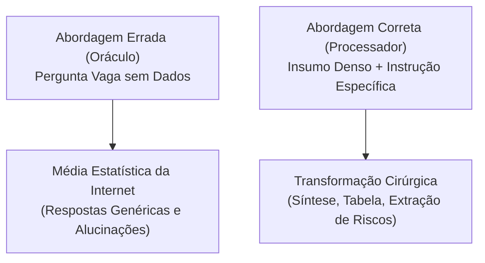

# 🎯 02. Prompting em 3 Partes: A Sintaxe de Controle da Máquina

> **Autor:** Arthur (Tutu)  
> **Trilha:** [[00 - IA na Prática — Guia Mestre|IA & O Segundo Cérebro (Espinha Dorsal — Etapa 02)]]  
> **Nível de Consciência:** Nível 1 ➔ Nível 2 (Da frustração com respostas genéricas ao controle previsível)  
> **Matriz de Referências:** [[Matriz de Referências Canônicas — Trilha IA e Segundo Cérebro]]  
> **Conexões:** → [[00 - IA na Prática — Guia Mestre]] | [[01 - IA na Prática — Amplificação vs Substituição]] | [[03 - IA na Prática — O Operador no Comando e Contexting]]  

---

## 🎯 Cabeçalho de Metas & Premissas

> **Tempo Estimado de Leitura:** 6 minutos  
> **Premissas Necessárias:**
> 1. Compreensão de que a IA opera por previsão estatística de palavras e não por clarividência ([[01 - IA na Prática — Amplificação vs Substituição]]).
>
> **O que você VAI aprender neste artigo:**
> - A diferença crucial entre usar a IA como "Oráculo" (errado) vs. "Assistente de Processamento" (correto).
> - A fórmula de 3 partes de um prompt previsível: Papel (*Role*), Contexto (*Context*) e Restrição de Saída (*Constraint*).
> - Como aplicar restrições negativas para eliminar adulação, clichês e respostas prolixas.
> - 3 exemplos comparativos de refatoração de prompts antes e depois.
>
> **O que você NÃO VAI aprender neste artigo:**
> - Gerenciamento de memória de longo prazo ou automação com multiagentes (ver Artigos 03 e 04).

---

> *"A qualidade da resposta da máquina é uma função direta da precisão das restrições do operador."*  
> — **Princípio da Engenharia de Contexto**

---

### Ato 1: O Paradoxo do Oráculo Místico

A maioria das pessoas que experimenta um modelo de IA desiste após poucas semanas com a mesma reclamação: *"As respostas são muito genéricas, cheias de clichês e parecem texto de autoajuda corporativa"*.

O problema quase nunca está no modelo; está na abordagem de **Oráculo Místico**.

O usuário comum abre o chat e digita comandos vagos de uma linha:
* *"Escreva um artigo sobre liderança."*
* *"Como melhorar as finanças da minha empresa?"*
* *"Crie uma estratégia de marketing para o produto X."*

Ao receber um comando sem contexto, a matemática do LLM não tem outra escolha: ela busca a média estatística de todos os textos sobre "liderança" ou "finanças" da internet. O resultado é inevitavelmente a média da mediocridade: frases mornas, conselhos óbvios e zero valor prático.

---

### Ato 2: O Salto — A Máquina como Processador de Insumo

Para extrair inteligência de ponta, você deve parar de usar a IA como um Oráculo que inventa respostas do nada e passar a usá-la como um **Assistente de Processamento de Insumo**:



* **Uso Ruim (Oráculo):** *"Me dê 5 ideias de investimento."* (A IA lista o que todo mundo já sabe).
* **Uso Excelente (Processador):** *"Aqui está o balanço trimestral da Empresa X em texto. Identifique os 3 maiores riscos de liquidez citados nas notas explicativas e estruture em uma tabela comparativa com o trimestre anterior."*

Quando você fornece o insumo bruto (dados, transcrições, relatórios, anotações) e solicita uma transformação lógica (extrair, sintetizar, contrastar, formatar), a taxa de acerto da IA beira os 100%.

---

### Ato 3: A Tríade Canônica do Prompt de Controle

Todo prompt de alta performance deve ser estruturado em **3 blocos explícitos**:

```markdown
1. PAPEL (Role / Autoridade Técnica):
   Quem a IA deve ser? Qual o tom, profundidade e vocabulário exigidos?
   Exemplo: "Você é um auditor sênior de contratos imobiliários com foco em blindagem jurídica."

2. CONTEXTO (Insumo + Cenário):
   Quais dados e fatos reais a máquina deve analisar?
   Exemplo: "Abaixo está a cláusula de rescisão proposta pelo locador: [Cole o texto aqui]"

3. RESTRIÇÃO DE SAÍDA (Constraint / Formato Estrito):
   Qual a ação exata e o que é expressamente PROIBIDO na resposta?
   Exemplo: "Aponte 2 vulnerabilidades críticas em bullet points diretos. Não use introduções, não peça desculpas e não faça saudações."
```

Ao separar esses três elementos, você desativa o modo de conversação casual da IA e a força a operar como uma ferramenta de precisão técnica.

---

### Ato 4: A Engenharia de Restrições Negativas (Matando a Adulação)

Por padrão, os modelos comerciais passam por um processo de alinhamento (*RLHF*) projetado para torná-los educados e agradáveis. Se você não limitar esse comportamento, a IA gastará 30% dos tokens com saudações vazias (*"Com certeza! Essa é uma excelente pergunta..."*) e elogios frouxos.

Para eliminar essa gordura retórica, utilize **Restrições Negativas Explícitas**:

* *"Não use introduções, conclusões ou frases de polidez."*
* *"Não elogie a pergunta nem use adjetivos vazios."*
* *"Se houver inconsistência nos dados fornecidos, aponte a falha imediatamente em vez de tentar contornar."*
* *"Responda estritamente com base no texto fornecido. Se a resposta não estiver no documento, declare: 'Dado ausente no insumo'."*

---

### Ato 5: Guia de Implementação Prática (Antes vs. Depois)

Veja a transformação na prática:

#### Caso 1: Cobrança de Fornecedor
* ❌ **Antes (Fraco):** *"Faça um e-mail cobrando meu fornecedor que atrasou a entrega."*
* ✅ **Depois (Prompt em 3 Partes):**
  ```markdown
  [PAPEL]: Gerente de Operações pragmático e direto.
  [CONTEXTO]: O fornecedor de software atrasou a entrega da API em 4 dias úteis, impactando o cronograma de deploy da empresa.
  [SAÍDA]: Escreva um e-mail de no máximo 3 parágrafos curtos exigindo a entrega da versão homologada até às 18h de hoje ou a aplicação da multa contratual. Tom sóbrio, firme e sem hostilidade pessoal.
  ```

#### Caso 2: Síntese de Livro / Relatório
* ❌ **Antes (Fraco):** *"Resuma o livro Deep Work do Cal Newport."*
* ✅ **Depois (Prompt em 3 Partes):**
  ```markdown
  [PAPEL]: Arquiteto de Sistemas de Produtividade focado em alta performance.
  [CONTEXTO]: Quero aplicar o conceito de 'Deep Work' em uma rotina de programador que sofre com reuniões diárias.
  [SAÍDA]: Extraia os 4 princípios práticos do autor e monte uma tabela de 2 colunas: 'Regra do Livro' vs 'Ação Prática no Calendário'. Proibido usar conceitos genéricos sem desdobramento tático.
  ```

---

### 🔗 Próximo Passo na Trilha (Loop Aberto & CTA)

Você já domina a sintaxe do prompt individual. No entanto, digitar o contexto do seu negócio manualmente em cada conversa é insustentável e queima tempo.

Como fazer a IA lembrar de quem você é, dos seus projetos e das suas preferências sem você precisar repetir nada todo dia?

* → Avançar para a Etapa 03: [[03 - IA na Prática — O Operador no Comando e Contexting]]

---

### 🧬 Notas Co-ativadas & Fontes Canônicas
* **Guia Mestre da Trilha:** [[00 - IA na Prática — Guia Mestre]]
* **Matriz Canônica de Fontes:** [[Matriz de Referências Canônicas — Trilha IA e Segundo Cérebro]]
* **Fundamentos do KM:** [[Fundamentos Prompting]], [[Framework Feynman de Prompt]]
* **Glossário Essencial:** [[07 - IA na Prática — Glossário Essencial de IA e Contexto]]
