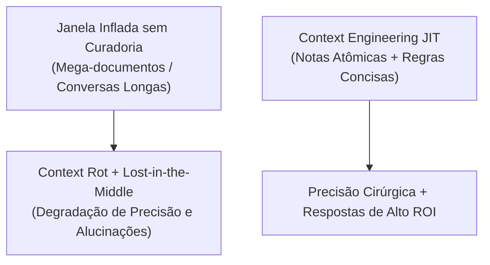
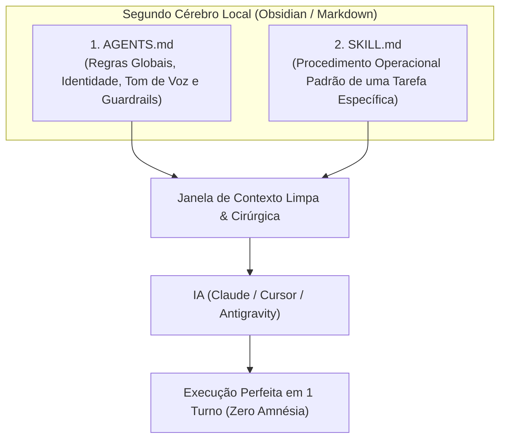

# 🧠 03. Engenharia de Contexto: O Córtex do Segundo Cérebro

> **Autor:** Arthur (Tutu)  
> **Trilha:** [[00 - IA na Prática — Guia Mestre|IA & O Segundo Cérebro (Espinha Dorsal — Etapa 03)]]  
> **Nível de Consciência:** Nível 2 ➔ Nível 3 (Do prompt avulso à persistência estruturada de conhecimento)  
> **Conexões:** → [[00 - IA na Prática — Guia Mestre]] | [[02 - IA na Prática — Prompting em 3 Partes]] | [[04 - IA na Prática — A Era dos Agentes e Automações]]  

---

## 🎯 Cabeçalho de Metas & Premissas

> **Tempo Estimado de Leitura:** 7 minutos  
> **Premissas Necessárias:**
> 1. Domínio da fórmula de prompting em 3 partes ([[02 - IA na Prática — Prompting em 3 Partes]]).
> 2. Clareza de que a IA não possui memória persistente entre conversas separadas no navegador.
>
> **O que você VAI aprender neste artigo:**
> - Por que a metáfora do **Gênio com Amnésia** explica o maior gargalo operacional do uso diário de IA.
> - A física dos tokens: por que mais de 90% do consumo atual de IA é leitura de contexto (*Input*), não geração (*Output*).
> - As duas grandes armadilhas de memória dos LLMs: *Lost-in-the-Middle* e *Context Rot*.
> - Como estruturar um córtex persistente no Obsidian usando a arquitetura de 2 arquivos (`AGENTS.md` + `SKILL.md`) para curar a amnésia da máquina.

---

## 🧭 Índice do Artigo
- [[#Ato 1: O 'Gênio com Amnésia' & O Ciclo do Desperdício de Tokens]]
- [[#Ato 2: O Gargalo Real — Extensão de Memória, Lost-in-the-Middle e Context Rot]]
- [[#Ato 3: A Arquitetura de 2 Arquivos — O Córtex Externo no Obsidian]]
- [[#Ato 4: Comparativo — O Usuário Amador vs. O Engenheiro de Contexto]]
- [[#Ato 5: Guia de Implementação Imediata]]
- [[#🔗 Próximo Passo na Trilha]]
- [[#🧬 Notas Co-ativadas & Conexões da Trilha]]

---

> *"Fluência em IA não é saber qual modelo usar. É saber exatamente o que colocar dentro da janela de contexto."*  
> — **Axioma da Engenharia de Contexto**

---

### Ato 1: O 'Gênio com Amnésia' & O Ciclo do Desperdício de Tokens

A inteligência artificial opera exatamente como um **gênio com amnésia que chega na sua empresa todas as manhãs**:

Ele possui um QI de 180, aprende qualquer problema complexo em frações de segundo e é capaz de refatorar sistemas inteiros. No entanto, toda vez que uma sessão é encerrada ou uma nova aba é aberta, ele bebe a poção do esquecimento e perde 100% da memória do que aconteceu antes.

Considere a rotina frustrante do usuário comum diante desse fenômeno:
1. Abre o ChatGPT ou Claude de manhã.
2. Digita cinco parágrafos explicando quem ele é, qual é a sua empresa, quais são as regras do projeto e o tom de voz desejado.
3. Faz duas perguntas, obtém a resposta e fecha a aba.
4. À tarde, abre uma nova conversa e **repete todo o processo de digitação do zero**.

Esse ciclo improdutivo é chamado de **Amnésia Operacional**.

Além de drenar sua energia mental, essa prática vai contra a própria física econômica da computação moderna:
* A razão de tokens de **Entrada (Input) vs. Saída (Output)** saltou de 4,5x para **12x**. Os modelos leem 12 vezes mais do que escrevem.
* **Mais de 90% dos tokens processados** são de contexto de entrada.
* **Mais de 70% do custo financeiro e de latência** decorre de como o contexto é alimentado na máquina.

A solução definitiva não é redigir redações explicativas a cada conversa, mas **registrar suas diretrizes, preferências e regras em arquivos Markdown (`.md`) curados**. Ao apontar o arquivo para a IA ler, o gênio se atualiza em 1 segundo e você economiza milhares de tokens de esforço e dinheiro.

---

### Ato 2: O Gargalo Real — Extensão de Memória, Lost-in-the-Middle e Context Rot

Um dos maiores mitos da indústria é que "janelas de contexto de 1 milhão de tokens resolveram todos os problemas". A realidade técnica é bem diferente.

Embora a máquina consiga carregar livros inteiros na memória, ela sofre de dois limites estruturais:

1. **Lost-in-the-Middle (Liu et al., 2024):**  
   Os LLMs dão prioridade estatística aos tokens posicionados no **início** (instruções de sistema) e no **fim** (a pergunta imediata) do prompt. Informações críticas soterradas no meio de um arquivo de 50 páginas perdem relevância e são frequentemente ignoradas.
2. **Context Rot (Degradação por Ruído — Chroma, 2025):**  
   Ao contrário do cérebro humano, que filtra ruídos intuitivamente, quanto mais texto desnecessário, logs velhos ou conversas passadas você empilha na janela da IA, **mais o raciocínio dela se degrada**. Contextos gigantescos sem curadoria atômica confundem a máquina e disparam alucinações.

O real ganho de IA está no **processamento veloz de informação curada**, não em despejar gigabytes de lixo na janela.

---

### Ato 3: A Arquitetura de 2 Arquivos — O Córtex Externo no Obsidian

Para curar a amnésia da IA sem sobrecarregar a janela de contexto, organizamos o conhecimento no Obsidian sob a **Arquitetura de Dois Arquivos**:

1. **`AGENTS.md` (A Constituição do seu Ecossistema):**  
   Um arquivo conciso na raiz que ensina à IA quem é você, quais são as restrições inegociáveis do seu cofre e como ela deve se comportar (ex: proibir bajulações de chatbot, usar português direto, salvar arquivos apenas em certas pastas).
2. **`SKILL.md` (O Manual Operacional de Cada Especialidade):**  
   Instruções modulares ativadas sob demanda para tarefas específicas (ex: revisar código, analisar balanços financeiros, criar roteiros de estudo ou checar links quebrados).

Quando você trabalha com arquivos Markdown estruturados, você não precisa ensinar a IA a trabalhar a cada mensagem: o contexto é carregado sob demanda (*Just-In-Time*), com precisão de laser.

---

### Ato 4: Comparativo — O Usuário Amador vs. O Engenheiro de Contexto

| Dimensão | Usuário Tradicional (Prompting Isolado) | Engenheiro de Contexto (Segundo Cérebro) |
| :--- | :--- | :--- |
| **Tratamento da Amnésia** | Reexplica premissas e contexto a cada nova conversa. | Aponta para arquivos `.md` persistentes no Obsidian. |
| **Volume de Tokens Gastos** | 80%+ do consumo em digitação redundante de entrada. | 90%+ do consumo em dados de alta densidade e valor. |
| **Consistência de Saída** | Respostas oscilantes, genéricas e instáveis. | Respostas padronizadas, alinhadas às regras do cofre. |
| **Escalabilidade** | Preso ao limite de sua velocidade de digitação. | Pronto para orquestrar agentes autônomos locais. |

---

### Ato 5: Guia de Implementação Imediata

Para implementar um córtex de contexto persistente na sua rotina hoje:

1. **Crie seu `AGENTS.md`:** Na raiz da sua pasta de trabalho, crie o arquivo com 3 blocos diretos:
   - *Quem sou eu e qual o objetivo deste ecossistema.*
   - *Regras de tom: Proibição de adulação, concisão cirúrgica e foco em dados.*
   - *Estrutura de pastas e onde salvar cada entrega.*
2. **Crie sua Primeira Skill (`skills/revisor/SKILL.md`):** Defina o passo a passo de como você deseja que seus textos ou análises sejam processados.
3. **Teste com seu Assistente Local:** Aponte seu assistente (Cursor, Antigravity ou Claude) para a pasta e execute um comando. Observe como ele assume a postura imediatamente sem que você precise digitar nenhuma introdução.

---

### 🔗 Próximo Passo na Trilha

Você transformou a IA em um especialista que conhece seu contexto e suas regras. Porém, você ainda está no controle manual de cada clique.

*Como dar o próximo salto e permitir que a IA execute tarefas de ponta a ponta — lendo arquivos, rodando validações e atualizando seus projetos de forma autônoma e segura?*

* → Avançar para a Etapa 04: [[04 - IA na Prática — A Era dos Agentes e Automações]]

---

### 🧬 Notas Co-ativadas & Conexões da Trilha
* **Guia Mestre da Trilha:** [[00 - IA na Prática — Guia Mestre]]
* **Etapa Anterior (Prompting em 3 Partes):** [[02 - IA na Prática — Prompting em 3 Partes]]
* **Próxima Etapa (Agentes e Automação):** [[04 - IA na Prática — A Era dos Agentes e Automações]]
* **Glossário Essencial de IA:** [[07 - IA na Prática — Glossário Essencial de IA e Contexto]]
