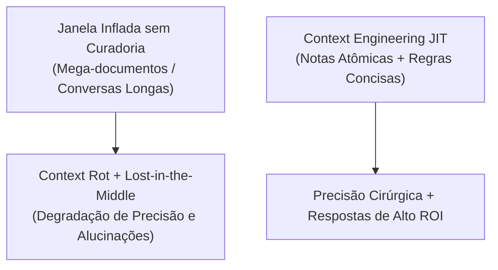
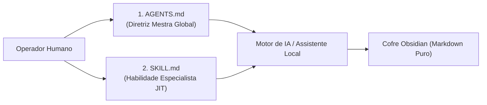

# 🧠 03. Engenharia de Contexto: O Córtex do Segundo Cérebro

> **Autor:** Arthur (Tutu)  
> **Trilha:** [[00 - IA na Prática — Guia Mestre|IA & O Segundo Cérebro (Espinha Dorsal — Etapa 03)]]  
> **Nível de Consciência:** Nível 2 ➔ Nível 3 (Do prompt avulso à persistência estruturada de conhecimento)  
> **Matriz de Referências:** [[Matriz de Referências Canônicas — Trilha IA e Segundo Cérebro]]  
> **Conexões:** → [[00 - IA na Prática — Guia Mestre]] | [[02 - IA na Prática — Prompting em 3 Partes]] | [[04 - IA na Prática — A Era dos Agentes e Automações]]  

---

## 🎯 Cabeçalho de Metas & Premissas

> **Tempo Estimado de Leitura:** 7 minutos  
> **Premissas Necessárias:**
> 1. Domínio da fórmula de prompting em 3 partes ([[02 - IA na Prática — Prompting em 3 Partes]]).
> 2. Clareza de que a IA não possui memória persistente entre conversas separadas no navegador.
>
> **O que você VAI aprender neste artigo:**
> - Por que *Context Engineering* superou o mero *Prompting* como a habilidade técnica mais valiosa da era da IA.
> - A física dos tokens: por que mais de 90% do consumo atual de IA é leitura de contexto (*Input*), não geração (*Output*).
> - As duas grandes armadilhas de memória dos LLMs: *Lost-in-the-Middle* e *Context Rot*.
> - Como estruturar um córtex persistente no Obsidian usando a arquitetura de 2 arquivos (`AGENTS.md` + `SKILL.md`).
>
> **O que você NÃO VAI aprender neste artigo:**
> - Orquestração de múltiplos agentes autônomos com execução de código (ver Artigo 04).

---

> *"Fluência em IA não é saber qual modelo usar. É saber exatamente o que colocar dentro da janela de contexto."*  
> — **Thiago Peraro (CEIA 2026) / Tobi Lütke**

---

### Ato 1: O Ciclo da Amnésia & O Desperdício de Tokens

Considere a rotina do usuário comum:
1. Ele abre o ChatGPT ou Claude de manhã.
2. Digita 5 parágrafos explicando quem ele é, qual é o seu projeto, quais são as regras da sua empresa e o tom de escrita desejado.
3. Faz duas perguntas, obtém a resposta e fecha a aba.
4. À tarde, abre uma nova conversa e **repete todo o processo do zero**.

Esse ciclo é chamado de **Amnésia Operacional**.

Além de queimar tempo humano, essa prática vai contra a própria economia da computação. Conforme demonstrado no *Cursor Developer Habits Report (2026)* e na palestra de [[Thiago Peraro — Segundo Cérebro e Context Engineering (CEIA 2026)|Thiago Peraro no CEIA 2026]]:
* A razão de tokens de **Entrada (Input) vs. Saída (Output)** saltou de 4,5x para **12x**. Os modelos leem 12 vezes mais do que escrevem.
* **Mais de 90% dos tokens processados** são de contexto de entrada.
* **Mais de 70% do custo financeiro e de latência** decorre de como o contexto é alimentado na máquina.

Quem não domina a injeção de contexto está queimando recursos e operando com 10% da eficiência possível.

---

### Ato 2: O Gargalo Real — Extensão de Memória, Lost-in-the-Middle e Context Rot

Um dos maiores mitos da indústria é que "janelas de contexto de 1 milhão de tokens resolveram todos os problemas". A realidade técnica é bem diferente.

Embora a máquina consiga carregar livros inteiros na memória, ela sofre de dois limites estruturais:

1. **Lost-in-the-Middle (Liu et al., 2024):**  
   Os LLMs dão prioridade estatística aos tokens posicionados no **início** (instruções de sistema) e no **fim** (a pergunta imediata) do prompt. Informações críticas soterradas no meio de um arquivo de 50 páginas perdem relevância e são frequentemente ignoradas.
2. **Context Rot (Degradação por Ruído — Chroma, 2025):**  
   Ao contrário do cérebro humano, que filtra ruídos intuitivamente, quanto mais texto desnecessário, logs velhos ou conversas passadas você empilha na janela da IA, **mais o raciocínio dela se degrada**. Contextos gigantescos sem curadoria atômica confundem a máquina e disparam alucinações.



O real ganho de IA está no **processamento veloz de informação curada**, não em despejar gigabytes de lixo na janela.

---

### Ato 3: A Arquitetura de 2 Arquivos (`AGENTS.md` + `SKILL.md`)

Para resolver a amnésia da IA sem sobrecarregar a janela de contexto, você não precisa de bancos de dados vetoriais complexos. Você só precisa de **dois arquivos em Markdown** ancorados no seu cofre local (Obsidian):



1. **`AGENTS.md` (A Diretriz Mestra Global):**  
   Fica na raiz do seu ecossistema. Contém as regras permanentes: seu perfil, o tom de comunicação, as restrições negativas (anti-adulação) e a governança de pastas. É lido automaticamente em toda sessão.
2. **`SKILL.md` (A Habilidade Especialista Just-in-Time):**  
   Fica em pastas de processos (`skills/<nome-da-skill>/`). Contém o passo a passo de uma tarefa específica (ex: *como revisar um contrato*, *como fatiar um livro*, *como gerar um relatório financeiro*). É carregado na memória apenas quando a tarefa correspondente é acionada.

Essa separação garante que a IA tenha memória de longo prazo sem sofrer de *Context Rot*.

---

### Ato 4: A Taxonomia Canônica do Segundo Cérebro

Para que a IA e os agentes naveguem no seu computador com precisão, o seu cofre local deve seguir uma estrutura funcional limpa. Adote a tríade canônica:

```
📁 meu-segundo-cerebro/
├── 📄 AGENTS.md        → Regras globais, tom de voz e governança.
├── 📁 plans/           → Planos abertos, pendências e projetos em andamento.
├── 📁 knowledge/       → Referências consolidadas, dados históricos e notas conceituais.
├── 📁 skills/          → Roteiros de processos (`SKILL.md`) e automações executáveis.
└── 📄 DECISIONS.md     → Log consolidado de decisões tomadas (ADRs).
```

Quando você pede para a IA *"analisar o plano do projeto X sob o processo Y"*, ela não precisa varrer o disco todo: ela lê `plans/projeto-x.md`, carrega `skills/processo-y/SKILL.md` e entrega o resultado com precisão matemática.

---

### Ato 5: Guia de Implementação Prática (Instalando seu Córtex em 3 Passos)

1. **Crie seu `AGENTS.md`:** Na raiz da sua pasta de trabalho, crie o arquivo com 3 blocos:
   - *Quem sou eu e qual o objetivo deste ecossistema.*
   - *Regras de tom: Proibição de adulação, concisão cirúrgica e foco em dados.*
   - *Onde cada tipo de arquivo deve ser salvo.*
2. **Crie sua Primeira Skill (`skills/revisor/SKILL.md`):** Defina o passo a passo de como você deseja que seus textos ou códigos sejam auditados.
3. **Teste com seu Assistente Local:** Aponte seu assistente (Cursor, Antigravity ou Claude) para o cofre e execute um comando. Observe como ele assume a postura imediatamente sem que você precise digitar nenhuma introdução.

---

### 🔗 Próximo Passo na Trilha (Loop Aberto & CTA)

Você transformou a IA em um especialista que conhece seu contexto e suas regras. Porém, você ainda está no controle manual de cada clique.

Como dar o próximo salto e permitir que a IA execute tarefas de ponta a ponta — lendo arquivos, rodando validações e atualizando seus projetos de forma autônoma e segura?

* → Avançar para a Etapa 04: [[04 - IA na Prática — A Era dos Agentes e Automações]]

---

### 🧬 Notas Co-ativadas & Fontes Canônicas
* **Guia Mestre da Trilha:** [[00 - IA na Prática — Guia Mestre]]
* **Matriz Canônica de Fontes:** [[Matriz de Referências Canônicas — Trilha IA e Segundo Cérebro]]
* **Palestra de Referência:** [[Thiago Peraro — Segundo Cérebro e Context Engineering (CEIA 2026)]]
* **Fundamentos do KM:** [[AI-KM Operating System — Arquitetura Agnóstica para Segundo Cérebro, KM e Agentes]], [[Agent Memory — Fixing AI Amnesia]], [[Cognitive Offloading]]
* **Glossário Essencial:** [[07 - IA na Prática — Glossário Essencial de IA e Contexto]]
