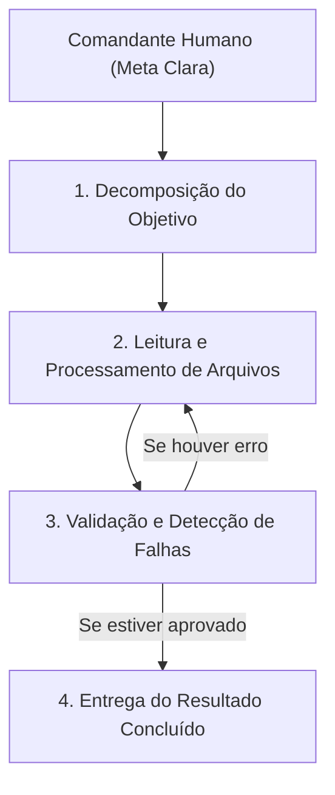
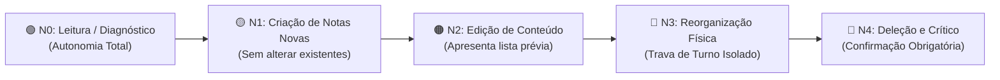

# 🤖 04. Agentes e Automação: A Era da Ação Autônoma

> **Autor:** Arthur (Tutu)  
> **Trilha:** [[00-ia-na-pratica-guia-mestre|IA & O Segundo Cérebro (Espinha Dorsal — Etapa 04)]]  
> **Nível de Consciência:** Nível 3 ➔ Nível 4 (Do contexto persistente à orquestração agêntica soberana)  
> **Conexões:** → [[00-ia-na-pratica-guia-mestre|00 - IA na Prática — Guia Mestre]] | [[03-ia-na-pratica-o-operador-no-comando-e-contexting|03 - IA na Prática — O Operador no Comando e Contexting]] | [[08-ia-na-pratica-casos-reais-e-replicaveis-do-vault|08 - IA na Prática — Casos Reais e Replicáveis do Vault]]  

---

## 🎯 Cabeçalho de Metas & Premissas

> **Tempo Estimado de Leitura:** 8 minutos  
> **Premissas Necessárias:**
> 1. Domínio da injeção de contexto e organização de pastas em Markdown ([[03-ia-na-pratica-o-operador-no-comando-e-contexting|03 - IA na Prática — O Operador no Comando e Contexting]]).
>
> **O que você VAI aprender neste artigo:**
> - O salto de chats de turno único para sistemas de múltiplos loops iterativos (*AI Loops*).
> - Como o ecossistema local (Obsidian + Markdown + Assistente Agêntico) opera sem depender de nuvens fechadas.
> - A matriz de governança e disjuntores de segurança por níveis de risco (Travas N0 a N4).
> - As 6 Camadas de um Segundo Cérebro AI-First.
> - O Actionable Kit Plug-and-Play para ativar seu primeiro agente em 5 minutos.

---

## 🧭 Índice do Artigo
- [[#Ato 1: O Salto Lógico — De Chats Reativos para Loops de Agência]]
- [[#Ato 2: O Ecossistema Local (Obsidian + Markdown + Motor Agêntico)]]
- [[#Ato 3: O Perigo da Autonomia Cega & A Governança de Travas (N0 a N4)]]
- [[#Ato 4: As 6 Camadas do Segundo Cérebro AI-First]]
- [[#Ato 5: Actionable Kit Plug-and-Play (Ative seu Agente em 5 Minutos)]]
- [[#🔗 Próximo Passo na Trilha]]
- [[#🧬 Notas Co-ativadas & Conexões da Trilha]]

---

> *"A verdadeira virada agêntica não é empilhar bots sobre processos burocráticos legados. É ter a coragem de redesenhar o fluxo de trabalho ao redor da IA."*  
> — **Thiago Peraro (CEIA 2026)**

---

### Ato 1: O Salto Lógico — De Chats Reativos para Loops de Agência

Até aqui, você operou a IA em uma dinâmica de **Turno Único Reativo**: você digita uma mensagem no navegador, a máquina responde com um bloco de texto estático e o fluxo é interrompido. Se a resposta contiver um erro ou exigir salvar um arquivo, você precisa intervir manualmente.

A **Era dos Agentes** rompe essa barreira mecânica. Um Agente de IA não é apenas um chatbot; é um sistema autônomo com capacidade de:

1. **Interpretar um objetivo amplo:** *"Revise as 5 notas da pasta de projetos, identifique conflitos de prazos e gere uma tabela consolidada."*
2. **Decompor a tarefa em etapas lógicas:** Planejar a ordem de execução.
3. **Executar loops de ação (*AI Loops*):** Ler o arquivo no computador, processar o conteúdo, chamar ferramentas locais, testar a saída e corrigir eventuais erros antes de entregar o resultado final.



---

### Ato 2: O Ecossistema Local (Obsidian + Markdown + Motor Agêntico)

Para rodar agentes de alta produtividade sem fricção técnica nem dependência de fornecedores fechados, você precisa de apenas dois pilares no seu computador:

1. **O Banco de Dados Soberano (Obsidian):**  
   Suas notas, regras e projetos salvos em arquivos puros de texto (`.md`), versionados com Git e organizados nas 3 pastas funcionais (`plans/`, `knowledge/`, `skills/`).
2. **O Motor Agêntico Local (IDE ou CLI):**  
   Assistentes agênticos locais (como Antigravity, Cursor, Claude Desktop + MCP ou Goose CLI) que têm permissão para ler seus arquivos locais, navegar pelas pastas e executar tarefas em lote com velocidade de máquina.

Como todo o conhecimento reside em arquivos Markdown locais, você não fica refém de assinaturas de SaaS que podem bloquear seus dados ou mudar termos de uso da noite para o dia.

---

### Ato 3: O Perigo da Autonomia Cega & A Governança de Travas (N0 a N4)

Dar autonomia a um agente não significa conceder "carta branca" irrestrita. Um agente autônomo sem travas pode entrar em loops alucinatórios, sobrescrever arquivos importantes ou deletar notas por engano.

Para blindar seu ambiente, adote a **Matriz de Governança por Níveis de Risco**:



* **🟢 N0 (Leitura & Diagnóstico):** O agente tem liberdade total para ler notas, buscar padrões, contar arquivos e gerar relatórios no chat sem pedir permissão.
* **🟡 N1 (Criação Isolada):** O agente pode criar novos rascunhos em pastas transitórias.
* **🟠 N2 (Edição de Conteúdo):** O agente só edita notas existentes após listar no chat quais arquivos serão alterados.
* **🔴 N3 (Movimentações e Renomeações):** Exige **Disjuntor de Turno Isolado**: o agente apresenta a proposta de movimentação e para a execução, aguardando aprovação explícita no turno seguinte.
* **🛑 N4 (Deleções Físicas e Regras Críticas):** Proibição total de deleção em lote ou alteração de diretrizes sem autorização pontual do Comandante.

---

### Ato 4: As 6 Camadas do Segundo Cérebro AI-First

Um ecossistema cognitivo maduro opera sobre **6 camadas integradas**:

1. **Camada 1: Knowledge-as-Code:** Toda nota é um arquivo Markdown com frontmatter YAML no Git.
2. **Camada 2: Context Engineering Aplicado:** Resumos de alta densidade e revelação progressiva (*Progressive Disclosure*).
3. **Camada 3: Confidence Scoring:** Notas possuem scores de maturidade de 0.0 a 1.0, impedindo que dados crus sejam tratados como verdades canônicas.
4. **Camada 4: Multi-Agent Swarm:** Especialistas autônomos para tarefas distintas (pesquisa, auditoria, finanças).
5. **Camada 5: Autonomous Triggers:** Automações disparadas por contexto ou cronogramas.
6. **Camada 6: Human-in-the-Loop:** O operador humano retém o julgamento moral, o bom gosto e o disjuntor final.

---

### Ato 5: Actionable Kit Plug-and-Play (Ative seu Agente em 5 Minutos)

Para começar a operar hoje, copie os dois blocos estruturais abaixo no seu cofre:

#### Bloco 1: Regras Globais (`.agents/AGENTS.md`)
```markdown
# 🧠 Diretrizes do Meu Segundo Cérebro

1. **Soberania dos Dados:** Você é um assistente agêntico atachado às minhas notas locais em Markdown. Nunca delete ou mova arquivos sem minha confirmação explícita.
2. **Zero Muletas Sociais:** Não inicie respostas com elogios ("Excelente pergunta"). Inicie diretamente no diagnóstico técnico ou dado numérico.
3. **Taxonomia Rígida:** Respeite a estrutura de pastas:
   - `plans/`: Planos em aberto e execuções futuras.
   - `knowledge/`: Referências consolidadas e notas conceituais.
   - `skills/`: Roteiros de processos e automações.
   - `DECISIONS.md`: Log histórico de decisões.
4. **Tom do Operador:** Conciso, direto, focado em utilidade prática e imune a adulação.
```

#### Bloco 2: Skill de Auditoria (`skills/auditoria-rascunhos/SKILL.md`)
```markdown
---
name: auditoria-rascunhos
description: Lê rascunhos em plans/ e aponta falhas lógicas, clichês e pontos cegos.
---

# 🔍 Skill: Auditoria de Rascunhos

Quando acionado, execute:
1. **Varredura N0:** Leia a nota indicada na pasta `plans/`.
2. **Diagnóstico:** Identifique 3 trechos com excesso de palavras, jargões corporativos ou argumentos fracos.
3. **Proposta:** Entregue uma versão lapidada e concisa no chat, aguardando minha aprovação antes de salvar.
```

---

### 🔗 Próximo Passo na Trilha

Você completou a jornada central da Espinha Dorsal: compreendeu a física dos LLMs, dominou o prompting em 3 partes, instalou seu córtex de contexto e aprendeu a governar agentes autônomos com segurança.

Agora, explore as Sidequests especializadas para aprofundar seu discernimento crítico, consultar a terminologia técnica e inspirar-se em casos reais:

* → Consultar o [[07-ia-na-pratica-glossario-essencial-de-ia-e-contexto|07 - IA na Prática — Glossário Essencial de IA e Contexto]]
* → Explorar os [[08-ia-na-pratica-casos-reais-e-replicaveis-do-vault|08 - IA na Prática — Casos Reais e Replicáveis do Vault]]
* → Entender o perigo do [[05-ia-na-pratica-ai-slop-e-o-pos-soberano|05 - IA na Prática — AI Slop e o POS Soberano]]
* → Dominar o pensamento socrático em [[06-ia-na-pratica-a-maieutica-da-dissonancia-cognitiva|06 - IA na Prática — A Maiêutica da Dissonância Cognitiva]]

---

### 🧬 Notas Co-ativadas & Conexões da Trilha
* **Guia Mestre da Trilha:** [[00-ia-na-pratica-guia-mestre|00 - IA na Prática — Guia Mestre]]
* **Etapa Anterior (Engenharia de Contexto):** [[03-ia-na-pratica-o-operador-no-comando-e-contexting|03 - IA na Prática — O Operador no Comando e Contexting]]
* **Glossário Essencial:** [[07-ia-na-pratica-glossario-essencial-de-ia-e-contexto|07 - IA na Prática — Glossário Essencial de IA e Contexto]]
* **Casos Reais do Vault:** [[08-ia-na-pratica-casos-reais-e-replicaveis-do-vault|08 - IA na Prática — Casos Reais e Replicáveis do Vault]]
