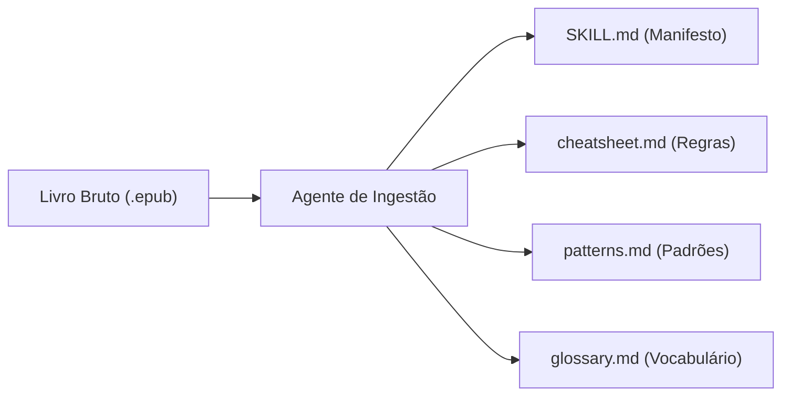

# 🛠️ 08. Casos Reais e Replicáveis do Segundo Cérebro

> **Autor:** Arthur (Tutu)  
> **Trilha:** [[00 - IA na Prática — Guia Mestre|IA & O Segundo Cérebro (Sidequest 4 — Casos Práticos)]]  
> **Conexões:** → [[00 - IA na Prática — Guia Mestre]] | [[04 - IA na Prática — A Era dos Agentes e Automações]] | [[Matriz de Referências Canônicas — Trilha IA e Segundo Cérebro]]  

---

## 🎯 Cabeçalho de Metas & Premissas

> **Premissas Necessárias:**
> - Compreensão do conceito de Segundo Cérebro como banco de dados local em Markdown ([[03 - IA na Prática — O Operador no Comando e Contexting]]).
> - Clareza de que agentes locais operam sobre arquivos do disco através de instruções estruturadas ([[04 - IA na Prática — A Era dos Agentes e Automações]]).
>
> **O que você VAI aprender neste artigo:**
> - Como aplicar IA na vida real para além de perguntas genéricas no navegador.
> - 3 arquiteturas reais em produção: Ingestão de Livros em Book Skills, Auditoria de Grafos e Conciliação Financeira.
> - O roteiro para implementar seu primeiro fluxo replicável hoje.

---

## 🏛️ A Virada Prática: Do Chat Abstrato para a Infraestrutura Local

A maioria das pessoas utiliza IA abrindo uma aba do navegador, colando uma dúvida e fechando a janela. No dia seguinte, todo o histórico evaporou, a IA esqueceu quem é o usuário e a rotina recomeça do zero.

A verdadeira virada de produtividade ocorre quando você conecta o modelo de linguagem a uma infraestrutura de arquivos locais (**Knowledge-as-Code**). Ao manter suas notas, regras e projetos em arquivos Markdown (`.md`) organizados no Obsidian, a IA deixa de ser um brinquedo casual e passa a operar como um colaborador autônomo com memória persistente.

Abaixo estão **3 casos reais em produção** construídos sobre essa exata arquitetura.

---

## 📚 Caso 1: Ingestão e Fatiamento de Livros (De ePub a Mentor Agêntico)

### O Problema Clássico
Você lê um livro de 300 páginas sobre finanças ou estratégia. Três meses depois, lembra apenas de 5% do conteúdo. As anotações ficaram perdidas em cadernos físicos ou em PDFs estáticos.

### A Solução com IA
Criamos uma automação agêntica (`ingestao-livros`) que processa o arquivo `.epub` do livro e o descontrói em **4 artefatos modulares padronizados**:
1. `SKILL.md`: O manifesto da obra com o modelo mental do autor e gatilhos de acionamento.
2. `cheatsheet.md`: As regras de decisão rápidas e checklists operacionais.
3. `patterns.md`: Os padrões de comportamento recomendados e armadilhas a evitar.
4. `glossary.md`: O vocabulário específico do autor.

### O Ganho de ROI
O livro deixa de ser um texto morto e vira uma **Book Skill**. Quando precisamos tomar uma decisão estratégica sobre negócios ou finanças, podemos invocar o agente e instruí-lo: *"Avalie este projeto estritamente sob os frameworks de Peter Drucker ou Nassim Taleb cadastrados na Biblioteca"*. O agente carrega os 4 artefatos na janela de contexto e responde com a voz e os critérios do autor.

---

## 🔍 Caso 2: Auditoria Mecânica e Saúde de Grafos Zettelkasten

### O Problema Clássico
Conforme um cofre pessoal atinge milhares de notas interligadas, o grafo começa a sofrer com links quebrados (erros de digitação), notas órfãs (isoladas sem conexão) e duplicações conceituais. Fazer essa manutenção manualmente consome horas de trabalho burocrático.

### A Solução com IA
Implementamos agentes de auditoria (`auditoria-grafos` e `saude-e-grafos-vault`) operando em modo **Somente Leitura (N0)**:
- Fazem a varredura bidirecional em 100% dos arquivos do cofre.
- Resolvem cada link `[[Nome da Nota]]` contra o sistema de arquivos físico.
- Detectam links quebrados e geram relatórios com métrica **BLR (Broken Link Ratio = 0.0%)**.
- Calculam a maturidade de cada nota através de scores de confiança YAML.

### O Ganho de ROI
Manutenção preventiva instantânea. Um comando executa a varredura de mais de 2.000 notas em segundos, garantindo que o Segundo Cérebro permaneça um grafo hiperconectado e 100% íntegro sem esforço braçal.

---

## 💳 Caso 3: Conciliação Financeira Imutável (OFX e Faturas PDF)

### O Problema Clássico
Planilhas financeiras manuais morrem no segundo mês porque o atrito de digitar cada cafezinho e categorizar 80 compras do cartão de crédito é insustentável.

### A Solução com IA
O fluxo (`financas-importacao`) recebe o arquivo bruto de extrato bancário (`.ofx`) e a fatura em PDF do cartão:
1. Um script Python local extrai os dados brutos de transações com data, estabelecimento e valor.
2. A IA aplica a matriz de categorização fixa (Alimentação, Moradia, Saúde, Assinaturas), eliminando ambiguidades.
3. O relatório mensal é gerado automaticamente em Markdown, com tabelas detalhadas e comparativos históricos.

### O Ganho de ROI
A gestão financeira mensal foi reduzida para **menos de 5 minutos**. Basta baixar os extratos da conta e rodar o fluxo. A categorização é consistente, imutável e armazenada localmente sem expor dados confidenciais a serviços terceiros inseguros.

---

## 🚀 Como Começar no Seu Computador (Actionable ROI em 3 Passos)

Você não precisa de sistemas complexos para começar. Siga este roteiro mínimo:

1. **Instale o Obsidian:** Crie um cofre local e adote a taxonomia de 3 pastas fundamentais:
   - `plans/`: Projetos e tarefas em andamento.
   - `knowledge/`: Notas conceituais, resumos de livros e referências consolidadas.
   - `skills/`: Seus roteiros de processos e instruções de prompts.
2. **Defina suas Regras de Instrução (`AGENTS.md`):** Crie um arquivo central na raiz do cofre definindo o seu tom, suas preferências e o que a IA deve priorizar ao te ajudar.
3. **Use a IA como Processador de Arquivos:** Ao trabalhar em um projeto, abra seu assistente agêntico local (Cursor, Antigravity ou Cline), aponte para a nota relevante e peça para ela sintetizar, formatar ou validar o conteúdo diretamente no disco.

---

## 🧬 Conexões e Referências
- **Hub Mestre da Trilha:** [[00 - IA na Prática — Guia Mestre]]
- **Plano Mestre:** [[Plano Mestre — Trilha de IA e Segundo Cérebro]]
- **Matriz Canônica:** [[Matriz de Referências Canônicas — Trilha IA e Segundo Cérebro]]
- **Artigo de Agentes:** [[04 - IA na Prática — A Era dos Agentes e Automações]]
