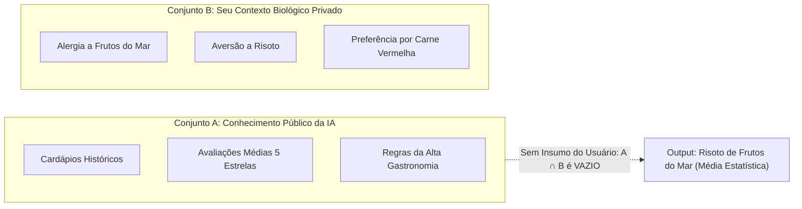

# 🎲 Experimento Mental — O Chute Estatístico e a Ilusão de Certeza da IA

> **Autor:** Arthur (Tutu)  
> **Trilha:** [[00 - IA na Prática — Guia Mestre|IA & O Segundo Cérebro (Sidequest de Fundamentos)]]  
> **Artigo Relacionado:** ← [[01 - IA na Prática — Amplificação vs Substituição]]  

---

## 🎯 O Cenário: O Garçom Onisciente com Venda nos Olhos

Imagine que você entra em um restaurante de alta gastronomia internacional. O garçom que o atende leu todos os livros de culinária já publicados, memorizou os cardápios dos últimos 500 anos e conhece a composição química exata de 100.000 ingredientes.

Você se senta à mesa e faz um pedido simples:
> *"Por favor, me traga o prato que eu vou achar mais saboroso hoje."*

O garçom sorri, não faz nenhuma pergunta adicional e, 20 minutos depois, coloca diante de você um refinadíssimo **risoto de frutos do mar com raspas de trufas negras**. Ele descreve o prato com uma eloquência impecável: explica a textura do arroz arbóreo, a acidez perfeita do vinho branco e a harmonia das especiarias.

A explicação é fascinante. O problema? **Você é severamente alérgico a camarão e odeia risoto.**

---

## 🔍 A Física do Erro: Teoria dos Conjuntos na Prática

Por que o garçom agiu dessa forma? Ele não mentiu, não foi negligente e não tentou sabotar sua refeição.

Ele operou sob a lógica da **Teoria dos Conjuntos**:

1. **O Universo da Máquina (Conjunto A):** O garçom consultou o conjunto de todos os pratos mais elogiados estatisticamente por críticos gastronômicos no mundo. Na média do conjunto, o risoto de frutos do mar tem uma probabilidade altíssima de agradar.
2. **O Seu Universo Privado (Conjunto B):** Suas restrições imunológicas e suas preferências sensoriais pertencem a um conjunto privado ao qual o garçom **não tem acesso físico**.
3. **A Ilusão de Certeza:** Como a função do garçom é entregar uma resposta articulada e não admitir o silêncio, ele entrega a **média ponderada do Conjunto A**, mascarada por uma retórica sofisticada.

---

## 🎵 O Segundo Teste: A Playlist Impossível

O mesmo fenômeno ocorre na música. Se você pedir a uma IA:
> *"Recomende uma música que vai mudar a minha vida."*

Ela vasculhará o conjunto de dados em busca das músicas mais citadas na história da cultura pop (*Bohemian Rhapsody*, *Imagine*, ou a *Nona Sinfonia de Beethoven*). Ela descreverá os acordes e o contexto histórico com riqueza poética.

Se você estiver em um momento de introspecção e buscando um solo obscuro de violão clássico, a sugestão da IA soará desconectada e genérica. Não porque a música seja ruim, mas porque a IA **está chutando a média da humanidade** para cobrir a ausência das suas variáveis individuais.

---

## 🧠 A Moral do Experimento: Por que a Verificação Humana é Inegociável

Este experimento mental revela a verdadeira mecânica dos Modelos de Linguagem (LLMs):

1. **A IA Sempre Chuta:** Quando não recebe dados específicos, a máquina não hesita nem avisa que faltam premissas; ela escolhe o próximo token mais provável com base na média dos textos da internet.
2. **Elegância Não é Verdade:** A gramática impecável e a segurança do tom são propriedades matemáticas do modelo estatístico, não garantias de que o fato corresponde à realidade física ou às suas necessidades.
3. **O Papel do Comandante:** Você nunca deve terceirizar a decisão final para o modelo. A utilidade da IA depende diretamente de **quantas variáveis do seu contexto privado (Conjunto B)** você foi capaz de injetar na conversa.

---

### 🧬 Conexões e Referências
* **Artigo Central da Trilha:** [[01 - IA na Prática — Amplificação vs Substituição]]
* **Guia Mestre:** [[00 - IA na Prática — Guia Mestre]]
* **Próxima Etapa da Trilha:** [[02 - IA na Prática — Prompting em 3 Partes]]
