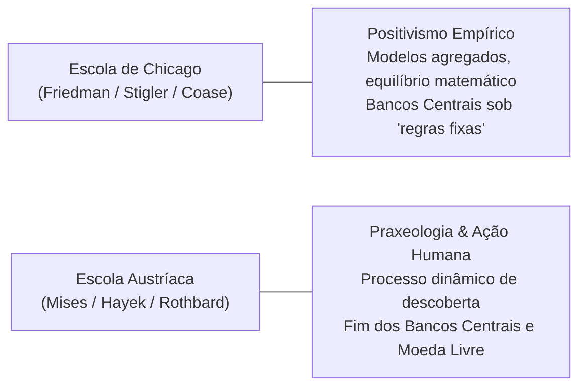

---
aliases:
  - questao-coase-vs-samuelson-chicago-vs-austriacos
title: "Coase vs Samuelson: O Custo de Transação"
tipo: semente
dominio: carreira_autoridade
status: ativo
confidence: 1.0
publish: true
tags:
  - wiki
  - semente
  - economia
  - coase
  - samuelson
  - custos-de-transacao
  - escola-austriaca
  - chicago
created_at: 2026-09-22
---

# ❓ Coase vs Samuelson: O Custo de Transação

> **Origem da Faísca:** [[Audio_2026-09-22_131953|Áudio 22/09/2026 13:19]]  
> **Trilha Vinculada:** [[00-economia|Trilha 2: Economia e Antifragilidade]]  
> **Conexões Estruturais:** [[01-as-6-licoes]] (Trilha 2), [[02-austriaca-vs-keynesianismo]] (Trilha 2), [[curva-de-phillips]] (Trilha 2) e [[04-o-dilema-principal-agente-e-as-falhas-de-governo]] (Trilha 11)  

---

## ⚡ A Ilusão das "Falhas de Mercado" de Samuelson e a Resposta de Coase

Por quase meio século, a síntese neoclássica liderada por Paul Samuelson ensinou às universidades que o livre mercado era inerentemente defeituoso devido às chamadas **externalidades** e à existência de **bens públicos**. Se uma fábrica polui um rio ou se um farol beneficia navegantes que não pagam por ele, o mercado supostamente falha, justificando a imposição de taxas pigouvianas, subsídios ou estatização direta.

Ronald Coase desmontou esse dogma intervencionista no clássico *The Problem of Social Cost* (1960). Coase provou que o problema das externalidades não é uma falha ética ou intrínseca do mercado, mas sim a **indefinição de direitos de propriedade** e o peso dos **custos de transação**.

Se os direitos de propriedade sobre um recurso forem claramente demarcados e negociáveis, e se os custos de negociar forem baixos, as partes envolvidas chegarão voluntariamente à solução mais eficiente, independentemente de quem detém o direito inicial. O governo, ao intervir com regulações monolíticas, frequentemente eleva os custos de transação ao infinito, impedindo a negociação privada e perpetuando o conflito que alegava resolver.

---

## 💥 Escola de Chicago vs Escola Austríaca: Duas Defesas, Dois Mundos Metodológicos

Embora tanto a Escola de Chicago (Friedman, Stigler, Coase) quanto a Escola Austríaca (Mises, Hayek, Rothbard) convirjam na defesa da liberdade individual e na denúncia da tirania estatal, a semelhança termina no diagnóstico político. Seus fundamentos epistemológicos são polos opostos:

1. **Escola de Chicago (Positivismo Empírico):**
   * *Método:* Enxerga a economia como uma ciência empírica similar à física. Para Milton Friedman (*Essays in Positive Economics*), uma teoria não é julgada pelo realismo de suas premissas, mas pelo sucesso de suas previsões matemáticas.
   * *Moeda e Estado:* Aceita a existência do Estado como árbitro monetário e defende que o Banco Central deve expandir a base monetária a uma taxa rígida e previsível (K-percent rule).

2. **Escola Austríaca (Praxeologia e Descoberta Dinâmica):**
   * *Método:* Rejeita a pretensão de medir a consciência humana com fórmulas estatísticas. A economia é deduzida a partir do axioma indestrutível da **Ação Humana** (Mises): indivíduos agem deliberadamente empregando meios escassos para atingir fins subjetivos no tempo.
   * *O Mercado como Processo:* O mercado nunca está em "equilíbrio estático"; é um fluxo incessante de tentativa, erro e aprendizado mediado pelo sistema de preços (Hayek).
   * *Moeda:* Demonstra que qualquer Banco Central é um comitê central de planejamento soviético da taxa de juros, responsável primário pelos ciclos de euforia e recessão. A solução austríaca é a desestatização total da moeda (padrão-ouro e moedas privadas competitivas).

Chicago tenta aperfeiçoar a gestão do Estado; a Escola Austríaca demonstra que a própria intervenção estatal impede o cálculo econômico racional.

---

## 🔬 Gatilhos de Evidência & Checagem Factual (Passaporte para Broto/Sidequest)

| Afirmação / Ponto Crítico | Tipo de Evidência | Questão Específica (Quem, Onde, Quando) | Fonte Canônica de Checagem |
| :--- | :--- | :--- | :--- |
| **O Teorema de Coase** | Artigo Canônico de Economia | Como Coase formulou a reciprocidade do dano em disputas de vizinhança e custos de transação? | *The Problem of Social Cost* (Ronald Coase, Journal of Law and Economics, 1960) |
| **A Teoria dos Bens Públicos** | Neoclássico Formal | De que forma Samuelson formalizou a condição de eficiência para provisão de bens públicos puros? | *The Pure Theory of Public Expenditure* (Paul Samuelson, 1954) |
| **A Divergência Metodológica** | Filosofia da Ciência Econômica | Qual a refutação de Mises ao positivismo de Friedman sobre testes econométricos na ação humana? | *Ação Humana* (Ludwig von Mises, 1949, Introdução e Cap. II) |

---

## ❓ Questões Abertas para Discussão

1. Em disputas digitais modernas (direitos autorais de IA, privacidade de dados ou alocação de espectro), como o Teorema de Coase poderia desenhar mercados voluntários sem a tutela de agências reguladoras?
2. Por que a formação acadêmica tradicional privilegia o modelo de Samuelson — ensinando jovens que o Estado precisa "corrigir falhas" — em detrimento da teoria de custos de transação e falhas de governo?
3. Se a Escola de Chicago ainda concede ao Estado o poder de emitir e regular a moeda, não estaria ela plantando a semente da própria inflação que seus economistas criticam?

---

## 🧬 Notas Co-ativadas (Sinapses)

* [[01-as-6-licoes]]: O papel primordial dos preços livres no cálculo de lucros e perdas.
* [[02-austriaca-vs-keynesianismo]]: A crítica ao agregacionismo macroeconômico e aos modelos de equilíbrio.
* [[curva-de-phillips]]: A falácia das soluções monetárias artificiais e o custo invisível do Estado.
* [[04-o-dilema-principal-agente-e-as-falhas-de-governo]]: As falhas de governo que superam qualquer falha de mercado teórica.
* [[Corpus de Voz Autoral — Arthur Melo]]: Rigor analítico, distinção epistemológica e desmistificação do intervencionismo.
