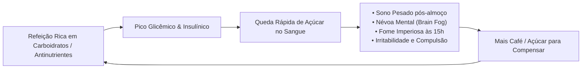

# ⚡ 01. A Falsa Normalidade do Cansaço e a Inflamação Oculta

> **Autor:** Arthur (Tutu)  
> **Trilha:** [[00-nutricao-ancestral-e-terapeutica-de-eliminacao-guia-mestre|Nutrição Ancestral & Terapêutica de Eliminação (Espinha Dorsal — Etapa 01)]]  
> **Nível de Consciência:** Nível 0 ➔ Nível 1 (Da inconsciência dos sintomas diários à identificação da inflamação alimentar)  
> **Conexões:** → [[00-nutricao-ancestral-e-terapeutica-de-eliminacao-guia-mestre|00 - Nutrição Ancestral & Terapêutica de Eliminação — Guia Mestre]] | → [[02-dieta-carnivora-fundamentos-antinutrientes-e-densidade-heme|02 - Dieta Carnívora — Fundamentos, Antinutrientes e Densidade Heme]]  

---

## 🎯 Cabeçalho de Metas & Premissas

> **Tempo Estimado de Leitura:** 7 minutos  
> **Premissas Necessárias:**
> 1. Disposição para questionar hábitos alimentares considerados "saudáveis" pela sabedoria popular.
> 2. Honestidade para avaliar o próprio nível de energia, digestão e clareza mental ao longo do dia.
>
> **O que você VAI aprender neste artigo:**
> - Por que sentir sono pesado após o almoço e névoa mental às 15h NÃO é um traço normal do envelhecimento.
> - A montanha-russa biológica de picos e quedas de glicose/insulina que rouba o seu foco diário.
> - A diferença entre alimento denso e calorias inflamatórias na parede intestinal.
> - O que a pesquisa de Harvard com mais de 2.000 pessoas revelou sobre a eliminação de alimentos modernos.

---

## 🧭 Índice do Artigo
- [[#Ato 1: O Padrão Oculto da Fadiga Subclínica]]
- [[#Ato 2: A Montanha-Russa da Glicose e a Névoa Mental]]
- [[#Ato 3: A Guerra na Parede Intestinal (Inflamação de Baixo Grau)]]
- [[#Ato 4: O Estudo de Harvard — A Evidência e a Leitura Aplicada]]
- [[#Ato 5: O Checklist de Autoavaliação em 60 Segundos]]
- [[#🔗 Próximo Passo na Trilha]]
- [[#🧬 Notas Co-ativadas & Conexões da Trilha]]

---

> *"Nós nos acostumamos tanto a operar com 50% da nossa capacidade biológica que passamos a chamar a disfunção crônica de 'estilo de vida'."*  
> — **Princípio da Clareza Metabólica**

---

### Ato 1: O Padrão Oculto da Fadiga Subclínica

Observe a rotina média de uma pessoa moderna:

Ela acorda cansada, necessita de uma dose imediata de cafeína para começar a pensar, toma um café da manhã com pães ou cereais e começa o trabalho. Às 10h30 sente uma queda de energia e busca um lanche. Ao meio-dia, faz uma refeição tradicional (arroz, feijão, salada com sementes e alguma proteína magra).

Trinta minutos após o almoço, ocorre o inevitável: **o peso nas pálpebras, a letargia digestiva, a distensão abdominal e a incapacidade de realizar trabalho intelectual profundo**.

A maioria das pessoas normaliza esse ciclo. Dizem a si mesmas: *"É o estresse do trabalho"*, *"É a idade chegando"*, ou *"Todo mundo fica com sono depois de almoçar"*.

Isso é uma **ilusão de normalidade**. Um corpo humano biologicamente equilibrado não entra em colapso energético após se alimentar. Se a comida que você consome gera fadiga e lentidão em vez de disposição imediata, você não está se nutrindo — está sobrecarregando o seu sistema imunológico e metabólico.

---

### Ato 2: A Montanha-Russa da Glicose e a Névoa Mental

Para entender por que o seu cérebro desliga após comer, precisamos olhar para a física da partição de energia:

1. **A Enxurrada de Açúcar:** Quando você ingere carboidratos refinados, grãos ou farinhas, seu trato digestivo quebra esses alimentos rapidamente em moléculas de glicose, disparando a concentração de açúcar na corrente sanguínea.
2. **O Pânico da Insulina:** O sangue humano tolera apenas cerca de **1 colher de chá de glicose** dissolvida em todo o sistema circulatório (~4g a 5g). Qualquer excesso é tóxico para os vasos sanguíneos e neurônios. Em resposta ao pico, o pâncreas descarrega uma onda maciça de **insulina** para forçar essa glicose para dentro das células.
3. **O Crash Hipoglicêmico Reativo:** O excesso de insulina remove o açúcar do sangue com tanta agressividade que a glicemia cai abaixo do nível basal estável. O cérebro — que depende de um fluxo energético constante — entra em modo de emergência: surge a névoa mental (*brain fog*), a ansiedade e o desejo incontrolável por mais doces ou carboidratos.

Enquanto você estiver preso nessa montanha-russa de picos e vales, seu foco analítico será refém do relógio alimentar.

---

### Ato 3: A Guerra na Parede Intestinal (Inflamação de Baixo Grau)

O problema da alimentação moderna não se resume às calorias ou ao índice glicêmico: reside na **agressão química ininterrupta ao epitélio intestinal**.

A parede do seu intestino possui uma camada celular microscópica de apenas **uma única célula de espessura**, responsável por separar o alimento em digestão da sua corrente sanguínea.

Quando você consome uma dieta baseada em óleos de sementes industriais (soja, milho, canola), grãos com alto teor de defensivos vegetais (como fitatos e lectinas) e ultraprocessados:
* Ocorre o aumento da permeabilidade intestinal (*leaky gut*).
* Partículas alimentares mal digeridas e toxinas bacterianas cruzam a barreira e caem na corrente sanguínea.
* O sistema imunológico entra em alerta permanente, elevando marcadores sistêmicos como a **Proteína C-Reativa (PCR ultra-sensível)**.

Essa inflamação silenciosa drena a sua energia diurna, gera inchaço crônico e prepara o terreno para dores articulares, dermatites e distúrbios autoimunes.

---

### Ato 4: O Estudo de Harvard — A Evidência e a Leitura Aplicada

Em 2021, pesquisadores da **Universidade de Harvard** publicaram um dos maiores estudos observacionais sobre o impacto da remoção radical de alimentos vegetais e processados:

> 📄 **Estudo Oficial:** *Behavioral Characteristics and Self-Reported Health Status among 2,029 Carnivore Diet Consumers* (Lennerz et al., *Current Developments in Nutrition / Harvard University*, 2021).
> 
> * **Amostra:** 2.029 adultos acompanhados consumindo uma dieta baseada estritamente em alimentos de origem animal por um período médio de 14 meses.
> * **Dados Clínicos:**
>   - **95%** dos participantes relataram melhora geral ou resolução completa da saúde.
>   - **91%** relataram eliminação da fome constante e estabilização do apetite.
>   - **85%** relataram melhora expressiva na clareza mental e foco diurno.
>   - **93%** dos diabéticos tipo 2 reduziram ou eliminaram completamente o uso de insulina e medicação oral.

#### 💡 A Leitura Aplicada para a sua Vida:
* **O que o estudo comprova tecnicamente:** A eliminação de plantas, grãos e óleos vegetais não causou deficiências nutricionais ou colapso de saúde nos participantes acompanhados por mais de um ano; ao contrário, produziu remissão massiva de sintomas digestivos e metabólicos.
* **O que você precisa saber na prática:** A maioria dos sintomas que você sente diariamente (distensão abdominal, cansaço pós-almoço, dores articulares e oscilação de humor) não é sua culpa biológica, mas a consequência direta do bombardeio de toxinas e carboidratos da dieta moderna. Ao remover esses irritantes, o corpo se autorregula em questão de semanas.

---

### Ato 5: O Checklist de Autoavaliação em 60 Segundos

Faça um diagnóstico sincero do seu estado atual. Marque mentalmente quantos destes sintomas você vivencia pelo menos 3 vezes por semana:

- [ ] Sonolência incontrolável ou queda brusca de rendimento 30 a 60 minutos após o almoço.
- [ ] Sensação de estômago pesado, inchaço abdominal ou gases no final da tarde.
- [ ] Necessidade imperiosa de comer algo a cada 3 ou 4 horas para não ficar irritado ou fraco.
- [ ] Dores articulares leves (joelhos, dedos, coluna) sem causa traumática evidente.
- [ ] Dificuldade de concentração e sensação de cabeça pesada (*brain fog*) nas primeiras horas da manhã.

Se você marcou **2 ou mais itens**, seu corpo está enviando sinais claros de intolerância alimentar e estresse inflamatório.

---

### 🔗 Próximo Passo na Trilha

Agora que você reconheceu que a fadiga diária não é um traço inevitável da vida adulta, o próximo passo é entender a **física da solução**:

*Por que as plantas produzem toxinas químicas defensivas para evitar serem comidas? E por que a carne vermelha é o alimento mais denso, biodisponível e seguro para a digestão humana?*

* → Avançar para a Etapa 02: [[02-dieta-carnivora-fundamentos-antinutrientes-e-densidade-heme|02 - Dieta Carnívora — Fundamentos, Antinutrientes e Densidade Heme]]

---

### 🧬 Notas Co-ativadas & Conexões da Trilha
* **Guia Mestre da Sub-Trilha:** [[00-nutricao-ancestral-e-terapeutica-de-eliminacao-guia-mestre|00 - Nutrição Ancestral & Terapêutica de Eliminação — Guia Mestre]]
* **Trilha Mestre de Bio-Otimização:** [[00-bio-otimizacao-guia-mestre|00 - Bio-Otimização — Guia Mestre]]
* **Próxima Etapa (Fundamentos & Antinutrientes):** [[02-dieta-carnivora-fundamentos-antinutrientes-e-densidade-heme|02 - Dieta Carnívora — Fundamentos, Antinutrientes e Densidade Heme]]
* **Sidequest de Fisiologia:** [[a-mecanica-do-diabetes-tipo-2-resistencia-a-insulina-e-o-paradoxo-da-mala-cheia|A Mecânica do Diabetes Tipo 2 — Resistência à Insulina e o Paradoxo da Mala Cheia]]
* **Livro do Acervo:** **A Revolução Carnívora** *(Fernanda Geribello Anders)*
