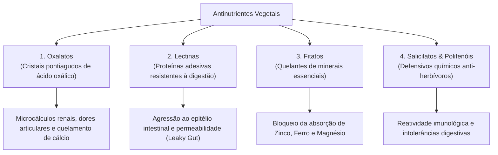

# 🥩 02. Dieta Carnívora — Fundamentos, Antinutrientes e Densidade Heme

> **Autor:** Arthur (Tutu)  
> **Trilha:** [[00-nutricao-ancestral-e-terapeutica-de-eliminacao-guia-mestre|Nutrição Ancestral & Terapêutica de Eliminação (Espinha Dorsal — Etapa 02)]]  
> **Nível de Consciência:** Nível 1 ➔ Nível 2 (Da identificação da inflamação ao domínio dos mecanismos biológicos da carne e antinutrientes)  
> **Conexões:** ← [[01-nutricao-ancestral-a-falsa-normalidade-do-cansaco-e-a-inflamacao-oculta|01 - Nutrição Ancestral — A Falsa Normalidade do Cansaço e a Inflamação Oculta]] | → [[03-dieta-carnivora-o-protocolo-de-transicao-e-adaptacao-estavel|03 - Dieta Carnívora — O Protocolo de Transição e Adaptação Estável]]  

---

## 🎯 Cabeçalho de Metas & Premissas

> **Tempo Estimado de Leitura:** 8 minutos  
> **Premissas Necessárias:**
> 1. Reconhecimento de que a inflamação alimentar moderna afeta o rendimento diário ([[01-nutricao-ancestral-a-falsa-normalidade-do-cansaco-e-a-inflamacao-oculta|01 - Nutrição Ancestral — A Falsa Normalidade do Cansaço e a Inflamação Oculta]]).
> 2. Disposição para analisar a evolução biológica de predadores e presas sob primeiros princípios.
>
> **O que você VAI aprender neste artigo:**
> - Por que os vegetais desenvolveram defesas químicas naturais (antinutrientes) para evitar serem devorados.
> - As 4 principais classes de antinutrientes (oxalatos, lectinas, fitatos, salicilatos) e seus impactos na absorção mineral.
> - A superioridade biológica do ferro heme, vitamina B12, creatina e colina animal.
> - Por que a bioquímica humana NÃO possui requerimento essencial para carboidratos exógenos.

---

## 🧭 Índice do Artigo
- [[#Ato 1: A Guerra Química Invisível no Reino Vegetal]]
- [[#Ato 2: As 4 Classes de Antinutrientes e o Dano Epitelial]]
- [[#Ato 3: A Densidade Heme e os Micronutrientes Insubstituíveis]]
- [[#Ato 4: O Mito da Necessidade de Carboidratos (Gliconeogênese)]]
- [[#Ato 5: Tabela Comparativa — Carne & Órgãos vs Alimentos Vegetais]]
- [[#🔗 Próximo Passo na Trilha]]
- [[#🧬 Notas Co-ativadas & Conexões da Trilha]]

---

> *"Animais podem correr, morder, camuflar-se ou lutar para evitar a predação. Plantas não podem se mover; sua única defesa é a guerra química."*  
> — **Dr. Paul Saladino, em The Carnivore Code**

---

### Ato 1: A Guerra Química Invisível no Reino Vegetal

Existe um dogma romântico na cultura moderna de que tudo o que brota da terra é intrinsecamente benéfico, inofensivo e desenhado para o consumo humano irrestrito.

A biologia evolutiva conta uma história completamente diferente:

Todo organismo vivo no planeta possui um imperativo reprodutivo: **sobreviver e evitar ser devorado**.
* Animais usam presas, cascos, garras e velocidade de fuga.
* Plantas, por serem seres sésseis (imóveis), desenvolveram ao longo de centenas de milhões de anos um vasto arsenal de **compostos químicos defensivos**, conhecidos como **antinutrientes** ou **fitoquímicos**.

Quando um herbívoro ou inseto ingere uma planta, essas toxinas servem para inflamar seu trato digestivo, inibir suas enzimas reprodutivas, perfurar seu intestino ou ligar-se aos seus minerais, impedindo que a espécie continue predando aquela folha, semente ou raiz.

O ser humano moderno consome essas defesas vegetais concentradas em larga escala todos os dias.

---

### Ato 2: As 4 Classes de Antinutrientes e o Dano Epitelial

Conforme catalogado na literatura médica e desconstruído pelo Dr. Paul Saladino em *The Carnivore Code*:

1. **Oxalatos (Ácido Oxálico):** Cristais microscópicos pontiagudos encontrados em abundância no espinafre, acelga, amêndoas e cacau. Ligam-se ao cálcio, formando cristais insolúveis que podem se acumular nos rins (cálculos) e nos tecidos moles, gerando dores musculares e articulares.
2. **Lectinas:** Proteínas que sobrevivem ao cozimento (abundantes em feijões, leguminosas, soja e grãos) e têm afinidade por carboidratos da mucosa intestinal. Elas se ligam aos enterócitos, abrindo as junções oclusivas (*tight junctions*) e induzindo permeabilidade intestinal e resposta autoimune.
3. **Fitatos (Ácido Fítico):** Compostos presentes na casca de grãos integrais, nozes e sementes. Atuam como quelantes potentes: sequestram zinco, ferro, cálcio e magnésio, tornando esses minerais indisponíveis para a absorção humana.
4. **Salicilatos e Fitoestrógenos:** Substâncias que a planta sintetiza para paralisar insetos ou alterar a fertilidade de predadores (como as isoflavonas da soja).

Quando você adota a **Dieta Carnívora**, você não está apenas comendo carne: você está aplicando uma **terapêutica de eliminação radical**, zerando a exposição diária a essas dezenas de toxinas defensivas.

---

### Ato 3: A Densidade Heme e os Micronutrientes Insubstituíveis

Enquanto os vegetais exigem processos metabólicos complexos e ineficientes para converter precursores em formas ativas, a carne vermelha de ruminantes, os ovos e as vísceras entregam nutrientes em sua **forma biológica terminal e biodisponível**:

* **Ferro Heme vs Ferro Não-Heme:** O ferro heme presente na carne vermelha possui absorção direta de 25% a 35% sem sofrer interferência de fitatos. O ferro não-heme das plantas (como no feijão e espinafre) possui taxa de absorção de apenas 2% a 7% e é severamente bloqueado por outros compostos.
* **Vitamina B12 (Cobalamina):** Nutriente essencial para a mielinização dos neurônios, síntese de DNA e formação de glóbulos vermelhos. **Inexistente no reino vegetal** em forma bioativa.
* **Creatina e Carnosina:** Compostos abundantes no tecido muscular animal que aumentam a síntese de ATP celular no cérebro e protegem os neurônios contra a glicação e o estresse oxidativo.
* **Colina e Retinol (Vitamina A Real):** O retinol da gema do ovo e do fígado é imediatamente utilizável pelo organismo. O betacaroteno das cenouras precisa ser convertido enzimaticamente em retinol, com taxas de conversão que podem ser inferiores a 3% em pessoas com polimorfismos genéticos comuns.

---

### Ato 4: O Mito da Necessidade de Carboidratos (Gliconeogênese)

A sabedoria convencional frequentemente afirma que *"o cérebro precisa de 130 gramas de carboidratos por dia para funcionar"*.

Essa afirmação confunde uma necessidade de **glicose celular** com uma necessidade de **ingestão de carboidratos**:

> 🧬 **Fato Bioquímico:** Não existe nenhum carboidrato essencial na biologia humana. Existem **aminoácidos essenciais** (que você morre se não comer) e **ácidos graxos essenciais** (gorduras que você morre se não ingerir). Mas **zero** carboidratos essenciais.

O fígado humano possui uma via metabólica perfeitamente calibrada chamada **Gliconeogênese**:
* A partir de glicerol (quebrado das gorduras) e aminoácidos (das proteínas), o fígado produz exatamente a quantidade de glicose que os tecidos dependentes (como hemácias e partes dos rins) necessitam a cada minuto.
* Em uma dieta carnívora, o cérebro passa a utilizar **corpos cetônicos ($\beta$-hidroxibutirato)** para suprir até 70% a 80% de sua energia, reduzindo a demanda por glicose a um mínimo absoluto.

O resultado é uma **glicemia plana e constante 24 horas por dia**, sem nenhum pico e sem nenhuma queda pós-prandial.

---

### Ato 5: Tabela Comparativa — Carne & Órgãos vs Alimentos Vegetais

Compare a densidade de micronutrientes por 100g de alimento em termos de biodisponibilidade e ausência de bloqueadores:

| Nutriente / Marcador | Fígado Bovino (100g) | Carne Vermelha Ruminante (100g) | Espinafre Cru (100g) | Feijão Cozido (100g) |
| :--- | :---: | :---: | :---: | :---: |
| **Vitamina B12** | 59.3 mcg *(2400% VD)* | 2.5 mcg *(100% VD)* | **0.0 mcg** | **0.0 mcg** |
| **Vitamina A (Retinol)** | 4.960 mcg *(550% VD)* | Traços bioativos | 0 mcg *(Apenas Betacaroteno)* | 0 mcg |
| **Ferro Biodisponível** | 6.5 mg *(Heme — Alta absorção)* | 2.8 mg *(Heme — Alta absorção)* | 2.7 mg *(Não-heme bloqueado por oxalato)* | 2.1 mg *(Não-heme bloqueado por fitato)* |
| **Zinco** | 4.0 mg *(Alta absorção)* | 6.0 mg *(Alta absorção)* | 0.5 mg *(Bloqueado)* | 1.1 mg *(Bloqueado)* |
| **Colina** | 333 mg | 70 mg | 19 mg | 30 mg |
| **Antinutrientes Presentes** | **Zero** | **Zero** | **Altíssimo** *(Oxalatos)* | **Altíssimo** *(Lectinas e Fitatos)* |

---

### 🔗 Próximo Passo na Trilha

Com os fundamentos da eliminação de antinutrientes consolidados e a densidade da carne compreendida, a pergunta prática é:

*Como fazer a transição para uma dieta estritamente carnívora de 30 dias sem sofrer com a fraqueza inicial, como repor eletrólitos corretamente e quais cortes comprar no açougue?*

* → Avançar para a Etapa 03: [[03-dieta-carnivora-o-protocolo-de-transicao-e-adaptacao-estavel|03 - Dieta Carnívora — O Protocolo de Transição e Adaptação Estável]]

---

### 🧬 Notas Co-ativadas & Conexões da Trilha
* **Guia Mestre da Sub-Trilha:** [[00-nutricao-ancestral-e-terapeutica-de-eliminacao-guia-mestre|00 - Nutrição Ancestral & Terapêutica de Eliminação — Guia Mestre]]
* **Etapa Anterior (A Falsa Normalidade do Cansaço):** [[01-nutricao-ancestral-a-falsa-normalidade-do-cansaco-e-a-inflamacao-oculta|01 - Nutrição Ancestral — A Falsa Normalidade do Cansaço e a Inflamação Oculta]]
* **Próxima Etapa (Protocolo de 30 Dias):** [[03-dieta-carnivora-o-protocolo-de-transicao-e-adaptacao-estavel|03 - Dieta Carnívora — O Protocolo de Transição e Adaptação Estável]]
* **Sidequest de Mitos:** [[dieta-carnivora-os-5-maiores-mitos-e-misconceptions-desmistificados|Dieta Carnívora — Os 5 Maiores Mitos e Misconceptions Desmistificados]]
* **Livro do Acervo:** **The Carnivore Code** *(Dr. Paul Saladino)*
