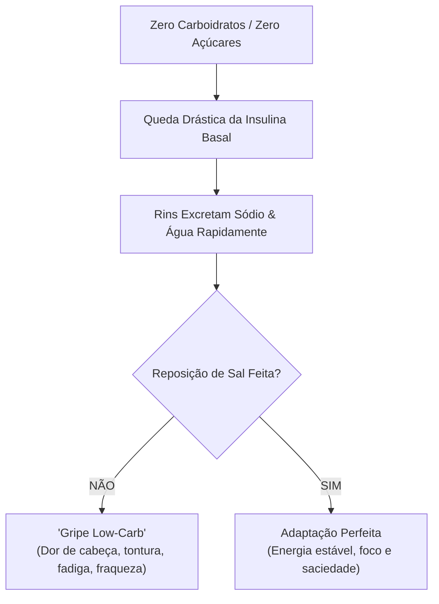
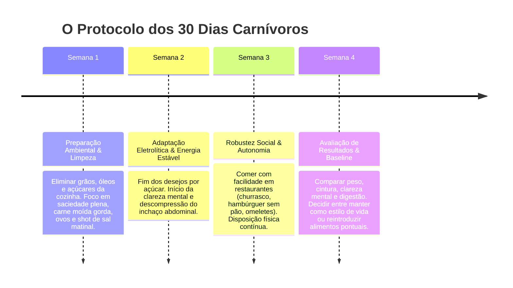

# ⚡ 03. Dieta Carnívora — O Protocolo de Transição e Adaptação Estável

> **Autor:** Arthur (Tutu)  
> **Trilha:** [[00-nutricao-ancestral-e-terapeutica-de-eliminacao-guia-mestre|Nutrição Ancestral & Terapêutica de Eliminação (Espinha Dorsal — Etapa 03)]]  
> **Nível de Consciência:** Nível 2 ➔ Nível 3 (Do entendimento dos fundamentos à execução prática de 30 dias sem atrito)  
> **Conexões:** ← [[02-dieta-carnivora-fundamentos-antinutrientes-e-densidade-heme|02 - Dieta Carnívora — Fundamentos, Antinutrientes e Densidade Heme]] | → [[00-nutricao-ancestral-e-terapeutica-de-eliminacao-guia-mestre|00 - Nutrição Ancestral & Terapêutica de Eliminação — Guia Mestre]]  

---

## 🎯 Cabeçalho de Metas & Premissas

> **Tempo Estimado de Leitura:** 8 minutos  
> **Premissas Necessárias:**
> 1. Compreensão da lógica de eliminação de antinutrientes e densidade heme ([[02-dieta-carnivora-fundamentos-antinutrientes-e-densidade-heme|02 - Dieta Carnívora — Fundamentos, Antinutrientes e Densidade Heme]]).
> 2. Decisão deliberada de testar uma intervenção nutricional controlada de 30 dias.
>
> **O que você VAI aprender neste artigo:**
> - A mecânica da *natriurese de jejum* (por que a queda de insulina drena água e sal nos primeiros dias).
> - O protocolo de reposição eletrolítica para blindar seu corpo contra a "gripe low-carb".
> - A lista exata de cortes de ruminantes, ovos e gorduras para comprar no açougue.
> - O cronograma de 4 semanas para adaptar o microbioma e atingir saciedade plena.

---

## 🧭 Índice do Artigo
- [[#Ato 1: O Choque da 1ª Semana e a Natriurese de Jejum]]
- [[#Ato 2: O Protocolo Eletrolítico Inegociável (Água & Sal)]]
- [[#Ato 3: A Seleção de Cortes e o Alinhamento Lipídico (Gordura vs Proteína)]]
- [[#Ato 4: A Adaptação Intestinal e a Reprogramação da Flora]]
- [[#Ato 5: O Cronograma de Execução de 30 Dias (Semana a Semana)]]
- [[#🔗 Próximos Passos & Sidequests da Trilha]]
- [[#🧬 Notas Co-ativadas & Conexões da Trilha]]

---

> *"O fracasso na adaptação carnívora quase nunca é fome ou falta de carboidratos. É simplesmente falta de sal e medo irracional de comer gordura suficiente."*  
> — **Axioma da Adaptação Metabólica**

---

### Ato 1: O Choque da 1ª Semana e a Natriurese de Jejum

Nos primeiros 3 a 5 dias de eliminação de carboidratos, o corpo passa por uma mudança hormonal abrupta:

1. **A Queda da Insulina Basal:** Ao zerar o influxo de glicose, os níveis de insulina caem para a faixa mínima saudável.
2. **A Liberação Renal de Sódio:** A insulina é o principal hormônio que instrui os rins a reterem sódio. Quando a insulina cai, os rins entram em um processo chamado **natriurese de jejum**: excretam rapidamente grandes quantidades de sódio e água na urina.
3. **A Falsa "Gripe Low-Carb":** Se você não repuser esse sódio ativamente, o volume sanguíneo diminui ligeiramente, provocando dor de cabeça, tontura ao levantar, fraqueza muscular e câimbras.

A grande maioria das pessoas que desiste da dieta nos primeiros dias acredita que *"o corpo precisa de açúcar"*. Na realidade, o corpo estava apenas **desidratado e carente de sal**.

---

### Ato 2: O Protocolo Eletrolítico Inegociável (Água & Sal)

Para garantir uma transição sem nenhum sintoma desagradável, adote a seguinte regra diária:

* 🧂 **Salgue a Comida Generosamente:** Use sal integral (sal marinho, sal grosso moído ou sal rosa). Não tenha medo do sal: sem insulina alta, seus rins eliminam o excesso com facilidade.
* 💧 **Shot de Água Salina Matinal:** Ao acordar, beba um copo de 300ml de água com uma pitada generosa de sal (cerca de 1g a 2g de sal). Isso restaura o volume plasmático instantaneamente.
* 💊 **Magnésio Suplementar (Opcional, mas Recomendado):** Se sentir tensão muscular ou intestino preso na primeira semana, suplemente 200mg a 300mg de magnésio quelato/bisglicinato antes de dormir.

---

### Ato 3: A Seleção de Cortes e o Alinhamento Lipídico (Gordura vs Proteína)

O segundo erro mais frequente é tentar fazer uma dieta carnívora com carnes excessivamente magras (peito de frango grelhado e patinho moído sem gordura).

> ⚠️ **Aviso de Fisiologia:** O corpo humano não consegue utilizar proteína pura como combustível energético primário sem sobrecarregar a capacidade hepática de desaminação da ureia (*rabbit starvation* ou intoxicação proteica). **A gordura é o seu combustível diário**.

#### 🛒 Guia Prático de Compras no Açougue:
1. **Base Principal (Ruminantes Gordos):**
   - Costela bovina, picanha, fraldinha, contrafilé com capa de gordura, acém de cozimento lento, cupim.
   - Carne moída com proporção **80% carne / 20% gordura** (peça para moer com pedaços de gordura do peito ou costela).
2. **Ovos Caipiras:**
   - Ovos inteiros com gema líquida (ricos em colina, luteína e gorduras saudáveis).
3. **Gorduras de Cozimento:**
   - Manteiga com sal, ghee, banha de porco artesanal ou sebo bovino. (Zero óleos vegetais de soja, milho ou canola).
4. **Frutos do Mar e Vísceras (Superalimentos):**
   - Sardinhas e salmão (ômega-3 DHA/EPA).
   - Fígado bovino: Consumir pequenas porções (50g a 100g) **1 a 2 vezes por semana** para garantir uma explosão de cobre, vitamina A e B12.

---

### Ato 4: A Adaptação Intestinal e a Reprogramação da Flora

Durante as primeiras 2 semanas, o microbioma intestinal passa por uma substituição de colônias: as bactérias que se alimentavam de fibras e açúcares morrem por escassez, enquanto as bactérias que processam aminoácidos e gorduras proliferam.

* **Menor Volume Fecal:** Não confunda menor frequência de evacuação com constipação. A carne é digerida e absorvida em quase 95% no intestino delgado; resta pouquíssimo resíduo para o cólon. Evacuar a cada 2 dias sem desconforto, dor ou gases é o padrão fisiológico normal.
* **Manejo de Fezes Soltas:** Se ocorrer evacuação líquida nos primeiros dias, significa que a bile hepática ainda está calibrando a capacidade de emulsificar a nova quantidade de gorduras. Basta reduzir temporariamente a gordura líquida (manteiga derretida) e consumir cortes mais sólidos até a adaptação.

---

### Ato 5: O Cronograma de Execução de 30 Dias (Semana a Semana)

Para implementar o protocolo com rigor e clareza:

#### Regra de Ouro da Saciedade:
Nos primeiros 14 dias, **nunca conte calorias e nunca passe fome**. Coma carne e ovos até atingir a saciedade completa. O seu cérebro precisa reaprender o sinal de saciedade biológico real emitido pelos hormônios peptídeo YY e colecistocinina.

---

### 🔗 Próximos Passos & Sidequests da Trilha

Com o protocolo em mãos, você tem em mãos a ferramenta máxima de reset metabólico. Para aprofundar tópicos específicos e desmistificar preocupações comuns:

* 🔬 **Fisiologia Descomplicada:** [[a-mecanica-do-diabetes-tipo-2-resistencia-a-insulina-e-o-paradoxo-da-mala-cheia|A Mecânica do Diabetes Tipo 2 — Resistência à Insulina e o Paradoxo da Mala Cheia]] *(Entenda por que a resistência à insulina é uma célula cheia e como esvaziá-la)*.
* 🛡️ **Desmonte de Mitos:** [[dieta-carnivora-os-5-maiores-mitos-e-misconceptions-desmistificados|Dieta Carnívora — Os 5 Maiores Mitos e Misconceptions Desmistificados]] *(Vitamina C, o mito das fibras, colesterol LMHR e ácido úrico)*.
* ⚡ **Sinergia Sistêmica:** [[a-triade-metabolica-dieta-carnivora-cetose-nutricional-e-jejum-intermitente|A Tríade Metabólica — Dieta Carnívora, Cetose Nutricional e Jejum Intermitente]] *(Como integrar carnívora, cetose e jejum sem esforço cognitivo)*.

---

### 🧬 Notas Co-ativadas & Conexões da Trilha
* **Guia Mestre da Sub-Trilha:** [[00-nutricao-ancestral-e-terapeutica-de-eliminacao-guia-mestre|00 - Nutrição Ancestral & Terapêutica de Eliminação — Guia Mestre]]
* **Etapa 01 (A Falsa Normalidade do Cansaço):** [[01-nutricao-ancestral-a-falsa-normalidade-do-cansaco-e-a-inflamacao-oculta|01 - Nutrição Ancestral — A Falsa Normalidade do Cansaço e a Inflamação Oculta]]
* **Etapa 02 (Fundamentos & Densidade Heme):** [[02-dieta-carnivora-fundamentos-antinutrientes-e-densidade-heme|02 - Dieta Carnívora — Fundamentos, Antinutrientes e Densidade Heme]]
* **Livro do Acervo:** **The Carnivore Diet** *(Jacob Greene & Dr. Shawn Baker)*
* **Livro do Acervo:** **A Revolução Carnívora** *(Fernanda Geribello Anders)*
