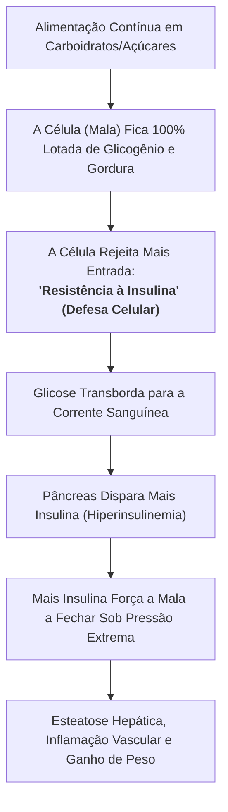
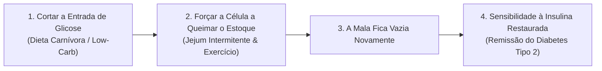

# 🧳 A Mecânica do Diabetes Tipo 2 — Resistência à Insulina e o Paradoxo da Mala Cheia

> **Autor:** Arthur (Tutu)  
> **Trilha:** [[00-nutricao-ancestral-e-terapeutica-de-eliminacao-guia-mestre|Nutrição Ancestral (Sidequest de Fisiologia)]]  
> **Conexões:** ← [[01-nutricao-ancestral-a-falsa-normalidade-do-cansaco-e-a-inflamacao-oculta|01 - Nutrição Ancestral — A Falsa Normalidade do Cansaço e a Inflamação Oculta]] | → [[03-dieta-carnivora-o-protocolo-de-transicao-e-adaptacao-estavel|03 - Dieta Carnívora — O Protocolo de Transição e Adaptação Estável]]  

---

## 🎯 Cabeçalho de Metas & Premissas

> **Tempo Estimado de Leitura:** 6 minutos  
> **Premissas Necessárias:**
> 1. Curiosidade para entender como o corpo processa energia sem jargões médicos complicados.
>
> **O que você VAI aprender neste ensaio:**
> - Por que a "resistência à insulina" não é um defeito biológico misterioso, mas uma defesa celular.
> - A metáfora da mala superlotada: o mecanismo real do transbordamento de glicose.
> - Por que o tratamento convencional focado em injetar mais insulina agrava a causa-raiz da doença.
> - A mecânica simples para esvaziar a célula e restaurar a sensibilidade metabólica.

---

## 🧭 Índice do Artigo
- [[#Ato 1: O Que a Medicina Convencional Ensina (A Ilusão da Chave Quebrada)]]
- [[#Ato 2: A Metáfora da Mala Superlotada]]
- [[#Ato 3: O Erro Crítico do Tratamento Tradicional]]
- [[#Ato 4: A Mecânica da Reversão (Esvaziando a Bagagem)]]
- [[#Ato 5: Marcadores Clínicos para Acompanhar no Sangue]]
- [[#🔗 Conexões & Próximos Passos]]
- [[#🧬 Notas Co-ativadas & Conexões da Trilha]]

---

> *"Tratar diabetes tipo 2 dando mais insulina para uma célula abarrotada de glicose é o equivalente médico a tentar fechar uma mala explodindo de roupas chamando mais duas pessoas para pular em cima dela."*  
> — **Metáfora da Saturação Celular**

---

### Ato 1: O Que a Medicina Convencional Ensina (A Ilusão da Chave Quebrada)

Durante décadas, a explicação padrão dada aos pacientes sobre o Diabetes Tipo 2 foi o modelo da **fechadura e da chave**:

> *"A insulina é a chave que abre a porta da célula para a glicose entrar. Na resistência à insulina, a fechadura está emperrada, a chave não gira e a glicose fica acumulada no sangue."*

Essa explicação é elegante, mas está **completamente errada no Diabetes Tipo 2** (ela descreve perfeitamente o Diabetes Tipo 1, onde o pâncreas é destruído e não produz chaves, mas falha miseravelmente no Tipo 2).

No Diabetes Tipo 2, a fechadura não está quebrada e não faltam chaves. Na verdade, o sangue está inundado de insulina.

O motivo real pelo qual a glicose não entra na célula é muito mais simples e intuitivo: **a célula já está completamente cheia**.

---

### Ato 2: A Metáfora da Mala Superlotada

Imagine que as suas células musculares e hepáticas são uma **mala de viagem**:

1. **A Mala Vazia (Metabolismo Jovem & Saudável):** Quando você é ativo e come pouco açúcar, sua mala celular tem espaço de sobra. Ao ingerir uma refeição, a insulina empurra facilmente as roupas (moléculas de glicose) para dentro da mala. A mala fecha sem esforço e a glicose no sangue permanece baixa.
2. **O Excesso Contínuo de Bagagem:** Se você consome carboidratos, pães, refrigerantes e doces várias vezes ao dia por 10 ou 20 anos, você continua colocando roupas dentro da mala todos os dias sem nunca retirá-las.
3. **A Saturação Absoluta:** Chega um momento em que a mala atinge a capacidade máxima. Não cabe mais nem uma meia.
4. **A Resistência como Autoproteção:** Quando o pâncreas envia mais insulina para empurrar mais glicose, a célula simplesmente se recusa a abrir. Se entrasse mais glicose em uma célula já saturada, ocorreria toxicidade celular e morte mitocondrial. A **"resistência à insulina"** não é uma falha: é um mecanismo de autodefesa da célula contra o excesso de energia.

Como a célula não aceita mais nada, a glicose não tem para onde ir e **transborda para a corrente sanguínea**. O exame de sangue acusa hiperglicemia.

---

### Ato 3: O Erro Crítico do Tratamento Tradicional

O que a abordagem médica convencional frequentemente faz diante de um paciente com Diabetes Tipo 2?

Prescreve remédios que forçam o pâncreas a produzir mais insulina (secretagogos) ou aplica **injeções de insulina exógena**.

Voltando à metáfora da mala:
* A mala já está estourando o zíper.
* Em vez de retirar roupas da mala, o tratamento tradicional traz mais três pessoas fortes (doses maciças de insulina) para **pular em cima da mala com os joelhos** e forçar o zíper a fechar por mais algumas semanas.

Qual é o resultado a médio e longo prazo?
* A glicemia no sangue até pode baixar temporariamente no exame, mas o paciente **engorda rapidamente**, desenvolve **esteatose hepática (gordura no fígado)**, vê seus triglicerídeos explodirem e a resistência à insulina piorar progressivamente, exigindo doses cada vez maiores de medicação.

---

### Ato 4: A Mecânica da Reversão (Esvaziando a Bagagem)

Se o problema fundamental é que a mala está superlotada, a solução definitiva não é empurrar com mais força. É **parar de colocar coisas novas e esvaziar o que está dentro**:

1. **Parar o Influxo (Dieta Carnívora / Low-Carb Estrita):** Ao remover farinhas, açúcares e grãos, você zera a entrada de nova glicose no sistema.
2. **Queimar a Energia Acumulada (Jejum Intermitente & Ceto-Oxidação):** Com a insulina baixa, o corpo finalmente tem autorização hormonal para abrir a mala e queimar os estoques acumulados de gordura e glicogênio para gerar energia.
3. **Restauração Espontânea da Sensibilidade:** Conforme a célula esvazia, a "resistência" desaparece sem a necessidade de nenhuma intervenção mágica. A fechadura volta a funcionar perfeitamente porque agora existe espaço interno disponível.

---

### Ato 5: Marcadores Clínicos para Acompanhar no Sangue

Para monitorar se a sua mala celular está sendo esvaziada, não olhe apenas para a glicemia de jejum. Acompanhe a tríade metabólica:

| Exame / Marcador | Padrão Inflamatório (Mala Cheia) | Padrão Otimizado (Mala Esvaziando) | O que Significa na Prática? |
| :--- | :---: | :---: | :--- |
| **Insulina de Jejum** | $> 10 \mu\text{UI/mL}$ | $< 5 \mu\text{UI/mL}$ | Mostra o esforço que o pâncreas está fazendo para manter a glicose controlada. |
| **Triglicerídeos** | $> 150 \text{ mg/dL}$ | $< 80 \text{ mg/dL}$ | Indica o excesso de carboidratos convertidos em gordura pelo fígado. |
| **Rácio TG / HDL** | $> 3.0$ | $< 1.5$ | O maior preditor cardiovascular e marcador indireto de resistência à insulina. |
| **HbA1c (Hemoglobina Glicada)** | $> 5.7\%$ | $< 5.3\%$ | A média do açúcar circulante nos últimos 90 dias. |

---

### 🔗 Conexões & Próximos Passos

A compreensão de que a resistência à insulina é um problema de sobrecarga energética celular desfaz o maior mito da medicina moderna.

Para entender como a eliminação completa de carboidratos e a adoção de carnes gordas permite desinflamar o organismo sem passar fome:

* → Ler a Sidequest dos Mitos: [[dieta-carnivora-os-5-maiores-mitos-e-misconceptions-desmistificados|Dieta Carnívora — Os 5 Maiores Mitos e Misconceptions Desmistificados]]
* → Entender a Sinergia Metabólica: [[a-triade-metabolica-dieta-carnivora-cetose-nutricional-e-jejum-intermitente|A Tríade Metabólica — Dieta Carnívora, Cetose Nutricional e Jejum Intermitente]]
* → Acessar o Guia de Execução: [[03-dieta-carnivora-o-protocolo-de-transicao-e-adaptacao-estavel|03 - Dieta Carnívora — O Protocolo de Transição e Adaptação Estável]]

---

### 🧬 Notas Co-ativadas & Conexões da Trilha
* **Guia Mestre da Sub-Trilha:** [[00-nutricao-ancestral-e-terapeutica-de-eliminacao-guia-mestre|00 - Nutrição Ancestral & Terapêutica de Eliminação — Guia Mestre]]
* **Trilha Mestre:** [[00-bio-otimizacao-guia-mestre|00 - Bio-Otimização — Guia Mestre]]
* **Artigo 01 (Falsa Normalidade do Cansaço):** [[01-nutricao-ancestral-a-falsa-normalidade-do-cansaco-e-a-inflamacao-oculta|01 - Nutrição Ancestral — A Falsa Normalidade do Cansaço e a Inflamação Oculta]]
* **Livro do Acervo:** **Outlive: The Science and Art of Longevity** *(Dr. Peter Attia)*
