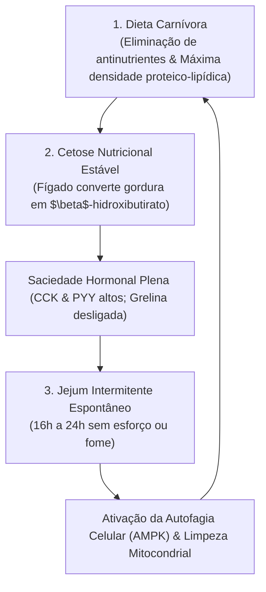
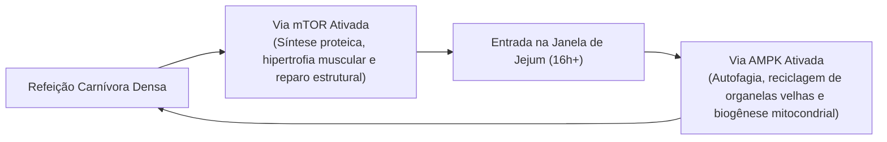

# ⚡ A Tríade Metabólica — Dieta Carnívora, Cetose Nutricional e Jejum Intermitente

> **Autor:** Arthur (Tutu)  
> **Trilha:** [[00-nutricao-ancestral-e-terapeutica-de-eliminacao-guia-mestre|Nutrição Ancestral (Sidequest de Integração Sistêmica)]]  
> **Conexões:** ← [[03-dieta-carnivora-o-protocolo-de-transicao-e-adaptacao-estavel|03 - Dieta Carnívora — O Protocolo de Transição e Adaptação Estável]] | → [[00-bio-otimizacao-guia-mestre|00 - Bio-Otimização — Guia Mestre]]  

---

## 🎯 Cabeçalho de Metas & Premissas

> **Tempo Estimado de Leitura:** 7 minutos  
> **Premissas Necessárias:**
> 1. Compreensão do funcionamento básico da queima de gordura e corpos cetônicos.
>
> **O que você VAI aprender neste ensaio:**
> - Como a Dieta Carnívora, a Cetose e o Jejum formam um único ecossistema metabólico integrado.
> - A mecânica hormonal da saciedade biológica (CCK, PYY e supressão da grelina).
> - Por que o jejum intermitente se torna espontâneo e sem sofrimento em uma alimentação carnívora.
> - A alternância perfeita entre a via anabólica mTOR e a reciclagem celular via AMPK (autofagia).

---

## 🧭 Índice do Artigo
- [[#Ato 1: A Falsa Concorrência das Estratégias Nutricionais]]
- [[#Ato 2: A Fisiologia da Saciedade Absoluta (O Fim da Fome Constante)]]
- [[#Ato 3: O Jejum Espontâneo (Sem Sofrimento ou Força de Vontade)]]
- [[#Ato 4: O Balanço Perfeito entre mTOR e AMPK (Autofagia Ativa)]]
- [[#Ato 5: O Protocolo Prático de Rotina da Tríade]]
- [[#🔗 Conexões & Próximos Passos]]
- [[#🧬 Notas Co-ativadas & Conexões da Trilha]]

---

> *"Quando você alimenta o corpo com a matriz biológica correta de proteínas e gorduras, você não precisa lutar contra a fome para jejuar. O jejum passa a ser o seu estado padrão de serenidade mental."*  
> — **Axioma da Tríade Metabólica**

---

### Ato 1: A Falsa Concorrência das Estratégias Nutricionais

No debate sobre saúde moderna, a internet costuma tratar a **Dieta Carnívora**, a **Dieta Cetogênica** e o **Jejum Intermitente** como se fossem três "dietas" separadas competindo pela sua atenção:

* O defensor do jejum diz que apenas a restrição de tempo cura o corpo.
* O defensor da cetogênica diz que apenas os corpos cetônicos importam.
* O defensor da carnívora foca exclusivamente na eliminação de plantas.

Na realidade da fisiologia humana, essas três ferramentas são **engrenagens de um mesmo motor**:

A **Dieta Carnívora** é a forma mais pura e sem ruído de entrar em **Cetose Nutricional**, o que por sua vez gera **Saciedade Absoluta**, tornando o **Jejum Intermitente** inevitável e natural.

---

### Ato 2: A Fisiologia da Saciedade Absoluta (O Fim da Fome Constante)

Por que a maioria das pessoas que tenta fazer jejum em dietas convencionais falha miseravelmente e passa o dia com raiva e dor de cabeça?

Porque estão tentando jejuar enquanto sofrem de **hipoglicemia reativa**:
1. Uma dieta com grãos e carboidratos gera picos e quedas rápidas de glicose.
2. A cada queda de açúcar, o estômago descarrega o hormônio **Grelina** (o hormônio da fome urgente), acompanhado de ansiedade.
3. Jejuar nesse estado exige uma força de vontade heroica que se esgota em poucas horas.

#### A Bioquímica da Saciedade Animal:
Quando você faz uma refeição baseada em carne de ruminante, gordura saturada e ovos:
* A gordura estimula os receptores duodenais a liberarem **Colecistocinina (CCK)**, que desacelera o esvaziamento gástrico e sinaliza ao cérebro que a digestão está completa.
* A proteína de alto valor biológico estimula a liberação do **Peptídeo YY (PYY)** no íleo e no cólon, desligando os centros de recompensa e apetite no hipotálamo.
* A **Grelina** permanece suprimida por 6 a 10 horas seguidas.

Você simplesmente não sente fome. A comida deixa de ser uma obsessão mental contínua.

---

### Ato 3: O Jejum Espontâneo (Sem Sofrimento ou Força de Vontade)

Em uma dieta carnívora bem ajustada, o jejum deixa de ser uma regra cronometrada em aplicativos de celular e se torna um **resultado espontâneo da saciedade**:

* Você faz uma refeição densa de carne e ovos ao meio-dia.
* Às 18h você não sente fome. Às 21h continua sem fome.
* Você vai dormir leve, tem uma noite de sono profundo (sem picos de insulina atrapalhando a secreção de hormônio do crescimento / GH) e acorda na manhã seguinte com energia total.
* Quando percebe, completou **18 a 20 horas de jejum** trabalhando com foco absoluto, alimentando-se apenas de água, café sem açúcar e uma pitada de sal.

O jejum não é mais um sacrifício: é o estado natural no qual o seu cérebro opera com clareza máxima movido a cetonas.

---

### Ato 4: O Balanço Perfeito entre mTOR e AMPK (Autofagia Ativa)

A longevidade celular depende de uma alternância rítmica entre dois sensores biológicos opostos:

1. **mTOR (Mammalian Target of Rapamycin) — O Modo Construção:**
   - Ativado pelos aminoácidos essenciais (especialmente a **leucina** presente na carne vermelha).
   - Indispensável para sinalizar a síntese proteica muscular, aumentar a densidade óssea e prevenir a sarcopenia (perda muscular no envelhecimento).
2. **AMPK (AMP-Activated Protein Kinase) — O Modo Limpeza:**
   - Ativado pela ausência de nutrientes e depleção temporária de glicose durante a janela de jejum.
   - Dispara o processo de **autofagia**: as células degradam mitocôndrias defeituosas, eliminam agregados proteicos disfuncionais e reciclam componentes celulares velhos.

A Tríade Metabólica fornece o equilíbrio perfeito: **ativação pulsátil e robusta da mTOR durante a refeição carnívora** seguida por **horas prolongadas de ativação da AMPK durante o jejum espontâneo**.

---

### Ato 5: O Protocolo Prático de Rotina da Tríade

Como estruturar esse estilo de vida na prática do seu dia a dia:

* 🌅 **Manhã (Janela de Foco em Jejum):**
  - Acorde, tome 300ml de água com uma pitada de sal integral e café/chá puro se desejar.
  - Execute seus blocos de trabalho intelectual mais difíceis com foco ininterrupto sob cetose matinal.
* 🥩 **Almoço (Refeição Densa 1 — Abertura da Janela):**
  - Quebre o jejum com uma refeição rica em carne vermelha gorda (picanha, costela, carne moída 80/20) e ovos caipiras. Coma até atingir a saciedade plena.
* 🌇 **Final de Tarde / Noite (Refeição 2 — Fechamento da Janela):**
  - Se houver fome real, faça uma segunda refeição mais leve de carnes, peixes ou ovos. Se não houver fome, encerre o dia apenas hidratado.
* 🌙 **Noite:**
  - Janela de sono com digestão concluída e glicemia estável, entrando nas horas de autofagia noturna.

---

### 🔗 Conexões & Próximos Passos

A integração entre a eliminação de antinutrientes da Dieta Carnívora, a estabilidade dos corpos cetônicos e a limpeza celular do Jejum Intermitente fecha o ciclo da alta performance metabólica.

Para colocar o plano em prática e consultar todas as diretrizes da trilha:

* → Voltar ao Guia Mestre de Nutrição Ancestral: [[00-nutricao-ancestral-e-terapeutica-de-eliminacao-guia-mestre|00 - Nutrição Ancestral & Terapêutica de Eliminação — Guia Mestre]]
* → Acessar o Guia Mestre de Bio-Otimização: [[00-bio-otimizacao-guia-mestre|00 - Bio-Otimização — Guia Mestre]]
* → Rever o Protocolo dos 30 Dias: [[03-dieta-carnivora-o-protocolo-de-transicao-e-adaptacao-estavel|03 - Dieta Carnívora — O Protocolo de Transição e Adaptação Estável]]

---

### 🧬 Notas Co-ativadas & Conexões da Trilha
* **Guia Mestre da Sub-Trilha:** [[00-nutricao-ancestral-e-terapeutica-de-eliminacao-guia-mestre|00 - Nutrição Ancestral & Terapêutica de Eliminação — Guia Mestre]]
* **Trilha Mestre:** [[00-bio-otimizacao-guia-mestre|00 - Bio-Otimização — Guia Mestre]]
* **Sidequest de Fisiologia:** [[a-mecanica-do-diabetes-tipo-2-resistencia-a-insulina-e-o-paradoxo-da-mala-cheia|A Mecânica do Diabetes Tipo 2 — Resistência à Insulina e o Paradoxo da Mala Cheia]]
* **Livro do Acervo:** **Outlive: The Science and Art of Longevity** *(Dr. Peter Attia)*
