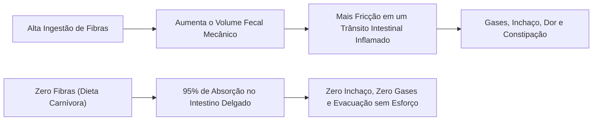
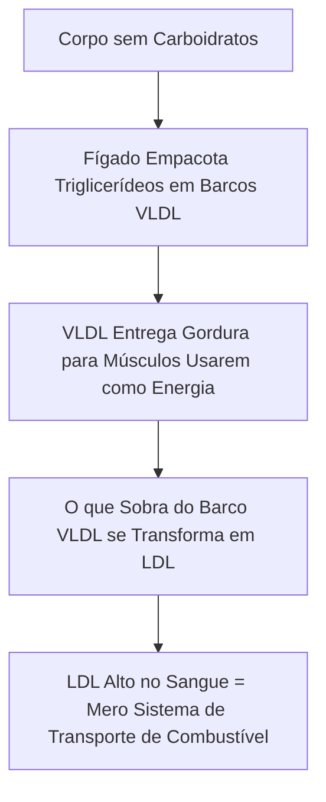

# 🛡️ Dieta Carnívora — Os 5 Maiores Mitos e Misconceptions Desmistificados

> **Autor:** Arthur (Tutu)  
> **Trilha:** [[00-nutricao-ancestral-e-terapeutica-de-eliminacao-guia-mestre|Nutrição Ancestral (Sidequest de Quebra de Objeções)]]  
> **Conexões:** ← [[02-dieta-carnivora-fundamentos-antinutrientes-e-densidade-heme|02 - Dieta Carnívora — Fundamentos, Antinutrientes e Densidade Heme]] | → [[03-dieta-carnivora-o-protocolo-de-transicao-e-adaptacao-estavel|03 - Dieta Carnívora — O Protocolo de Transição e Adaptação Estável]]  

---

## 🎯 Cabeçalho de Metas & Premissas

> **Tempo Estimado de Leitura:** 9 minutos  
> **Premissas Necessárias:**
> 1. Compreensão básica dos mecanismos de eliminação e densidade animal ([[02-dieta-carnivora-fundamentos-antinutrientes-e-densidade-heme|02 - Dieta Carnívora — Fundamentos, Antinutrientes e Densidade Heme]]).
>
> **O que você VAI aprender neste ensaio:**
> - Por que carnívoros não desenvolvem escorbuto (a mecânica do receptor celular GLUT-1).
> - O que o ensaio clínico do *World Journal of Gastroenterology* revelou sobre fibras e constipação.
> - O fenótipo LMHR (*Lean Mass Hyper-Responder*) e o *Lipid Energy Model* de Dave Feldman.
> - A verdadeira causa da gota e do acúmulo de ácido úrico no organismo.

---

## 🧭 Índice do Artigo
- [[#Mito 1: 'Você vai ter escorbuto sem frutas cítricas' (O Receptor GLUT-1)]]
- [[#Mito 2: 'O intestino vai parar sem fibras vegetais' (O Estudo WJG 2012)]]
- [[#Mito 3: 'O colesterol vai entupir suas artérias' (O Fenótipo LMHR)]]
- [[#Mito 4: 'Carne não tem todas as vitaminas' (A Densidade das Vísceras)]]
- [[#Mito 5: 'Comer carne vermelha causa gota e ácido úrico elevado']]
- [[#🔗 Conexões & Próximos Passos]]
- [[#🧬 Notas Co-ativadas & Conexões da Trilha]]

---

### Mito 1: "Você vai ter escorbuto sem frutas cítricas" (O Receptor GLUT-1)

#### ❌ A Objeção Popular:
*"Se você comer apenas carne e ovos, você terá carência de Vitamina C e desenvolverá escorbuto em poucos meses."*

#### 🔬 A Fisiologia & O Mecanismo GLUT-1:
O ácido ascórbico (Vitamina C) e a molécula de glicose possuem estruturas químicas quase idênticas. Ambas competem diretamente pelos mesmos receptores celulares de transporte: os transportadores **GLUT-1**.

```mermaid
graph TD
    subgraph Dieta Tradicional (Rica em Carboidratos)
        GlicoseAlta["Muita Glicose Circulante"] --> Compete["Glicose Bloqueia Receptores GLUT-1"]
        Compete --> DemandaAlta["Alta Demanda Diária de Vitamina C (60mg a 100mg+)"]
    end
    
    subgraph Dieta Carnívora (Zero Glicose Exógena)
        ZeroGlicose["Zero Glicose Circulante"] --> Livre["Receptores GLUT-1 100% Livres"]
        Livre --> DemandaBaixa["Baixíssima Demanda de Vitamina C (Pequenas doses bastam)"]
    end
```

1. **Na dieta rica em açúcar e carboidratos:** A glicose em excesso satura os receptores GLUT-1, impedindo que a vitamina C seja absorvida eficientemente. O corpo passa a exigir doses maciças (60mg a 100mg+) para evitar o escorbuto.
2. **Na Dieta Carnívora:** Sem glicose competindo, a absorção celular de vitamina C atinge eficiência máxima. Além disso, a carnosina e a glutationa presentes na carne fresca poupam a necessidade de vitamina C como antioxidante.
3. **A Presença Oculta:** Carne fresca de ruminantes, gema de ovo e fígado bovino contêm pequenas quantidades bioativas de vitamina C que são 100% suficientes para manter o colágeno e os tecidos intactos.

---

### Mito 2: "O intestino vai parar sem fibras vegetais" (O Estudo WJG 2012)

#### ❌ A Objeção Popular:
*"O ser humano precisa de 30g de fibras por dia para que o bolo fecal consiga se mover pelo intestino e evitar a constipação."*

#### 📄 A Evidência Clínica (WJG 2012):
Em 2012, o *World Journal of Gastroenterology* publicou um ensaio clínico controlado analisando pacientes com constipação idiopática crônica e distensão abdominal:

> 📄 **Paper Oficial:** *Stopping or reducing dietary fiber intake reduces constipation and its associated symptoms* (Ho et al., *World Journal of Gastroenterology*, 2012, 18(33): 4593–4596).
> 
> * **Metodologia:** 63 pacientes divididos em grupos de alta fibra, redução moderada e **remoção total (0g de fibras)**.
> * **Resultados Clínicos:**
>   - **Grupo 0g de Fibras:** **100% dos pacientes** tiveram resolução completa da constipação, inchaço abdominal, gases e sangramento anal.
>   - **Grupo Alta Fibra:** Continuou apresentando 100% dos sintomas graves de constipação e desconforto.



#### 💡 A Leitura Aplicada:
Fibras são matéria vegetal indigestível. Se uma rodovia está congestionada por um acidente (intestino inflamado), adicionar mais 50 caminhões de entulho (fibras) não desobstrui o tráfego — apenas piora o engarrafamento. Ao retirar as fibras, a parede intestinal desinflama e a digestão se torna silenciosa e eficiente.

---

### Mito 3: "O colesterol vai entupir suas artérias" (O Fenótipo LMHR)

#### ❌ A Objeção Popular:
*"Comer carne gorda e manteiga vai elevar seu colesterol LDL e causar um infarto fulminante."*

#### 🔬 O Modelo LMHR & O *Lipid Energy Model* (Dave Feldman, 2022):
Quando um indivíduo magro, metabolicamente saudável e ativo adota uma dieta estritamente carnívora ou cetogênica, seu colesterol LDL frequentemente sobe para níveis elevados (ex: 200 a 300+ mg/dL).

A cardiologia convencional assume que todo LDL alto é aterosclerótico. A bioquímica moderna desmentiu esse erro:

> 📄 **Pesquisa Oficial:** *The Lipid Energy Model: Reexamining Hyper-LDL-Cholesterolemia in Lean, Carbohydrate-Restricted Individuals* (Feldman et al., *Current Developments in Nutrition*, 2022).
> 
> * **O Fenótipo LMHR (*Lean Mass Hyper-Responder*):**
>   1. **Triglicerídeos muito baixos** ($< 80\text{ mg/dL}$ ou $< 50\text{ mg/dL}$).
>   2. **HDL muito alto** ($> 80\text{ mg/dL}$).
>   3. **LDL elevado** ($> 200\text{ mg/dL}$).



#### 💡 A Leitura Aplicada:
O LDL não é uma "toxina", mas um **barco de transporte de energia**. Em cetose carnívora, suas células queimam gordura; o fígado precisa enviar mais barcos carregados de lipídios para alimentar seus músculos. Na ausência de inflamação e glicose alta (que oxidam o LDL), essas partículas são inofensivas. O verdadeiro perigo cardiovascular é o LDL oxidado em ambiente de **resistência à insulina, triglicerídeos altos e HDL baixo**.

---

### Mito 4: "Carne não tem todas as vitaminas" (A Densidade das Vísceras)

#### ❌ A Objeção Popular:
*"Carne é apenas proteína e gordura; faltam minerais e vitaminas antioxidantes."*

#### 🔬 A Densidade Real:
O fígado bovino, o coração, a gema do ovo e a carne de pasto são os alimentos mais ricos em micronutrientes do planeta:

* **Vitamina A Real (Retinol):** 100g de fígado bovino fornecem mais de 500% da necessidade diária na forma que o corpo absorve imediatamente (sem perdas de conversão).
* **Complexo B Completo:** B1, B2, B3, B5, B6, B9 (folato) e B12 em abundância biodisponível.
* **Minerais Críticos:** Zinco, selênio, ferro heme, fósforo e cobre no equilíbrio exato para a absorção celular.
* **Nutrientes Exclusivos:** Creatina, carnitina, carnosina, taurina e colina — nutrientes essenciais para a função cognitiva que não existem em quantidades expressivas no reino vegetal.

---

### Mito 5: "Comer carne vermelha causa gota e ácido úrico elevado"

#### ❌ A Objeção Popular:
*"A carne é rica em purinas, o que eleva o ácido úrico e causa crises de gota."*

#### 🔬 A Fisiopatologia Real:
O ácido úrico é um potente antioxidante endógeno produzido na quebra de purinas. No entanto, o que causa o acúmulo patológico e a precipitação de cristais de urato nas articulações (gota) não é a ingestão de carne, mas a **incapacidade dos rins de excretar o ácido úrico**:

1. **O Papel da Frutose Industrial:** O consumo de açúcar de mesa e xarope de milho (frutose) é o maior indutor hepático de síntese rápida de ácido úrico.
2. **A Inibição por Hiperinsulinemia:** Níveis cronicamente altos de insulina competem com o ácido úrico nos túbulos renais, **bloqueando sua excreção na urina**.
3. **A Solução:** Ao adotar a Dieta Carnívora, você elimina a frutose e normaliza a insulina. Embora possa haver uma elevação transitória nas primeiras semanas de adaptação (competição com corpos cetônicos), a gota entra em remissão completa no médio prazo conforme a sensibilidade à insulina é restaurada.

---

### 🔗 Conexões & Próximos Passos

Com os mitos desarmados por dados e ensaios clínicos, o próximo passo é entender como a Dieta Carnívora se integra sinergicamente com a **Cetose Nutricional** e o **Jejum Intermitente**:

* → Ler a Sidequest: [[a-triade-metabolica-dieta-carnivora-cetose-nutricional-e-jejum-intermitente|A Tríade Metabólica — Dieta Carnívora, Cetose Nutricional e Jejum Intermitente]]
* → Voltar para a Espinha Dorsal: [[03-dieta-carnivora-o-protocolo-de-transicao-e-adaptacao-estavel|03 - Dieta Carnívora — O Protocolo de Transição e Adaptação Estável]]

---

### 🧬 Notas Co-ativadas & Conexões da Trilha
* **Guia Mestre da Sub-Trilha:** [[00-nutricao-ancestral-e-terapeutica-de-eliminacao-guia-mestre|00 - Nutrição Ancestral & Terapêutica de Eliminação — Guia Mestre]]
* **Artigo 02 (Fundamentos & Densidade Heme):** [[02-dieta-carnivora-fundamentos-antinutrientes-e-densidade-heme|02 - Dieta Carnívora — Fundamentos, Antinutrientes e Densidade Heme]]
* **Livro do Acervo:** **The Carnivore Code** *(Dr. Paul Saladino)*
* **Livro do Acervo:** **The Carnivore Diet** *(Jacob Greene & Dr. Shawn Baker)*
