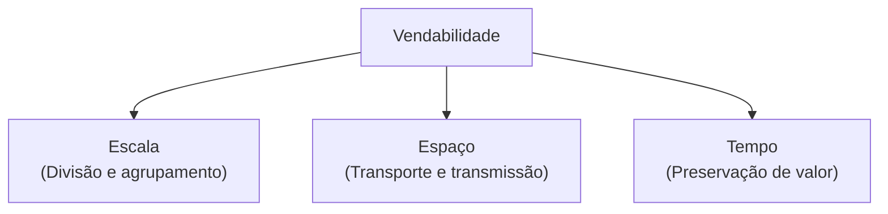

# 📈 02. As 4 Fases da Adoção Monetária e a Vendabilidade de Menger

> **Autor:** Arthur (Tutu)  
> **Trilha:** [[00-bitcoin|Soberania Digital & Bitcoin (Espinha Dorsal — Etapa 2)]]  
> **Nível de Consciência:** Nível 1 ➔ Nível 2 (Da desconstrução da moeda estatal à monetização histórica)  
> **Conexões:** ← [[01-bitcoin-das-predicoes-de-friedman-ao-bloco-genesis|01 - Bitcoin — Das Predições de Friedman ao Bloco Gênesis]] | → [[03-autocustodia|03 - Autocustódia & Soberania — A Física do Sem Risco de Contraparte]]  

---

## 🎯 Cabeçalho de Metas & Premissas

> **Tempo Estimado de Leitura:** 8 minutos  
> **Premissas Necessárias:**
> 1. A moeda estatal sofre diluição sistêmica contínua ([[01-bitcoin-das-predicoes-de-friedman-ao-bloco-genesis|01 - Bitcoin — Das Predições de Friedman ao Bloco Gênesis]]).
> 2. O dinheiro é uma descoberta espontânea de mercado, não uma criação estatal por decreto.
>
> **O que você VAI aprender neste artigo:**
> - Como separar volatilidade, risco de preço e horizonte de decisão.
> - As funções de reserva de valor, meio de troca e unidade de conta.
> - Como a vendabilidade organiza a comparação entre escala, espaço e tempo.
> - O que o ratio Stock-to-Flow ($S2F$) mede — e o que ele não permite concluir sozinho.
> - Um modelo interpretativo de quatro estágios da monetização, sem tratar o futuro como garantido.

---

## 🧭 Índice do Artigo
- [[#Ato 1: A Pergunta da Padaria e o Risco de Preço]]
- [[#Ato 2: As Funções do Dinheiro e a Vendabilidade]]
- [[#Ato 3: Stock-to-Flow e os Limites da Escassez]]
- [[#Ato 4: Um Modelo de Quatro Estágios da Monetização]]
- [[#🔗 Próximo Passo na Trilha]]
- [[#🧬 Notas Co-ativadas & Conexões da Trilha]]

---

> A conclusão abaixo é uma paráfrase da tradição monetária discutida por Menger e retomada em *O Padrão Bitcoin*, não uma citação literal de Menger.

---

### Ato 1: A Pergunta da Padaria e o Risco de Preço

O cético aponta para a cotação diária do Bitcoin:

> *"Como isso tem valor se oscila 5% em uma única tarde? Ninguém compra pão na padaria com algo tão volátil."*

A pergunta é correta. Volatilidade não é sinônimo de perda permanente, mas é risco de preço para quem pode precisar vender amanhã. Em um mercado aberto, a oscilação registra mudanças nas expectativas, na liquidez e na demanda; isso não transforma toda queda em falha monetária, nem elimina a possibilidade de perda.

Antes de responder se o Bitcoin já deve pagar o café, é preciso separar três funções do dinheiro:

- **Reserva de valor:** guardar poder de compra para uso futuro.
- **Meio de troca:** facilitar uma transação sem exigir coincidência direta entre o que cada pessoa vende e deseja comprar.
- **Unidade de conta:** servir como régua comum para expressar preços e fazer cálculos.

Um bem pode guardar valor sem ser a unidade usada no caixa do supermercado. Também pode ser aceito em algumas trocas sem que os comerciantes escrevam seus preços nele. Quando um café é anunciado em reais e apenas convertido para Bitcoin pela cotação do momento, o Bitcoin está sendo usado como meio de pagamento, mas ainda não como unidade de conta. A objeção da padaria mistura essas funções antes de examiná-las.

---

### Ato 2: As Funções do Dinheiro e a Vendabilidade

Para Carl Menger, retomado por Saifedean Ammous em *O Padrão Bitcoin*, a vendabilidade descreve a facilidade de vender um bem quando necessário, com pouca perda e em diferentes condições. A comparação passa por três dimensões:

- **Escala:** o bem pode ser dividido ou agrupado para transações pequenas e grandes?
- **Espaço:** o valor pode ser transportado ou transmitido quando comprador e vendedor estão distantes?
- **Tempo:** o estoque preserva valor enquanto novas unidades entram no mercado?

O ouro é denso e durável, mas exige custódia e logística para circular em pequenas quantidades ou atravessar fronteiras. O Bitcoin é divisível em satoshis e pode ser transmitido pela internet, mas sua experiência de uso depende de software, chaves, conectividade e segurança operacional. Nenhuma dessas propriedades elimina os riscos das demais.

| Ativo Monetário | Escala | Espaço | Tempo | Limite relevante |
| :--- | :--- | :--- | :--- | :--- |
| **Moeda fiduciária** | Boa | Boa em formato digital | Oferta definida por política monetária | Censura, diluição e risco de custódia |
| **Prata** | Boa | Pesada para grandes valores | Estoque menor diante da produção nova | Mais sensível a choques de oferta |
| **Ouro físico** | Limitada para pagamentos diretos | Exige custódia e transporte | Estoque acumulado muito maior que a produção anual | A centralização melhora a circulação, mas cria dependência de intermediários |
| **Bitcoin** | Divisível em satoshis | Transmissível digitalmente | Emissão programada, mas adoção e custódia continuam relevantes | Volatilidade, segurança operacional e risco regulatório |

---

### Ato 3: Stock-to-Flow e os Limites da Escassez

O ratio **Stock-to-Flow ($S2F$)** ajuda a comparar o estoque existente de um bem com a produção nova de um período:

$$\text{Stock-to-Flow } (S2F) = \frac{\text{Estoque acumulado (Stock)}}{\text{Produção nova (Flow)}}$$

Onde:
- **Stock:** tudo que foi produzido no passado e continua disponível.
- **Flow:** o que a produção acrescenta ao estoque no período observado.

Quanto maior a razão, menor é o fluxo novo em relação ao estoque. Isso ajuda a analisar a resistência da oferta à diluição. Não transforma escassez em previsão automática de preço: demanda, liquidez, concorrência, regras e horizonte também alteram o poder de compra.

Essa dinâmica pode ser lida junto do experimento de formação de preços em [[experimento-mental-oferta-demanda-e-a-formacao-de-precos|Experimento Mental — Oferta, Demanda e a Formação de Preços]], sem confundir escassez de oferta com previsão de preço.

#### Exemplo histórico: a prata e os irmãos Hunt
Durante séculos, ouro e prata competiram pelo uso monetário. A prata era divisível, mas sua oferta respondia mais facilmente a mudanças de preço.

Nos anos 1970, segundo a narrativa de Ammous, os **irmãos Hunt** tentaram encurralar o mercado de prata. A alta incentivou nova oferta e o movimento terminou com uma forte reversão de preço. O exemplo ilustra um limite: quando a produção responde ao preço, um choque de demanda pode ser parcialmente absorvido por nova oferta.

O ouro, por sua vez, acumulou um estoque histórico grande diante da produção anual. Essa diferença ajuda a explicar por que sua oferta tende a responder menos rapidamente a um choque de demanda, sem transformar a métrica em uma previsão isolada.

> A comparação abaixo é qualitativa: uma oferta mais responsiva pode absorver parte de um choque de demanda.

#### Emissão programada e limites da escassez
No Bitcoin, o halving reduz a emissão programada em intervalos definidos pelo protocolo.

Isso altera o fluxo novo, mas não determina sozinho o preço. A métrica é útil para discutir a oferta; o modelo de valuation e as métricas on-chain pertencem à sidequest [[valuation-do-bitcoin-stock-to-flow|Valuation do Bitcoin — Stock-to-Flow]], ainda em desenvolvimento.

---

### Ato 4: Um Modelo de Quatro Estágios da Monetização

Um modelo apresentado por [Vijay Boyapati](https://vijayboyapati.medium.com/the-bullish-case-for-bitcoin-part-3-of-4-2e2c002593f1), em diálogo com uma sequência atribuída a Stanley Jevons, descreve quatro funções que podem aparecer na monetização:

1. **Colecionável:** o bem é adquirido antes de ser amplamente usado como dinheiro.
2. **Reserva de valor:** participantes passam a guardá-lo para preservar riqueza e liquidez futura.
3. **Meio de troca:** o bem começa a circular em transações, inclusive por camadas de pagamento como [[as-camadas-do-bitcoin-lightning-e-liquid|Lightning e Liquid]].
4. **Unidade de conta:** preços, contratos e cálculos passam a ser expressos originalmente no bem.

Esse é um modelo interpretativo, não uma cronologia garantida nem uma lei universal. Os estágios podem coexistir, recuar ou nunca completar-se. O framework de cinco fases registrado no KM descreve um ciclo tecnológico diferente e não será fundido a este modelo monetário.

A [[a-lei-de-gresham-e-o-paradoxo-da-unidade-de-conta|Lei de Gresham]] ajuda a discutir por que um meio pode ser guardado enquanto outro circula, mas a aplicação ao Bitcoin é uma analogia moderna, não uma consequência automática da formulação clássica.

A volatilidade continua relevante. Um horizonte mais longo pode mudar a leitura de uma oscilação, mas não elimina a possibilidade de perda, falha operacional ou mudança de adoção. A pergunta não é se o risco desapareceu; é qual risco está sendo medido e em que horizonte.

---

### 🔗 Próximo Passo na Trilha

*Se você considera estudar ou testar o Bitcoin, como garantir a posse das chaves sem depender de terceiros ou custodiantes — e quais riscos operacionais isso introduz?*

* → Avançar para a Etapa 3: [[03-autocustodia|03 - Autocustódia & Soberania — A Física do Sem Risco de Contraparte]]

---

### 🧬 Notas Co-ativadas & Conexões da Trilha
* **Guia Mestre:** [[00-bitcoin|00 - Soberania Digital & Bitcoin — Guia Mestre]]
* **Espinha Dorsal:** ← [[01-bitcoin-das-predicoes-de-friedman-ao-bloco-genesis|01 - Bitcoin — Das Predições de Friedman ao Bloco Gênesis]] | → [[03-autocustodia|03 - Autocustódia & Soberania — A Física do Sem Risco de Contraparte]]
* **Sidequests Conectadas:**
  - [[as-camadas-do-bitcoin-lightning-e-liquid|As Camadas do Bitcoin — Lightning e Liquid]]
  - [[valuation-do-bitcoin-stock-to-flow|Valuation do Bitcoin — Stock-to-Flow]]
  - [[a-lei-de-gresham-e-o-paradoxo-da-unidade-de-conta|A Lei de Gresham e o Paradoxo da Unidade de Conta]]
  - [[experimento-mental-oferta-demanda-e-a-formacao-de-precos|Experimento Mental — Oferta, Demanda e a Formação de Preços]]
  - [[reserva-fracionaria-como-os-bancos-criam-dinheiro-do-vazio|Reserva Fracionária — Como os Bancos Criam Dinheiro do Vazio]]
* **Obras Consultadas:** *The Origins of Money* (Menger, 1892), *O Padrão Bitcoin* (Ammous), *Bitcoin Red Pill* (Amoedo & Schramm).
