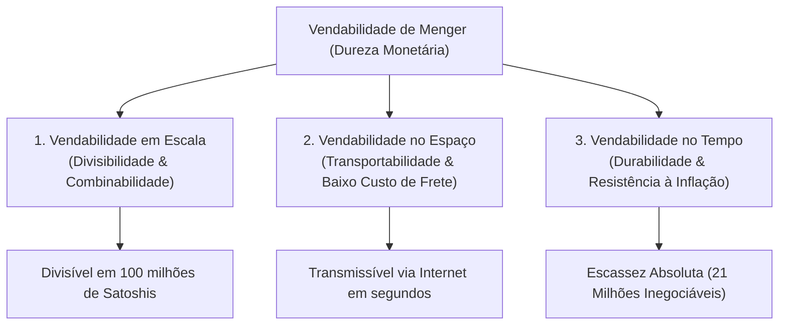
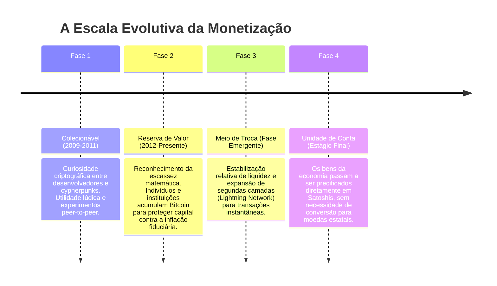

# 📈 02. As 5 Fases da Adoção Monetária e a Vendabilidade de Menger

> **Autor:** Arthur (Tutu)  
> **Trilha:** [[00 - Soberania Digital & Bitcoin — Guia Mestre|Soberania Digital & Bitcoin (Espinha Dorsal — Etapa 2)]]  
> **Nível de Consciência:** Nível 1 ➔ Nível 2 (Da desconstrução da moeda estatal à compreensão da monetização histórica)  
> **Conexões:** ← [[01 - Bitcoin — Das Predições de Friedman ao Bloco Gênesis]] | → [[03 - Autocustódia & Soberania — A Física do Sem Risco de Contraparte]]  

---

## 🎯 Cabeçalho de Metas & Premissas

> **Tempo Estimado de Leitura:** 8 minutos  
> **Premissas Necessárias:**
> 1. Compreensão de que a moeda fiduciária estatal sofre desvalorização crônica ([[01 - Bitcoin — Das Predições de Friedman ao Bloco Gênesis]]).
> 2. Disposição para analisar o dinheiro como um fenômeno espontâneo de mercado, e não como um decreto governamental.
>
> **O que você VAI aprender neste artigo:**
> - Por que criticar a volatilidade de curto prazo do Bitcoin ignora a história monetária.
> - A Teoria da Vendabilidade de Carl Menger (as 3 dimensões da moeda: Escala, Espaço e Tempo).
> - Como o ratio Stock-to-Flow ($S2F$) mede a dureza monetária do Ouro e do Bitcoin.
> - As 4 fases canônicas pelas quais qualquer ativo precisa passar antes de virar meio de pagamento universal.
> - Como a Lei de Metcalfe e o Efeito Lindy blindam o protocolo contra obsolescência.

---

## 🧭 Índice do Artigo
- [[#Ato 1: A Ilusão da Estabilidade Imediata (Por Que o Bitcoin Oscila?)]]
- [[#Ato 2: A Teoria da Vendabilidade de Carl Menger]]
- [[#Ato 3: O Ratio Stock-to-Flow ($S2F$) e a Dureza Matemática]]
- [[#Ato 4: As 4 Fases Históricas da Adoção Monetária]]
- [[#Ato 5: O Efeito Lindy e a Lei de Metcalfe ($V \propto N^2$)]]
- [[#🔗 Próximo Passo na Trilha]]
- [[#🧬 Notas Co-ativadas & Conexões da Trilha]]

---

> *"Nenhum ativo na história da humanidade nasceu pronto como meio de troca universal. O dinheiro não é inventado por decreto de uma noite para o dia; ele é descoberto pelo mercado através de um processo lento de monetização."*  
> — **Saifedean Ammous, em O Padrão Bitcoin**

---

### Ato 1: A Ilusão da Estabilidade Imediata (Por Que o Bitcoin Oscila?)

O cético convencional costuma apontar para o gráfico diário do Bitcoin e disparar a objeção clássica:

> *"Como isso pode ser dinheiro se oscila 5% em um único dia? Ninguém compra pão na padaria com algo tão volátil."*

Essa crítica comete um erro de diagnóstico elementar: **ela confunde um ativo monetário em fase inicial de monetização com uma moeda fiduciária estabelecida há séculos sob monopólio estatal**.

O ouro não começou a sua história como uma moeda estável aceita globalmente. Nos primeiros séculos de uso, o ouro era apenas um metal amarelo pesado, brilhante e colecionável. Ele oscilava violentamente de valor dependendo de qual tribo ou império o descobria, até que, ao longo de milênios, acumulou liquidez suficiente para estabilizar seu poder de compra.

O Bitcoin está comprimindo um processo histórico que levou 3.000 anos no ouro em apenas algumas décadas de computação global.

A volatilidade de curto prazo é apenas o mecanismo de descoberta de preços de um novo ativo saindo de **zero** em 2009 para se transformar na **reserva de valor global mais dura do planeta**.

---

### Ato 2: A Teoria da Vendabilidade de Carl Menger

Em 1892, o fundador da Escola Austríaca de Economia, **Carl Menger**, publicou o clássico *On the Origins of Money*, desmontando o mito de que o dinheiro surge de um "pacto social" ou "invenção do Estado".

Menger provou que o dinheiro emerge espontaneamente quando os indivíduos buscam o bem **mais vendável** (*saleable*) — aquele com menor perda de valor ao ser negociado em diferentes condições:



| Dimensão da Vendabilidade | Ouro Físico | Moeda Fiduciária (Dólar / Real) | Rede Bitcoin |
| :--- | :--- | :--- | :--- |
| **1. Escala (Divisibilidade)** | Péssima (cortar barras de ouro em frações destrói o metal). | Boa (centavos digitais centralizados). | **Perfeita** (1 BTC = $100.000.000$ Satoshis). |
| **2. Espaço (Transporte)** | Ruim (pesado, exige transporte blindado e alfândegas). | Regular (sujeita a limites bancários e censura SWIFT). | **Instantânea** (trilhões transportáveis em segundos). |
| **3. Tempo (Preservação)** | Excelente ($S2F \approx 62$ / durável por milênios). | Péssima (perde $98.5\%$ de valor em décadas). | **Absoluta** (emissão limitada a 21 milhões por código). |

O Bitcoin é a primeira tecnologia da história que atinge pontuação máxima nas três dimensões da vendabilidade de Menger simultaneamente.

---

### Ato 3: O Ratio Stock-to-Flow ($S2F$) e a Dureza Matemática

Por que o ouro foi o dinheiro supremo por milênios e por que o Bitcoin o superou?

A resposta reside no conceito de **Stock-to-Flow ($S2F$)**, popularizado por Saifedean Ammous em *O Padrão Bitcoin*:

$$\text{Stock-to-Flow } (S2F) = \frac{\text{Estoque Acumulado Existente (Stock)}}{\text{Nova Produção Anual (Flow)}}$$

* Quanto **maior** o ratio $S2F$, menor é a proporção de nova produção entrando no mercado, tornando o estoque imune à diluição de oferta quando a demanda sobe.
* Quanto **menor** o ratio $S2F$, mais fácil é para os produtores inundarem o mercado com novas unidades, colapsando o preço.

```mermaid
graph LR
    subgraph Dureza Monetária Crescente (Resistência à Diluição)
        Fiat["Moeda Fiat<br>S2F ~ 0<br>(Fluxo inflacionado por canetada)"] --> Prata["Prata<br>S2F ~ 22<br>(Inflação anual ~4.5%)"]
        Prata --> Ouro["Ouro Físico<br>S2F ~ 62<br>(Inflação anual ~1.5%)"]
        Ouro --> BTC["Bitcoin (Pós-2024)<br>S2F ~ 120+<br>(Emissão ~0.83% rumo a 0)"]
    end
```

Nas moedas fiduciárias, o $S2F$ tende a zero porque bancos centrais criam trilhões de dólares a custo zero. No ouro, o $S2F \approx 62$ porque minerar ouro novo exige escavações pesadas.

No Bitcoin, o mecanismo do **Halving** (corte da emissão de novos bitcoins pela metade a cada 210.000 blocos / ~4 anos) empurrou o $S2F$ do Bitcoin para **mais de 120 após abril de 2024**. O Bitcoin tornou-se o bem físico ou digital mais duro e resistente à inflação já conhecido pela ciência econômica.

---

### Ato 4: As 4 Fases Históricas da Adoção Monetária

A evolução de qualquer dinheiro novo segue uma sequência canônica de 4 estágios descrita por economistas e pesquisadores como Nick Szabo:



1. **Fase 1 — Colecionável:** O ativo é apreciado apenas por pioneiros e entusiastas.
2. **Fase 2 — Reserva de Valor (O Momento Atual):** O mercado descobre que o ativo é o melhor refúgio contra a impressão estatal. A demanda explode, provocando ciclos de alta e correção (*booms e busts*).
3. **Fase 3 — Meio de Troca:** Conforme o valor total de mercado ultrapassa múltiplos trilhões de dólares, a volatilidade arrefece e as camadas de escalabilidade (Lightning Network) tornam os micropagamentos práticos e baratos.
4. **Fase 4 — Unidade de Conta:** O estágio terminal de hiperbitcoinização, onde a riqueza é mensurada nativamente em Satoshis.

Exigir que o Bitcoin funcione como *Meio de Troca* antes de completar sua consolidação como *Reserva de Valor* é o equivalente a exigir que uma árvore dê frutos antes de criar raízes.

---

### Ato 5: O Efeito Lindy e a Lei de Metcalfe ($V \propto N^2$)

Dois princípios matemáticos garantem que o Bitcoin não seja substituído por cópias ou altcoins:

1. **A Lei de Metcalfe ($V \propto N^2$):** O valor de uma rede de telecomunicações ou financeira é proporcional ao **quadrado do número de usuários conectados**. Criar uma cópia do código do Bitcoin é trivial; replicar a rede global de centenas de milhares de nós validadores, milhões de usuários, liquidez institucional e infraestrutura de mineração é virtualmente impossível.
2. **O Efeito Lindy:** Para tecnologias não perecíveis, a expectativa de vida futura é proporcional à sua idade atual. Cada dia que o Bitcoin opera 24/7 sem sofrer ataques bem-sucedidos na sua camada base adiciona mais um dia à sua expectativa de sobrevivência nos próximos 50 anos.

---

### 🔗 Próximo Passo na Trilha

Com a lógica de monetização e a dureza do Stock-to-Flow dominadas, surge a questão prática e decisiva:

*Se o Bitcoin é a reserva de valor matemática soberana, como você garante que a sua riqueza está realmente sob sua posse e não sob o controle de uma corretora que pode congelar seus fundos?*

* → Avançar para a Etapa 3: [[03 - Autocustódia & Soberania — A Física do Sem Risco de Contraparte]]

---

### 🧬 Notas Co-ativadas & Conexões da Trilha
* **Guia Mestre da Trilha:** [[00 - Soberania Digital & Bitcoin — Guia Mestre]]
* **Etapa 01 (A Farsa de Papel):** [[01 - Bitcoin — Das Predições de Friedman ao Bloco Gênesis]]
* **Próxima Etapa (Autocustódia Soberana):** [[03 - Autocustódia & Soberania — A Física do Sem Risco de Contraparte]]
* **Mecânica Bancária Satélite:** [[Reserva Fracionária — Como os Bancos Criam Dinheiro do Vazio]]
* **Livro do Acervo:** **O Padrão Bitcoin** *(Saifedean Ammous)*
