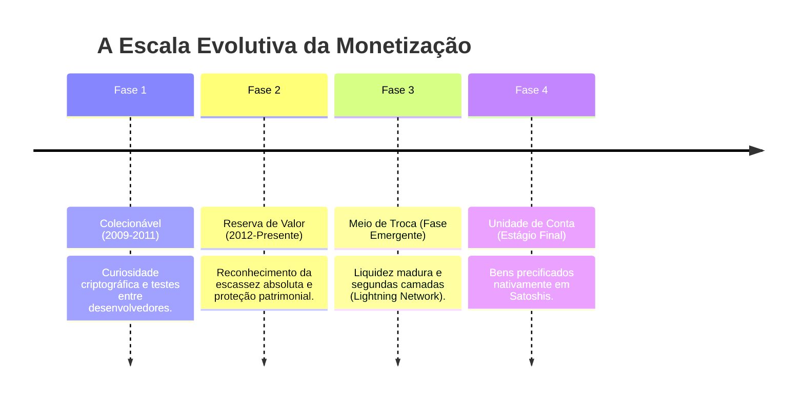
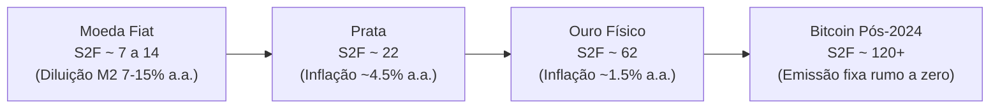
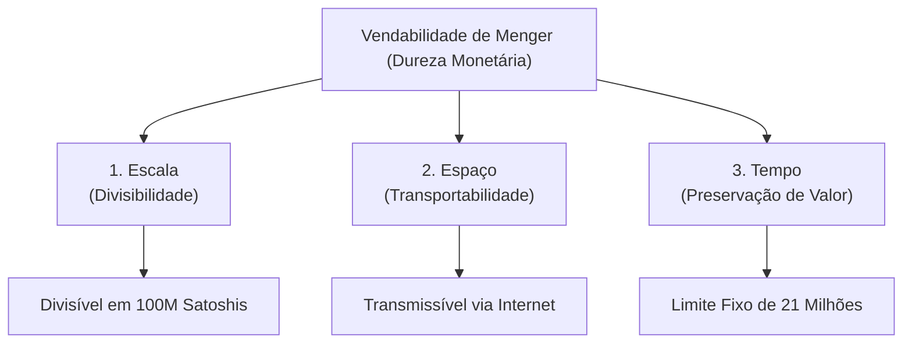

# 📈 02. As 4 Fases da Adoção Monetária e a Vendabilidade de Menger

> **Autor:** Arthur (Tutu)  
> **Trilha:** [[00 - Soberania Digital & Bitcoin — Guia Mestre|Soberania Digital & Bitcoin (Espinha Dorsal — Etapa 2)]]  
> **Nível de Consciência:** Nível 1 ➔ Nível 2 (Da desconstrução da moeda estatal à monetização histórica)  
> **Conexões:** ← [[01 - Bitcoin — Das Predições de Friedman ao Bloco Gênesis]] | → [[03 - Autocustódia & Soberania — A Física do Sem Risco de Contraparte]]  

---

## 🎯 Cabeçalho de Metas & Premissas

> **Tempo Estimado de Leitura:** 8 minutos  
> **Premissas Necessárias:**
> 1. A moeda estatal sofre diluição sistêmica contínua ([[01 - Bitcoin — Das Predições de Friedman ao Bloco Gênesis]]).
> 2. O dinheiro é uma descoberta espontânea de mercado, não uma criação estatal por decreto.
>
> **O que você VAI aprender neste artigo:**
> - Por que a volatilidade reflete a descoberta livre de preços e não risco permanente.
> - As 4 fases canônicas pelas quais um ativo passa antes de virar meio de troca.
> - Como o ratio Stock-to-Flow ($S2F$) mede a dureza dos metais e a superioridade do Bitcoin.
> - A Teoria da Vendabilidade de Carl Menger (Escala, Espaço e Tempo).

---

## 🧭 Índice do Artigo
- [[#Ato 1: A Farsa da Volatilidade e o Sr. Mercado Bipolar]]
- [[#Ato 2: As 4 Fases Históricas da Adoção Monetária]]
- [[#Ato 3: O Ratio Stock-to-Flow ($S2F$) e a Dureza dos Metais]]
- [[#Ato 4: A Teoria da Vendabilidade de Carl Menger]]
- [[#🔗 Próximo Passo na Trilha]]
- [[#🧬 Notas Co-ativadas & Conexões da Trilha]]

---

> *"O dinheiro não é uma invenção do Estado, nem o produto de um ato legislativo. A sanção da autoridade política não é necessária para a sua existência... Certas mercadorias tornaram-se dinheiro naturalmente, como resultado das relações econômicas e sem necessidade de convenção estatal."*  
> — **Carl Menger**, *The Origins of Money (1892)*

---

### Ato 1: A Farsa da Volatilidade e o Sr. Mercado Bipolar

O cético aponta para a cotação diária do Bitcoin com a clássica objeção:

> *"Como isso tem valor se oscila 5% em uma única tarde? Ninguém compra pão na padaria com algo tão volátil."*

A crítica incorre em dois erros de diagnóstico:

#### Volatilidade não é Risco: A Lição do Sr. Mercado

Em economia real, **volatilidade não é risco**. A volatilidade reflete a clássica alegoria do **"Sr. Mercado"** de Benjamin Graham: uma persona emocional, ansiosa e bipolar que bate à sua porta todos os dias oferecendo preços erráticos baseados em euforia ou pânico. Em um mercado livre e ininterrupto (24/7), a oscilação de preço é o mecanismo transparente pelo qual oferta e demanda se equilibram sem manipulação de bancos centrais (como explorado em [[Experimento Mental — Oferta, Demanda e a Formação de Preços]]).

Além disso, há um erro de categoria: **nem o ouro, nem o Bitcoin são moedas correntes de trocas diárias (*currencies*)**. Ambos são **reservas de valor primárias** (*money / store of value*). Exigir que um ativo nascente sirva para pagar o cafezinho antes de acumular liquidez global é inverter a ordem natural da evolução da moeda. O ouro levou mais de 3.000 anos para estabilizar seu poder de compra planetário; o Bitcoin está compactando essa descoberta em menos de duas décadas. A cada ciclo de 4 anos, a volatilidade cai em relação ao valor total de capital alocado.

---

### Ato 2: As 4 Fases Históricas da Adoção Monetária

Nenhum bem econômico nasce como meio de troca universal. Conforme detalhado por Nick Szabo, a monetização obedece a uma progressão de 4 estágios:

1. **Fase 1 — Colecionável:** O ativo é apreciado por propriedades peculiares por um nicho pioneiro. Foi a fase do Bitcoin de 2009 a 2011, minerado em PCs caseiros como experimento lúdico.
2. **Fase 2 — Reserva de Valor (O Estágio Atual):** O mercado reconhece a escassez matemática para preservar riqueza no tempo. A entrada de capital institucional gera ciclos de alta e correção (*booms and busts*) típicos da precificação pelo Sr. Mercado.
3. **Fase 3 — Meio de Troca:** Ao atingir trilhões em liquidez, a volatilidade marginal arrefece. O ativo passa a ser aceito no comércio diário via segundas camadas como a **Lightning Network** (detalhado em [[As Camadas do Bitcoin — Lightning e Liquid]]).
4. **Fase 4 — Unidade de Conta:** Estágio final onde bens são precificados em Satoshis. Cabe a provocação: talvez o Bitcoin nunca alcance plenamente esse estágio no comércio diário. Pela Lei de Gresham (analisada em [[A Lei de Gresham e o Paradoxo da Unidade de Conta]]), a moeda fraca expulsa a forte da circulação: indivíduos racionais gastam o dinheiro fiduciário inflacionário e entesouram o Bitcoin como reserva soberana de valor.

Cobrar do Bitcoin função transacional plena antes de consolidar sua reserva de valor é o equivalente a exigir que uma árvore dê frutos antes de criar raízes.

---

### Ato 3: O Ratio Stock-to-Flow ($S2F$) e a Dureza dos Metais

Para medir por que certas mercadorias vencem como reserva de valor, a economia utiliza a razão de **Stock-to-Flow ($S2F$)**, popularizada por Saifedean Ammous em *O Padrão Bitcoin*:

$$\text{Stock-to-Flow } (S2F) = \frac{\text{Estoque Acumulado (Stock)}}{\text{Produção Anual (Flow)}}$$

Onde:
- **Stock:** Quantidade total do bem já minerada e acumulada na sociedade.
- **Flow:** Produção nova inserida no mercado a cada ano.

Em termos práticos:
* Quanto **maior** o $S2F$, **menor** é o fluxo novo em relação ao estoque, tornando o ativo **resistente** à diluição de oferta.
* Commodities industriais têm $S2F < 1$: qualquer alta de preço dispara a produção e derruba o valor.

Essa dinâmica decorre da formação de preços entre oferta e demanda (revisitada em [[Experimento Mental — Oferta, Demanda e a Formação de Preços]]): quando a produção de novos fluxos não consegue responder à explosão de demanda, a valorização é absorvida integralmente pelo estoque acumulado.

#### Exemplo histórico: A Corrida dos Metais e a Quebra dos Irmãos Hunt
Durante séculos, ouro e prata competiram pelo monopólio monetário. A prata tinha melhor divisibilidade, mas uma vulnerabilidade fatal: sua abundância relativa na crosta confere a ela um $S2F \approx 22$ (inflação de fluxo anual de $\approx 4.5\%$).

Nos anos 1970, os **irmãos Hunt** tentaram encurralar o mercado de prata inflando o preço. A alta estimulou mineradores globais a extraírem mais metal e cidadãos a derreterem joias e talheres. A torrente de nova prata inundou o mercado, o preço despencou e os bilionários perderam mais de US$ 1 bilhão. Ativos com baixo $S2F$ não suportam choques de produção.

O ouro consolidou sua primazia porque sua escassez geológica confere um $S2F \approx 62$ (inflação anual de apenas $\approx 1.5\%$). Todo o ouro já minerado cabe em um cubo de cerca de 22 metros.

#### A Escassez Absoluta do Bitcoin ($S2F > 120$)
No padrão fiduciário, com a expansão monetária de M2 historicamente situada entre 7% e 15% ao ano, o $S2F$ gravita na faixa de 7 a 14, colapsando para valores próximos de zero apenas em episódios de hiperinflação. No Bitcoin, a produção é determinada por algoritmo: a cada **210.000 blocos** (~4 anos), o **Halving** corta a emissão pela metade.

Após abril de 2024, a emissão caiu para 3,125 BTC por bloco, elevando o **$S2F$ do Bitcoin para mais de 120** — o dobro do ouro e com inflação de oferta inferior a $0.83\%$ a.a. Pela primeira vez na história, existe um ativo com oferta totalmente inelástica, cujos fundamentos de precificação foram modelados por PlanB e analisados pelo Nakamoto Portfolio da Swan Research (aprofundados em [[Valuation do Bitcoin — Stock-to-Flow]]).

---

### Ato 4: A Teoria da Vendabilidade de Carl Menger

Em 1892, Carl Menger demonstrou que o dinheiro emerge da busca pelo bem mais **vendável** (*saleable*) — negociado com menor atrito em três dimensões:

#### Por Que Essas Três Características?
- **Escala (Divisibilidade):** Capacidade de pagar microvalores ou quantias gigantescas sem perda de material. O ouro falha aqui: raspar uma barra para comprar pão destrói a sua pureza e integridade.
- **Espaço (Transporte):** Capacidade de mover patrimônio através de fronteiras. Transportar milhões em ouro exige cofres, frete armado e submissão a alfândegas.
- **Tempo (Preservação):** Capacidade de transferir o fruto do trabalho para décadas no futuro sem ser confiscado pela inflação (dimensão onde a métrica de $S2F$ atua como indicador de dureza temporal).

| Ativo Monetário | Escala (Divisão) | Espaço (Transporte) | Tempo (Preservação) | Veredito |
| :--- | :--- | :--- | :--- | :--- |
| **Moeda Fiduciária** | Boa | Boa (digital, mas censurável) | **Péssima** ($S2F \approx 7 \text{ a } 14$) | Diluição crônica e risco de confisco. |
| **Prata** | Boa | Regular (pesada para impérios) | Mediana ($S2F \approx 22$) | Desmonetizada pelo ouro no séc. XIX. |
| **Ouro Físico** | **Péssima** | **Ruim** (pesado, fácil de confiscar) | **Excelente** ($S2F \approx 62$) | Venceu como padrão, mas sucumbiu à centralização. |
| **Rede Bitcoin** | **Perfeita** ($10^8$ sats) | **Instantânea** (teletransporte digital) | **Absoluta** ($S2F > 120$, 21M) | **Pico máximo nas 3 dimensões simultâneas.** |

O ouro impôs severas limitações de escala e espaço aos seus custodiantes. Por ser difícil de transportar e fracionar, foi guardado em bancos em troca de recibos de papel. Essa centralização viabilizou as reservas fracionárias (explorado em [[Reserva Fracionária — Como os Bancos Criam Dinheiro do Vazio]]) e culminou no rompimento do padrão-ouro em 1971.

O Bitcoin une a durabilidade temporal do ouro com a velocidade espacial e a divisibilidade infinita da informação digital.

---

### 🔗 Próximo Passo na Trilha

*Se o Bitcoin é a reserva de valor matemática soberana, como garantir a posse real das suas chaves privadas sem depender de terceiros ou custodiantes?*

* → Avançar para a Etapa 3: [[03 - Autocustódia & Soberania — A Física do Sem Risco de Contraparte]]

---

### 🧬 Notas Co-ativadas & Conexões da Trilha
* **Guia Mestre:** [[00 - Soberania Digital & Bitcoin — Guia Mestre]]
* **Espinha Dorsal:** ← [[01 - Bitcoin — Das Predições de Friedman ao Bloco Gênesis]] | → [[03 - Autocustódia & Soberania — A Física do Sem Risco de Contraparte]]
* **Sidequests Conectadas:**
  - [[As Camadas do Bitcoin — Lightning e Liquid]]
  - [[Valuation do Bitcoin — Stock-to-Flow]]
  - [[A Lei de Gresham e o Paradoxo da Unidade de Conta]]
  - [[Experimento Mental — Oferta, Demanda e a Formação de Preços]]
  - [[Reserva Fracionária — Como os Bancos Criam Dinheiro do Vazio]]
* **Obras Consultadas:** *The Origins of Money* (Menger, 1892), *O Padrão Bitcoin* (Ammous), *Bitcoin Red Pill* (Amoedo & Schramm).
