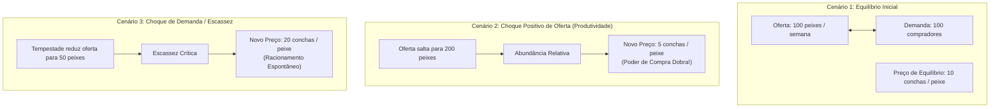

# 🍎 Experimento Mental — Oferta, Demanda e a Formação de Preços

> **Autor:** Arthur (Tutu)  
> **Trilha de Origem:** [[00-economia-e-antifragilidade-guia-mestre|Economia & Antifragilidade (Nível 1)]]  
> **Trilha Co-ativada:** [[00-soberania-digital-e-bitcoin-guia-mestre|Soberania Digital & Bitcoin]]  
> **Conexões Canônicas:** → [[01-bitcoin-das-predicoes-de-friedman-ao-bloco-genesis|01 - Bitcoin — Das Predições de Friedman ao Bloco Gênesis]]  

---

## 🎯 Por Que Preços Não São Arbitrários

No senso comum, muitas pessoas acreditam erroneamente que os preços são determinados de forma voluntariosa pela *"ganância dos comerciantes"* ou por decretos estatais.

Como demonstrado pela tradição da Escola Austríaca de Economia (Carl Menger e Ludwig von Mises), **os preços são sinais de informação e escassez relativa**. Eles comunicam instantaneamente a milhões de agentes descentralizados o valor que a sociedade atribui a determinado bem frente à sua disponibilidade real no mundo físico.

Para compreender como isso opera de forma cristalina, recorremos a um clássico experimento mental.

---

## 🧭 Índice do Artigo
- [[#🏝️ O Experimento Mental: A Ilha dos Pescadores e as Maçãs]]
- [[#🧠 As 3 Leis Axiomáticas dos Preços Livres]]
- [[#🧬 Conexões Semânticas & Referências]]

---

## 🏝️ O Experimento Mental: A Ilha dos Pescadores e as Maçãs

Imagine uma pequena comunidade isolada onde operam dois grupos principais: pescadores e agricultores.

A moeda de troca aceita por todos é uma quantidade fixa de conchas raras (digamos, 1.000 conchas em circulação em toda a ilha).

### 1. O Equilíbrio da Oferta e Demanda
* Se são pescados **100 peixes por semana** e há **100 pessoas** dispostas a comprar com a massa de conchas disponível, o preço estabiliza-se naturalmente em torno de **10 conchas por peixe**.

### 2. O Aumento da Produtividade (Choque de Oferta)
* Suponha que os pescadores inventem uma nova rede que permite capturar **200 peixes** com o mesmo esforço.
* Se a quantidade de dinheiro na ilha continua a mesma (1.000 conchas) e a demanda de consumo não se alterou, os pescadores precisam disputar a preferência dos compradores.
* **Resultado Inevitável:** O preço do peixe cai para **5 conchas**. Todos os habitantes da ilha ficaram mais ricos sem precisar ganhar aumento salarial nominal, pois o seu dinheiro agora compra o dobro de peixes.

### 3. A Escassez Imprevista (Choque de Demanda/Escassez)
* Caso uma tempestade danifique os barcos e a oferta caia temporariamente para **50 peixes**, a disputa entre os compradores faz o preço subir para **20 conchas**.
* Esse preço mais alto cumpre duas funções vitais:
  1. **Raciona o bem escasso:** Garante que apenas quem realmente precisa compre peixe naquele momento.
  2. **Atrai novos produtores:** Sinaliza para outros habitantes que vale a pena consertar barcos rapidamente e pescar mais.

---

## 🧠 As 3 Leis Axiomáticas dos Preços Livres

1. **Preços são Mensageiros, Não Vilões:** A alta de um preço apenas reflete a escassez real de um bem ou o excesso de dinheiro no mercado. Tabelar ou controlar preços é o equivalente a quebrar o termômetro para tentar curar a febre do paciente.
2. **Soberania do Consumidor:** Em um mercado sem privilégios estatais, o consumidor decide diariamente o que tem valor ao escolher comprar ou não comprar.
3. **A Ilusão Monetária:** Quando todos os preços sobem de forma generalizada e permanente na economia, o fenômeno não decorre de uma escassez súbita de todos os produtos ao mesmo tempo, mas sim da **diluição da moeda pelos governos**, que injetam dinheiro sem lastro e desvalorizam a unidade de medida.

---

## 🧬 Conexões Semânticas & Referências

* **Trilha de Economia:** [[00-economia-e-antifragilidade-guia-mestre|00 - Economia & Antifragilidade — Guia Mestre]]
* **Trilha de Bitcoin:** [[00-soberania-digital-e-bitcoin-guia-mestre|00 - Soberania Digital & Bitcoin — Guia Mestre]] | [[01-bitcoin-das-predicoes-de-friedman-ao-bloco-genesis|01 - Bitcoin — Das Predições de Friedman ao Bloco Gênesis]]
* **Fundamentos Históricos:** [[fundamentos-e-historia-do-bitcoin-da-crise-de-2008-ao-bloco-genesis|Fundamentos e História do Bitcoin — Da Crise de 2008 ao Bloco Gênesis]]
