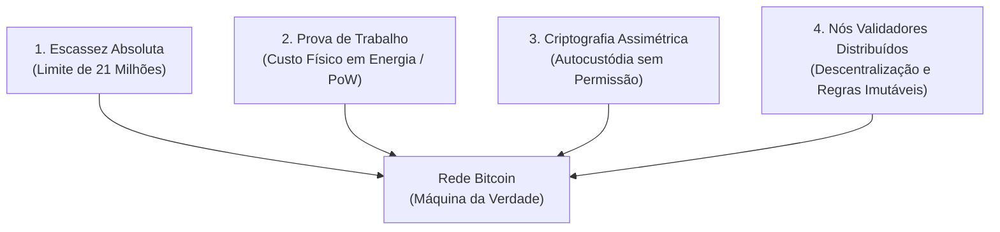

# 🏛️ Fundamentos e História do Bitcoin — Da Crise de 2008 ao Bloco Gênesis

> **Autor:** Arthur (Tutu)  
> **Trilha:** [[00-soberania-digital-e-bitcoin-guia-mestre|Soberania Digital & Bitcoin (Sidequest Fundacional)]]  
> **Artigo Principal Vinculado:** [[01-bitcoin-das-predicoes-de-friedman-ao-bloco-genesis|01 - Bitcoin — Das Predições de Friedman ao Bloco Gênesis]]  

---

## 🎯 Visão Geral

O nascimento do Bitcoin não foi um evento acadêmico isolado, mas uma **resposta tecnológica e moral direta à maior crise de solvência do sistema financeiro global desde a Grande Depressão de 1929**.

Compreender o surgimento da rede exige examinar a falência dos intermediários de confiança em 2008, a proposta revolucionária de Satoshi Nakamoto e os princípios matemáticos que tornam o protocolo uma tecnologia inconfiscável e livre de coerção estatal.

---

## 🧭 Índice do Artigo
- [[#💥 1. O Pano de Fundo: O Colapso de 2008 e os Resgates (*Bailouts*)]]
- [[#📄 2. O White Paper de Satoshi Nakamoto (31 de Outubro de 2008)]]
- [[#⛏️ 3. A Mineração do Bloco Gênesis (03 de Janeiro de 2009)]]
- [[#🧱 4. Os 4 Pilares Fundacionais do Protocolo]]
- [[#🧬 Conexões Semânticas & Referências]]

---

## 💥 1. O Pano de Fundo: O Colapso de 2008 e os Resgates (*Bailouts*)

Durante a década de 2000, o sistema bancário tradicional inflou uma bolha gigantesca de crédito imobiliário nos Estados Unidos, baseada em derivativos tóxicos e empréstimos de alto risco (*subprimes*). Quando os tomadores de empréstimo começaram a dar calote em massa em 2007 e 2008:

1. **A Falência dos Gigantes:** Instituições seculares como o banco de investimentos *Lehman Brothers* faliram em setembro de 2008, congelando o mercado interbancário mundial.
2. **Socialização das Perdas (*Bailouts*):** Em vez de permitir que o mercado liquidasse os maus investimentos, governos e bancos centrais imprimiram trilhões de dólares do nada para resgatar os mesmos banqueiros que causaram o colapso, sob o pretexto de serem *"grandes demais para quebrar"* (*Too Big to Fail*).
3. **A Quebra Moral do Contrato Social:** O cidadão comum arcou com o desemprego, a perda de casas e a inflação futura, enquanto a elite financeira embolsou bônus milionários garantidos por dívida pública.

Ficou evidente para os movimentos criptográficos e de defesa da liberdade individual que o dinheiro estatal não possuía guardiões confiáveis.

---

## 📄 2. O White Paper de Satoshi Nakamoto (31 de Outubro de 2008)

Em 31 de outubro de 2008, em uma lista de e-mails de entusiastas da criptografia (*The Cryptography Mailing List*), um indivíduo ou grupo sob o pseudônimo de **Satoshi Nakamoto** publicou um documento de 9 páginas intitulado:

> **"Bitcoin: A Peer-to-Peer Electronic Cash System"** *(Bitcoin: Um Sistema de Dinheiro Eletrônico Ponto a Ponto)*.

Neste manifesto técnico, Satoshi resolveu o problema central que impedia a criação de dinheiro digital há décadas: **o Problema do Gasto Duplo sem Intermediários**.

Antes do Bitcoin, qualquer arquivo digital podia ser copiado infinitamente (como um PDF ou uma foto). Para impedir que alguém gastasse o mesmo dinheiro digital duas vezes, era sempre necessário um banco central ou servidor centralizado para validar as contas. Satoshi combinou **criptografia assimétrica**, **redes ponto a ponto (P2P)** e um mecanismo de incentivos econômicos chamado **Prova de Trabalho (Proof-of-Work)**, permitindo que uma rede distribuída de computadores chegasse a um consenso sem depender de nenhuma autoridade central.

---

## ⛏️ 3. A Mineração do Bloco Gênesis (03 de Janeiro de 2009)

Em 3 de janeiro de 2009, Satoshi Nakamoto colocou a rede em operação e minerou o **Bloco 0** (conhecido como *Bloco Gênesis*), gerando as primeiras 50 unidades de bitcoin.

Dentro do código desse primeiro bloco, Satoshi gravou uma mensagem indelével extraída da primeira página do jornal britânico *The Times*:

```text
The Times 03/Jan/2009 Chancellor on brink of second bailout for banks
(The Times 03/Jan/2009 Chanceler à beira de um segundo resgate para os bancos)
```

Essa manchete serviu a dois propósitos fundamentais:
* **Prova Temporal:** Provou que o bloco não havia sido minerado antes daquela data.
* **Declaração de Missão:** Deixou gravado na pedra digital da história o motivo da criação do Bitcoin — uma alternativa definitiva a um sistema bancário corrupto baseado em resgates contínuos e diluição monetária.

---

## 🧱 4. Os 4 Pilares Fundacionais do Protocolo

O Bitcoin apoia-se em quatro pilares matemáticos e econômicos que garantem sua resiliência:



1. **Escassez Absoluta Programada:** Haverá no máximo **21.000.000 de bitcoins**. O ritmo de emissão é reduzido pela metade a cada 210.000 blocos (aproximadamente a cada 4 anos, no evento conhecido como *Halving*), tornando o ativo matematicamente imune à inflação discricionária.
2. **Prova de Trabalho (Proof of Work):** A emissão e validação de transações dependem do gasto de energia elétrica no mundo real para resolver problemas criptográficos (função SHA-256). Isso ancora o dinheiro à física da termodinâmica, impedindo a criação de moeda a custo zero.
3. **Criptografia de Chave Pública/Privada:** Apenas o detentor da chave privada correspondente ao endereço pode autorizar transferências. Não existe botão de estorno, congelamento judicial ou confisco sem a chave física.
4. **Governança sem Líder:** As regras do protocolo são aplicadas e auditadas por milhares de nós validadores (*Full Nodes*) independentes ao redor do planeta, impedindo que mineradores, governos ou corporações alterem o suprimento ou censurem transações.

---

## 🧬 Conexões Semânticas & Referências

* **Artigo Central da Trilha:** [[01-bitcoin-das-predicoes-de-friedman-ao-bloco-genesis|01 - Bitcoin — Das Predições de Friedman ao Bloco Gênesis]]
* **Guia Mestre da Trilha:** [[00-soberania-digital-e-bitcoin-guia-mestre|00 - Soberania Digital & Bitcoin — Guia Mestre]]
* **Mecânica Bancária:** [[reserva-fracionaria-como-os-bancos-criam-dinheiro-do-vazio|Reserva Fracionária — Como os Bancos Criam Dinheiro do Vazio]]
* **Experimento Mental de Preços:** [[experimento-mental-oferta-demanda-e-a-formacao-de-precos|Experimento Mental — Oferta, Demanda e a Formação de Preços]]
