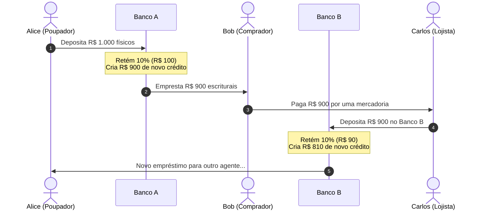
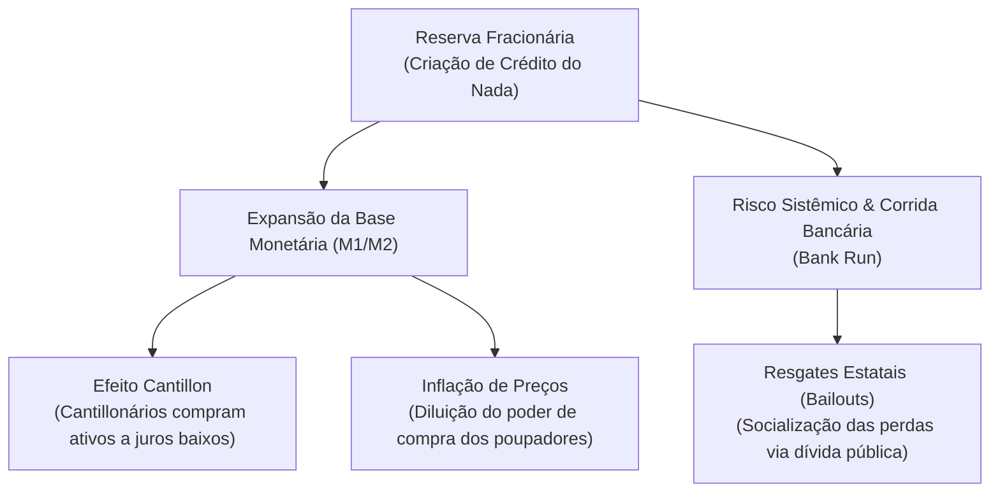

# 🏦 Reserva Fracionária — Como os Bancos Criam Dinheiro do Vazio

> **Autor:** Arthur (Tutu)  
> **Trilha:** [[00-soberania-digital-e-bitcoin-guia-mestre|Soberania Digital & Bitcoin (Sidequest de Apoio)]]  
> **Artigo Principal Vinculado:** [[01-bitcoin-das-predicoes-de-friedman-ao-bloco-genesis|01 - Bitcoin — Das Predições de Friedman ao Bloco Gênesis]]  

---

## 🎯 A Maior Ilusão do Sistema Bancário

A imensa maioria das pessoas acredita que, ao depositar R$ 10.000 em uma conta corrente, o banco guarda esse dinheiro em um cofre seguro e o mantém disponível para saque a qualquer momento.

Na prática jurídica e contábil do sistema financeiro moderno, **isso não acontece**.

Sob o regime de **Reserva Fracionária**, os bancos comerciais são autorizados por lei a reter apenas uma pequena fração dos depósitos (geralmente entre 10% e 20%, ou até 0% em alguns países) e **emprestar todo o restante** para terceiros. 

Ao fazer isso repetidamente, os bancos criam dinheiro escritural do vazio, expandindo a quantidade de moeda circulante na economia.

---

## 🧭 Índice do Artigo
- [[#⚙️ A Mecânica do Multiplicador Bancário]]
- [[#💥 As Consequências Perversas da Reserva Fracionária]]
- [[#🛡️ A Alternativa Soberana do Bitcoin]]
- [[#🧬 Conexões Semânticas & Referências]]

---

## ⚙️ A Mecânica do Multiplicador Bancário

Para visualizar como o dinheiro sem lastro é multiplicado em cascata, observe a cadeia de crédito entre múltiplos bancos:

### O Efeito Cascata:
1. **Depósito Inicial:** Alice deposita **R$ 1.000**.
2. **Primeiro Empréstimo:** O Banco A guarda R$ 100 de compulsório e empresta **R$ 900** para Bob comprar um carro.
3. **Segundo Depósito:** O vendedor do carro (Carlos) recebe os R$ 900 e os deposita no Banco B.
4. **Segundo Empréstimo:** O Banco B guarda R$ 90 (10%) e empresta **R$ 810** para Daniel.
5. **Resultado Contábil:** A economia agora possui **R$ 2.710** em saldos bancários (R$ 1.000 da Alice + R$ 900 do Carlos + R$ 810 do Daniel), embora apenas **R$ 1.000 em dinheiro físico real** tenham entrado no sistema!

Com uma taxa de compulsório de 10%, um único depósito inicial de R$ 1.000 pode gerar até **R$ 10.000 em dívidas e dinheiro escritural** circulando na praça.

---

## 💥 As Consequências Perversas da Reserva Fracionária

1. **Risco Existencial de Corrida Bancária (*Bank Run*):** Como o dinheiro físico não existe nos cofres, se apenas 15% ou 20% dos correntistas tentarem sacar seus saldos simultaneamente no mesmo dia, o banco quebra instantaneamente (como ocorreu historicamente no *Silicon Valley Bank* em 2023 e no *Lehman Brothers* em 2008).
2. **Alimentação do Efeito Cantillon:** Grandes corporações e o complexo estatal têm acesso prioritário a esse crédito recém-criado a juros baixos antes que os preços subam, adquirindo ativos reais a preços defasados, enquanto os trabalhadores recebem o dinheiro diluído no supermercado.
3. **Juros Reais Negativos e Inflação:** A multiplicação artificial de moeda empurra a inflação para cima, destruindo a poupança do cidadão comum e forçando a sociedade a se expor a riscos em busca de rendimento.

---

## 🛡️ A Alternativa Soberana do Bitcoin

A rede Bitcoin extingue completamente a possibilidade de reserva fracionária no protocolo-base:
* **Lastro Matemático Estrito:** Não é possível criar bitcoins sintéticos na camada de consenso da rede.
* **Transparência e Autocustódia:** Ao manter seus fundos em uma carteira própria (*cold wallet*), a sua chave privada detém a posse real dos UTXOs no blockchain, sem depender da promessa de solvência de nenhum banco intermediário (*Not your keys, not your coins*).

---

## 🧬 Conexões Semânticas & Referências

* **Artigo Principal da Trilha:** [[01-bitcoin-das-predicoes-de-friedman-ao-bloco-genesis|01 - Bitcoin — Das Predições de Friedman ao Bloco Gênesis]]
* **Guia Mestre da Trilha:** [[00-soberania-digital-e-bitcoin-guia-mestre|00 - Soberania Digital & Bitcoin — Guia Mestre]]
* **Fundamentos Históricos:** [[fundamentos-e-historia-do-bitcoin-da-crise-de-2008-ao-bloco-genesis|Fundamentos e História do Bitcoin — Da Crise de 2008 ao Bloco Gênesis]]
* **Experimento Mental de Preços:** [[experimento-mental-oferta-demanda-e-a-formacao-de-precos|Experimento Mental — Oferta, Demanda e a Formação de Preços]]
