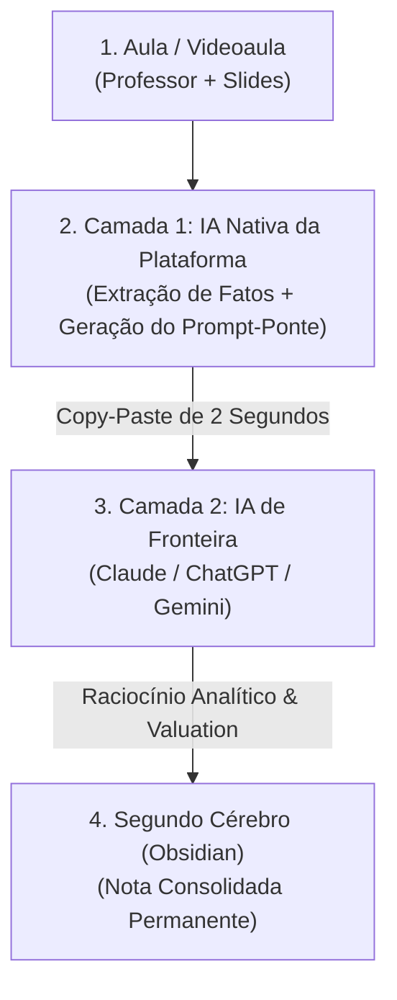

# 🎓 01. A Falência do Estudo Passivo e o Modelo Two-Tier de IA

> **Autor:** Arthur (Tutu)  
> **Trilha:** [[00 - Estudos & Agentes de IA — Guia Mestre|Estudos, Segundo Cérebro & Agentes de IA (Espinha Dorsal — Etapa 01)]]  
> **Nível de Consciência:** Nível 0 ➔ Nível 1 (Da ilusão de competência à captura ativa em duas camadas)  
> **Conexões:** → [[00 - Estudos & Agentes de IA — Guia Mestre]] | [[02 - Estudos com IA — Engenharia de Prompts de Alto Rendimento]]  

---

## 🎯 Cabeçalho de Metas & Premissas

> **Tempo Estimado de Leitura:** 6 minutos  
> **Premissas Necessárias:**
> 1. Estar matriculado em um curso universitário ou conduzindo estudos com carga de videoaulas e PDFs.
> 2. Disposição para abandonar anotações passivas e o hábito de pedir "resumos mágicos" genéricos.
>
> **O que você VAI aprender neste artigo:**
> - Por que assistir a horas de aula passivamente gera a falsa ilusão de aprendizado.
> - O que é a **Arquitetura Two-Tier (Duas Camadas)** e por que nenhuma IA isolada resolve seus estudos.
> - A mecânica do **Prompt-Ponte** para transferir contexto da aula para IAs analíticas em 2 segundos.
> - O fluxo prático para estruturar anotações que acumulam valor ao longo dos semestres.

---

> *"Ouvir uma explicação brilhante e entender o que o professor disse não significa que você aprendeu. Significa apenas que o professor sabe explicar."*  
> — **Axioma do Aprendizado Ativo**

---

### Ato 1: A Armadilha da 'Ilusão de Competência' no Ensino Moderno

O modelo universitário contemporâneo transferiu o grosso da carga horária para plataformas digitais de videoaulas. A reação padrão do estudante médio diante dessa avalanche divide-se em duas posturas igualmente falhas:

1. **A Passividade Zumbi:** Assistir a dezenas de horas de aula em velocidade normal (1x), acreditando que a simples exposição auditiva ao conteúdo transferirá o conhecimento para a memória de longo prazo. O aluno compreende a aula enquanto ela acontece, mas 48 horas depois não é capaz de articular um único conceito central.
2. **O Resumo Terceirizado Sem Critério:** Abrir o ChatGPT e colar comandos vagos como *"resuma essa matéria para mim"*. O modelo gera três parágrafos genéricos, repletos de adjetivos e vazios de dados técnicos, leis, fórmulas e casos reais. O aluno salva o texto em um Notion bagunçado, sente um alívio psicológico temporário e é reprovado na prova de raciocínio crítico.

Ambas as abordagens ignoram o princípio fundamental das ciências cognitivas (*Make It Stick*): **o cérebro só retém aquilo que é forçado a recuperar, processar e estruturar ativamente**. 

Se você terceiriza o raciocínio para a máquina, atrofia sua mente; se você não usa a máquina para eliminar a digitação mecânica, é engolido pela sobrecarga horária. A solução não é banir a IA, mas **arquitetar a divisão de trabalho entre você e a máquina**.

---

### Ato 2: As Forças e Fraquezas das IAs no Ambiente Acadêmico

Para desenhar um sistema eficiente, você precisa reconhecer as limitações físicas das ferramentas disponíveis:

* **IAs Nativas da Faculdade (ex: assistentes embutidos na plataforma de aulas):**
  * *Superpoder:* Têm acesso em tempo real à transcrição do professor, aos slides exibidos e ao contexto do momento exato do vídeo sem necessidade de upload de arquivos.
  * *Gargalo:* Utilizam modelos leves e rápidos. Têm pouca profundidade para contra-argumentação sofisticada, cálculos financeiros complexos ou análise de valuation.
* **IAs de Fronteira Externas (Claude Sonnet, ChatGPT Plus, Gemini Advanced):**
  * *Superpoder:* Raciocínio analítico de nível executivo sênior, capacidade de simular cenários de mercado e identificar pontos cegos conceituais.
  * *Gargalo:* Estão em abas separadas. Exigem que você copie e cole parágrafos inteiros de contexto para entender do que a aula está tratando, o que consome tempo e interrompe o fluxo de foco.

Tentar usar apenas uma dessas pontas gera frustração. A saída elegante é uni-las em um pipeline contínuo.

---

### Ato 3: A Arquitetura Two-Tier & A Mecânica do Prompt-Ponte

O modelo **Two-Tier (Duas Camadas)** organiza o processamento de estudos em uma linha de montagem com papéis estritamente desacoplados:

#### Como Funciona a Dinâmica em Tempo Real:
1. **Durante a Aula (Camada 1):** Enquanto o professor expõe o conteúdo, a IA leve nativa gera notas de síntese rápida com sintaxe padronizada (`•` para dados e conceitos teóricos, `→` para consequências e impactos práticos).
2. **O Surgimento da Dúvida Crítica:** Quando surge uma contradição conceitual ou uma dúvida de mercado (ex: *"Como esse conceito se aplica na prática de M&A?"*), você não tenta discutir com a IA leve. Você aciona um comando padronizado que instrui a IA leve a **empacotar o contexto da aula + os autores citados + a sua dúvida** em um bloco único de código.
3. **O Prompt-Ponte (A Passagem de Bastão):** A IA leve entrega um prompt completo e autocontido. Você copia esse bloco com um clique e cola diretamente no Claude ou ChatGPT (Camada 2).
4. **Resolução Sênior (Camada 2):** A IA de fronteira recebe o contexto cirúrgico e responde com profundidade de consultor executivo.
5. **Armazenamento no Grafo:** A resposta retorna para o espaço reservado (`> [!NOTE] 🔬 Achados da Pesquisa`) na sua nota do Obsidian, integrando-se permanentemente à sua base de conhecimento.

---

### Ato 4: Comparativo — Método Tradicional vs. Arquitetura Two-Tier

| Dimensão | Método Tradicional (Estudo Passivo) | Arquitetura Two-Tier com IA |
| :--- | :--- | :--- |
| **Tempo por Aula de 60 min** | 60 a 90 min (pausas constantes para copiar lousa). | 15 a 20 min (reprodução acelerada + captura automatizada). |
| **Retenção Conceitual** | Frágil (esquecimento após a data da prova). | Alta (ancorada em marcadores conceituais e active recall). |
| **Tratamento de Dúvidas** | Dúvidas ignoradas ou buscas superficiais no Google. | Dúvidas resolvidas por IA de fronteira com casos reais de mercado. |
| **Destino das Anotações** | Cadernos físicos ou Notion desestruturado que nunca mais são lidos. | Grafo de conhecimento interconectado no Obsidian com busca semântica perpétua. |

---

### Ato 5: Guia de Implementação Imediata

Para aplicar o modelo Two-Tier nos seus estudos hoje:

1. **Abandone a Digitação de Lousa:** Seu papel durante a aula é escutar criticamente, avaliar a lógica do professor e identificar os pontos cegos. Deixe a IA extrair a transcrição bruta e os termos-chave.
2. **Adote a Marcação Semântica Padrão:**
   * `•` Use exclusivamente para dados brutos, definições e normas teóricas.
   * `→` Use exclusivamente para raciocínio de negócios, impactos e o "por que isso importa".
3. **Reserve Slots de Pesquisa nas Suas Notas:** Sempre que encontrar um conceito denso, deixe uma caixa reservada para colar o aprofundamento analítico da IA de fronteira no fechamento da matéria.

---

### 🔗 Próximo Passo na Trilha (Loop Aberto & CTA)

Agora que você compreende a lógica da arquitetura em duas camadas, o gargalo operacional é a velocidade de comando: **como criar prompts de estudo tão rápidos e afiados que você consiga executá-los em menos de 2 segundos sem interromper sua atenção na aula?**

* → Avançar para a Etapa 02: [[02 - Estudos com IA — Engenharia de Prompts de Alto Rendimento]]

---

### 🧬 Notas Co-ativadas & Conexões da Trilha
* **Guia Mestre da Trilha:** [[00 - Estudos & Agentes de IA — Guia Mestre]]
* **Próxima Etapa (Engenharia de Prompts):** [[02 - Estudos com IA — Engenharia de Prompts de Alto Rendimento]]
