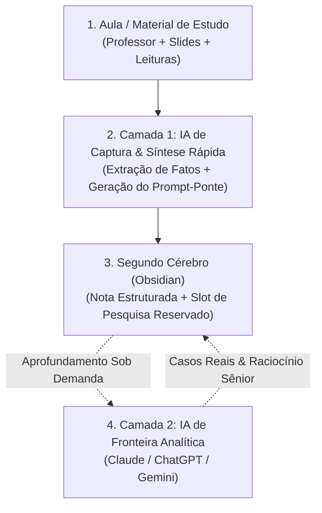

# 🎓 01. A Falência do Estudo Passivo e o Modelo Two-Tier de IA

> **Autor:** Arthur (Tutu)  
> **Trilha:** [[00 - Estudos & Agentes de IA — Guia Mestre|Estudos, Segundo Cérebro & Agentes de IA (Espinha Dorsal — Etapa 01)]]  
> **Nível de Consciência:** Nível 0 ➔ Nível 1 (Da ilusão de competência à captura ativa em duas camadas)  
> **Conexões:** → [[00 - Estudos & Agentes de IA — Guia Mestre]] | [[02 - Estudos com IA — Engenharia de Prompts de Alto Rendimento]]  

---

## 🎯 Cabeçalho de Metas & Premissas

> **Tempo Estimado de Leitura:** 6 minutos  
> **Premissas Necessárias:**
> 1. Estar matriculado em uma faculdade, curso ou conduzindo estudos com carga densa de videoaulas, slides e leituras.
> 2. Disposição para abandonar anotações passivas e o hábito de pedir resumos genéricos a chatbots.
>
> **O que você VAI aprender neste artigo:**
> - Por que assistir a horas de aula passivamente gera a falsa ilusão de aprendizado.
> - O que é a **Arquitetura Two-Tier (Duas Camadas)** e por que nenhuma IA isolada resolve seus estudos.
> - A mecânica do **Prompt-Ponte** para transferir contexto da aula para o seu Segundo Cérebro em segundos.
> - Como manter a opcionalidade de aprofundar dúvidas e casos reais sob demanda no seu horário de estudo particular.

---

> *"Ouvir uma explicação brilhante e entender o que o professor disse não significa que você aprendeu. Significa apenas que o professor sabe explicar."*  
> — **Axioma do Aprendizado Ativo**

---

### Ato 1: A Armadilha da 'Ilusão de Competência' no Ensino Moderno

Seja na faculdade presencial, no EAD ou em cursos livres, a rotina de quem estuda costuma ser inundada por dezenas de horas de aulas expositivas. Diante dessa avalanche, a reação padrão da maioria das pessoas divide-se em duas posturas igualmente ineficientes:

1. **A Passividade Zumbi:** Assistir a aulas em sequência em velocidade normal (1x), acreditando que a simples exposição auditiva transferirá o conhecimento para a memória de longo prazo. O aluno entende o que o professor fala no momento, mas 48 horas depois não é capaz de articular um único conceito sem olhar as anotações.
2. **O Resumo Terceirizado Sem Critério:** Abrir um chatbot e colar comandos vagos como *"resuma essa matéria para mim"*. O modelo devolve três parágrafos genéricos, cheios de adjetivos vazios e sem conexão com as nuances práticas da disciplina. O aluno salva o texto, sente um alívio psicológico passageiro, mas continua sem reter nada.

Ambas as abordagens ignoram o princípio central das ciências cognitivas (*Make It Stick*): **o cérebro só retém aquilo que é forçado a processar, contrastar e recuperar ativamente**. 

Se você terceiriza o raciocínio para a máquina, atrofia sua capacidade crítica; se não usa a máquina para eliminar a digitação mecânica, é engolido pela falta de tempo. A solução não é banir a inteligência artificial, mas **arquitetar uma divisão inteligente de trabalho entre você e os modelos de linguagem**.

---

### Ato 2: O Método — A Arquitetura Two-Tier & O Prompt-Ponte

O modelo **Two-Tier (Duas Camadas)** resolve esse dilema separando o processo de estudo em duas etapas funcionais com papéis estritamente desacoplados:



#### As Duas Camadas do Método:

1. **Camada 1 (Captura Contextual Rápida):** Uma IA leve ou de contexto imediato cuja única função é extrair a estrutura bruta da aula (fatos, termos, leis e definições) com marcação visual padronizada (`•` para conceito teórico, `→` para impacto prático).
2. **O Prompt-Ponte (A Passagem de Bastão):** Quando surge uma dúvida técnica, contradição teórica ou necessidade de ver a aplicação prática no mercado, a Camada 1 empacota **o contexto da aula + os dados citados + a sua dúvida** dentro de um bloco de comando pronto e autocontido.
3. **Camada 2 (IA de Fronteira Analítica):** Um modelo de ponta (como Claude Sonnet, ChatGPT Plus ou Gemini Advanced) focado em raciocínio executivo sênior, contra-argumentação e resolução da dúvida profunda.

O grande insight dessa arquitetura é a **transferência ágil de contexto**: você não perde tempo digitando redações no meio da aula; você apenas extrai o núcleo da discussão e mantém a porta aberta para aprofundar quando for o momento ideal.

---

### Ato 3: Como Eu Aplico no Meu Caso Pessoal (& Como Você Pode Adaptar)

Na minha rotina universitária na faculdade, tenho à disposição a **Hubie**, uma IA nativa integrada diretamente na plataforma de aulas que já tem acesso em tempo real aos slides e à transcrição do que o professor fala.

* **Como eu aproveito esse recurso:** Eu utilizo a IA nativa exclusivamente como **Camada 1**. Ela não serve para debates filosóficos profundos nem para simulações financeiras complexas (pois é um modelo mais leve), mas é imbatível para transcrever termos exatos e gerar o **Prompt-Ponte** em 2 segundos.
* **Como eu integro com a Camada 2:** Copio o bloco gerado pela IA nativa e colo no Claude ou ChatGPT para obter uma análise estratégica de nível de consultoria executiva.

#### Como Adaptar Para o Seu Próprio Contexto:
Se você não estuda em uma plataforma com IA nativa embutida, o princípio continua exatamente o mesmo:
* **Com PDFs ou Slides da Matéria:** Abra o PDF no ChatGPT ou Claude em uma aba lateral e use-o como Camada 1 para extrair a síntese dos tópicos e empacotar suas dúvidas.
* **Em Aulas Presenciais:** Grave o áudio com ferramentas de transcrição automática ou anote apenas os tópicos-chave e peça a uma IA rápida para gerar o prompt contextualizado daquela discussão.
* **Em Cursos do YouTube / Web:** Utilize ferramentas de extração de transcrição para alimentar o contexto inicial sem precisar digitar nada do zero.

---

### Ato 4: Aprofundamento Sob Demanda — Amplificação em Vez de Substituição

Uma das maiores armadilhas de tentar resolver todas as dúvidas durante a aula é quebrar o fluxo de atenção.

Na Arquitetura Two-Tier, a resolução analítica da Camada 2 **não precisa acontecer no desespero da aula ao vivo**. Ela é executada **sob demanda**, no seu horário de estudo individual e focado. 

Como cada dúvida já foi registrada no seu caderno digital com seu devido Prompt-Ponte, essas anotações funcionam como **poços de valor acumulados**:

| Dimensão | Estudo Passivo Tradicional | Arquitetura Two-Tier com IA |
| :--- | :--- | :--- |
| **Tempo por Aula de 60 min** | 60 a 90 min (pausas constantes para copiar lousa). | 15 a 20 min (reprodução acelerada + captura contextual). |
| **Tratamento de Dúvidas** | Dúvidas esquecidas ou pesquisas rasas no Google. | Dúvidas empacotadas em prompts-ponte para resolução analítica. |
| **Papel da Inteligência Artificial** | **Substituição:** Pede resumos prontos e atrofia o raciocínio. | **Amplificação:** Elimina digitação braçal e eleva a profundidade do debate. |
| **Destino do Conhecimento** | Anotações descartáveis que somem após a prova. | Conhecimento acumulado no Obsidian pronto para consultas futuras. |

Esse mecanismo materializa o conceito de [[01 - IA na Prática — Amplificação vs Substituição|Amplificação vs Substituição]]: a IA não estuda no seu lugar; ela remove o atrito mecânico para que você possa pensar em nível estratégico.

---

### Ato 5: Guia de Implementação Imediata

Para aplicar a lógica do Two-Tier nos seus estudos a partir de hoje:

1. **Abandone a Cópia Mecânica:** Deixe a transcrição de fatos e slides para a Camada 1. Seu cérebro deve focar em identificar contradições, teses centrais e aplicações práticas.
2. **Crie um Slot de Pesquisa para Dúvidas:** Quando registrar uma dúvida na sua nota, deixe reservado um espaço visual (ex: `> [!NOTE] 🔬 Achados da Pesquisa`) para colar a resposta do modelo de fronteira posteriormente.
3. **Use o Prompt-Ponte Base:** Salve o modelo abaixo para adaptar aos seus estudos:

````text
Você é um consultor executivo sênior e estrategista analítico.
Estou estudando o seguinte tópico da minha disciplina:
- Contexto do Conteúdo: [Descreva o tema, conceitos ou argumentos do professor/livro]
- Termos Técnicos & Autores: [Cite leis, teóricos ou fórmulas mencionadas]

Minha Dúvida / Reflexão Crítica:
"[Insira sua dúvida ou ponto de aprofundamento]"

Por favor, forneça uma análise aprofundada:
1. Resposta analítica direta (indo além do básico da aula).
2. Como esse conceito opera na prática do mercado e em tomadas de decisão reais.
3. Limitações teóricas, contra-argumentos ou pontos cegos da abordagem apresentada.
4. Síntese em 1 parágrafo com marcadores `•` (conceito) e `→` (impacto prático).
````

---

### 🔗 Próximo Passo na Trilha

Agora que você compreende a lógica da arquitetura em duas camadas e a opcionalidade de aprofundar dúvidas sob demanda, o gargalo operacional passa a ser a **velocidade de execução**:

*Como desenhar prompts de estudo tão rápidos e padronizados que você consiga dispará-los em menos de 2 segundos sem interromper a aula?*

* → Avançar para a Etapa 02: [[02 - Estudos com IA — Engenharia de Prompts de Alto Rendimento]]

---

### 🧬 Notas Co-ativadas & Conexões da Trilha
* **Guia Mestre da Trilha:** [[00 - Estudos & Agentes de IA — Guia Mestre]]
* **Trilha de IA Aplicada:** [[01 - IA na Prática — Amplificação vs Substituição]]
* **Próxima Etapa (Engenharia de Prompts):** [[02 - Estudos com IA — Engenharia de Prompts de Alto Rendimento]]
