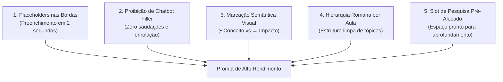

# ⚡ 02. Engenharia de Prompts de Alto Rendimento para Estudos

> **Autor:** Arthur (Tutu)  
> **Trilha:** [[00 - Estudos & Agentes de IA — Guia Mestre|Estudos, Segundo Cérebro & Agentes de IA (Espinha Dorsal — Etapa 02)]]  
> **Nível de Consciência:** Nível 1 ➔ Nível 2 (Do entendimento conceitual ao arsenal operacional plug & play)  
> **Conexões:** → [[00 - Estudos & Agentes de IA — Guia Mestre]] | ← [[01 - Estudos com IA — A Falência do Estudo Passivo e o Modelo Two-Tier]]  

---

## 🎯 Cabeçalho de Metas & Premissas

> **Tempo Estimado de Leitura:** 6 minutos  
> **Premissas Necessárias:**
> 1. Compreensão básica da Arquitetura Two-Tier ([[01 - Estudos com IA — A Falência do Estudo Passivo e o Modelo Two-Tier]]).
> 2. Disposição para utilizar comandos padronizados em vez de improvisar perguntas a cada aula.
>
> **O que você VAI aprender neste artigo:**
> - Por que prompts cheios de variáveis no meio do texto travam o seu ritmo de estudo.
> - Os 5 princípios práticos para desenhar prompts de captura em tempo real.
> - A tríade de prompts pronta para copiar, colar e usar na sua faculdade ou curso.
> - Como disparar comandos analíticos em menos de 2 segundos sem pausar o vídeo.

---

> *"A velocidade do seu aprendizado com IA não é limitada pela capacidade do modelo, mas pela fricção da sua interface de comando."*  
> — **Axioma do Operador de IA**

---

### Ato 1: A Morte do Prompt Improvisado

No calor de uma aula de 60 minutos, qualquer atrito cognitivo interrompe o seu raciocínio.

O erro mais comum ao usar inteligência artificial nos estudos é tentar digitar comandos longos e improvisados no meio da explicação do professor:

```text
❌ "Olá ChatGPT, o professor acabou de falar sobre custo de oportunidade e deu um exemplo de fábrica de sapatos. Você pode me explicar isso de forma simples e dar mais 3 exemplos para eu entender melhor?"
```

Enquanto você gasta 40 segundos redigindo esse parágrafo, a aula continua avançando, você perde o próximo conceito e a IA responde com três parágrafos genéricos cheios de enrolação (*"Com certeza! O custo de oportunidade é muito importante..."*).

Para estudar em alta velocidade (2x a 4x), você precisa de **prompts operacionais plug & play**: comandos pré-formatados onde você apenas preenche uma única variável em menos de 2 segundos e obtém uma resposta estruturada pronta para o seu caderno digital.

---

### Ato 2: Os 5 Princípios de Design de Prompts de Estudo

Para que um prompt funcione perfeitamente durante a aula, ele deve seguir 5 regras de ouro:



1. **Placeholders Isolados nas Extremidades:** Nunca coloque variáveis no meio do corpo do texto. O campo editável fica **estritamente na 1ª linha** ou **na última linha**, facilitando o preenchimento instantâneo.
2. **Proibição Absoluta de Chatbot Filler:** A IA é proibida por instrução de dar saudações (*"Olá!", "Boa pergunta!"*) ou fazer perguntas socráticas de fechamento (*"Ficou claro?"*). A saída deve ser Markdown puro em bloco de código.
3. **Marcação Semântica Visual:**
   * `•` (Bullet): Exclusivo para dados teóricos, leis, definições e fórmulas.
   * `→` (Seta): Exclusivo para consequências práticas, racional de negócio e o "por que isso importa".
4. **Hierarquia Romana por Sessão:** As grandes sessões iniciam com algarismos romanos (`## I. [Macrotema]`, `## II. [Macrotema]`), organizando as matérias em blocos lógicos.
5. **Slots de Pesquisa Pré-Alocados:** Toda dúvida técnica gerada já cria automaticamente a caixa `> [!NOTE] 🔬 Achados da Pesquisa` para receber o aprofundamento de IAs de fronteira (Claude / ChatGPT).

---

### Ato 3: A Tríade de Prompts Pronta para Uso (Plug & Play)

Abaixo está o arsenal exato que utilizo na minha rotina acadêmica. Você pode copiar e salvar esses blocos no seu gerenciador de snippets ou em uma nota rápida.

---

#### 📝 PROMPT 1: Síntese de Aula & Aprofundamento Rápido
* **Onde usar:** Na IA nativa da plataforma de aulas ou no chat com o PDF/slides abertos.  
* **Tempo de preenchimento:** 2 segundos (basta editar a 1ª linha).

````text
AULA / RECORTE: [DIGITE AQUI: Nº DA AULA + TÍTULO DO TEMA A APROFUNDAR]

Você é um estruturador de notas de estudo de alto rendimento. Com base no conteúdo e nos slides desta aula, estruture a síntese desta matéria.

### DIRETRIZES OBRIGATÓRIAS:
1. Proibição de Chatbot: ZERO introduções, saudações ou perguntas de encerramento.
2. Saída em Bloco de Código: Escreva toda a resposta dentro de um único bloco Markdown delimitado por backticks triplos.
3. Hierarquia: Inicie com `## I. [Título da Aula]` ou `### 1. [Nome do Subtema]`.
4. Marcadores:
   • Exclusivo para conceitos, definições e dados teóricos.
   → Exclusivo para consequências, racional de negócio, impactos e "por que isso importa".
5. Negritos: Destaque termos-chave, teóricos, normas e fórmulas em **negrito**.
6. Quadro Comparativo: Se houver variáveis ou etapas, inclua uma tabela Markdown comparativa.
7. Referências: Ao final, liste `📚 Referências:` com autores, livros ou leis citadas.
````

---

#### 🌉 PROMPT 2: Dúvida Crítica & Prompt-Ponte (Bridge-Prompting)
* **Onde usar:** Quando surgir uma dúvida complexa, contradição ou necessidade de caso prático de mercado.  
* **O que faz:** Gera a nota de dúvida local no seu caderno e entrega um prompt pronto para você colar no Claude ou ChatGPT.

````text
DÚVIDA / REFLEXÃO: [DIGITE AQUI SUA DÚVIDA OU PENSAMENTO SOBRE A AULA]

Você é um assistente de estudos. Com base nos slides e na fala do professor desta aula, processe a minha dúvida acima gerando a nota local e o prompt-ponte para IA de fronteira.

GERE ESTRITAMENTE A SEGUINTE ESTRUTURA EM BLOCO MARKDOWN:

### ❓ Dúvida / Reflexão: [Título Curto da Dúvida]
> [!QUESTION] Contexto da Aula & Provocação
> **Ponto da Aula:** [Resumo em 2 linhas da tese do professor e termos técnicos citados].
> **Dúvida do Aluno:** [A dúvida formulada de forma técnica e clara].

> [!NOTE] 🔬 Achados da Pesquisa (Espaço para Colar a Resposta do Claude/ChatGPT)
> <!-- Cole aqui a resposta da IA de fronteira após executar o prompt-ponte abaixo -->

---
#### 🌉 Prompt-Ponte para IA de Fronteira (Copie o bloco abaixo para o Claude/ChatGPT):
```markdown
Você é um consultor executivo sênior e estrategista de negócios de alto nível.
Estou assistindo a uma aula. O professor apresentou as seguintes premissas:
- Contexto da Aula: [Descreva o ponto da aula e argumentos do professor]
- Termos Técnicos & Autores: [Cite termos, fórmulas ou autores mencionados]

Minha Dúvida / Reflexão:
"[Dúvida do Aluno]"

Por favor, forneça uma análise aprofundada:
1. Resposta analítica direta (indo além do conteúdo básico da aula).
2. Mecânica real no mercado executivo (como opera na prática das empresas).
3. Pontos cegos ou limitações da teoria apresentada.
4. Síntese em 1 parágrafo com marcadores `•` (conceito) e `→` (impacto) para eu colar nas minhas notas.
```
````

---

#### 🏛️ PROMPT 3: Consolidador Mestre de Fim de Disciplina
* **Onde usar:** No Claude, ChatGPT ou no seu editor no encerramento da matéria, para fundir todas as anotações acumuladas em uma nota única e definitiva.

````text
Você é um arquiteto de conhecimento especialista em aprendizado ativo de alto rendimento.
Abaixo estão as anotações acumuladas durante o estudo da disciplina (resumos rápidos, dúvidas formuladas e respostas analíticas de pesquisa).

Consolide tudo em uma Nota Consolidada definitiva seguindo rigorosamente as regras:

### DIRETRIZES DE FORMATAÇÃO:
1. Elimine completamente sobras de prompts, tags de IA ou delimitações intermediárias.
2. Integre os "Achados da Pesquisa" organicamente no corpo do texto sob o subtema correspondente.
3. Grandes Seções em Romanos: `## I. [Macrotema]`, `## II. [Macrotema]`.
4. Subtemas Numerados: `### 1. [Subtema]`, `#### 1.1 [Tópico]`.
5. Marcadores de Conteúdo:
   • Use exclusivamente para definições, fatos e conceitos teóricos.
   → Use exclusivamente para consequências, racional de negócio, impactos e "por que isso importa".
6. Negritos: Destaque termos-chave, leis, teóricos e fórmulas em **negrito**.
7. Tabelas: Estrutura quadros comparativos sempre que houver modelos concorrentes.
8. Referências: Agrupe todas as fontes e autores citados ao final sob `## 📚 Referências & Bibliografia`.

ANOTAÇÕES ACUMULADAS:
[COLE AQUI TODAS AS ANOTAÇÕES E RESPOSTAS ACUMULADAS DA DISCIPLINA]
````

---

### Ato 4: A Mágica da Marcação Semântica (`•` vs `→`)

Compare visualmente a diferença entre dois blocos de estudo:

#### ❌ Formato Tradicional em Bloco Corrido:
> *"O Custo Médio Ponderado de Capital (WACC) é uma taxa que calcula o custo de financiamento de uma empresa combinando capital próprio e de terceiros. Isso é importante porque quando o WACC sobe a empresa precisa de projetos mais rentáveis para gerar valor aos acionistas e se o retorno for menor que o WACC o valor da firma é destruído."*

#### ✅ Formato Semântico Padronizado:
> * **Custo Médio Ponderado de Capital (WACC):**
>   • Definição: Taxa mínima de atratividade que pondera o custo do capital próprio (Ke) e de terceiros (Kd) pelo peso de cada fonte na estrutura de capital.
>   → Impacto Executivo: Se o Retorno sobre o Capital Investido (ROIC) for menor que o WACC, a empresa está **destruindo valor econômico (EVA negativo)** a cada novo investimento realizado.

Ao separar visualmente o **Conceito Teórico (`•`)** da **Decisão de Negócio (`→`)**, o seu cérebro escanear e revisa uma matéria inteira em 5 minutos antes de uma prova ou reunião de trabalho.

---

### Ato 5: Protocolo de Execução em 2 Segundos

Para colocar esse sistema em prática hoje:

1. **Cadastre os Prompts 1 e 2 no seu Navegador ou Teclado:** Salve-os como atalhos de expansão de texto (ex: `;resumo` para o Prompt 1 e `;ponte` para o Prompt 2) ou deixe-os fixados em uma aba lateral.
2. **Execute sem Pausar o Professor:** Ao ouvir um conceito denso, dispare o atalho, digite o nome do tópico na primeira linha e continue assistindo à aula.
3. **Cole a Saída Diretamente no seu Caderno:** Mantenha suas notas organizadas em Markdown e passe para o próximo tema com zero estresse de digitação.

---

### 🔗 Próximo Passo na Trilha

Com os prompts afiados e a captura automatizada em 2 segundos, o próximo desafio é a **gestão do tempo e o volume de matérias do semestre**:

*Como organizar semestres inteiros no Obsidian, calibrar a velocidade de estudo (2x a 4x) pelo ROI da matéria e nunca mais acumular conteúdo no final do período?*

* → Avançar para a Etapa 03: [[03 - Estudos com IA — O Sistema Operacional Acadêmico e Ritmo Lindy]]

---

### 🧬 Notas Co-ativadas & Conexões da Trilha
* **Guia Mestre da Trilha:** [[00 - Estudos & Agentes de IA — Guia Mestre]]
* **Etapa Anterior (Modelo Two-Tier):** [[01 - Estudos com IA — A Falência do Estudo Passivo e o Modelo Two-Tier]]
* **Próxima Etapa (Sistema Operacional Acadêmico):** [[03 - Estudos com IA — O Sistema Operacional Acadêmico e Ritmo Lindy]]
